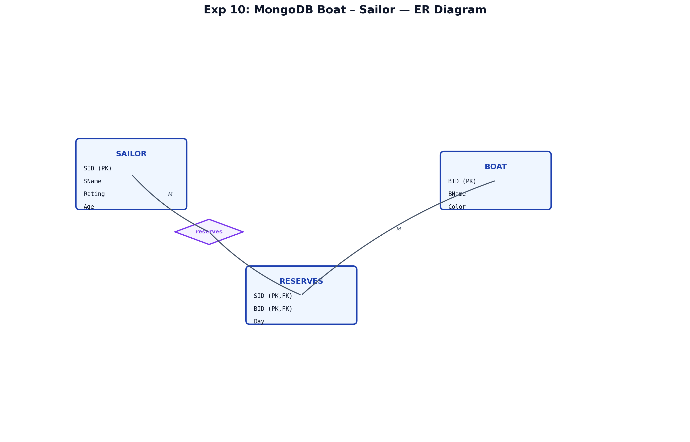
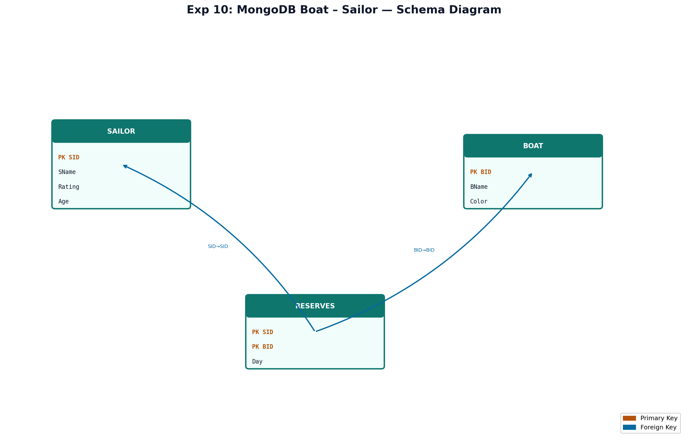

# EXPERIMENT NUMBER 10

## TITLE
MongoDB Boat–Sailor + Weekend Modification Trigger


---


## AIM
To query boat reservations in MongoDB and create an Oracle trigger on EMPLOYEE that blocks INSERT/UPDATE/DELETE on weekends.


---


## PROBLEM STATEMENT
Sailors reserve boats (RESERVES). MongoDB answers: count of boats reserved by a sailor, and boats of a given color. Oracle trigger on EMPLOYEE(SSN, Name, Sal, DeptNo) must raise an error when the table is modified on Saturday or Sunday.


---


## OBJECTIVES
1. Query boat reservations in MongoDB.
2. Create weekend block trigger on EMPLOYEE.
3. Test trigger with INSERT on weekday/weekend.

---

## ENTITY IDENTIFICATION
| Entity | Attributes | PK |
|--------|------------|-----|
| SAILOR | SID, SName, Rating, Age | SID |
| BOAT | BID, BName, Color | BID |
| RESERVES | SID, BID, Day | (SID,BID,Day) |

---

## CONSTRAINTS
Domain: Rating 1–10; Age > 0. Referential: RESERVES → SAILOR, BOAT. Cardinality: M:N.

---

## ER DIAGRAM

### ER Diagram (Figure)


*Figure: Entity–Relationship diagram (Chen notation). PK = Primary Key, FK = Foreign Key.*

---


## SCHEMA DIAGRAM

### Schema Diagram (Figure)


*Figure: Relational schema with referential links. Orange = PK, Blue = FK.*

---


## MONGODB IMPLEMENTATION
```javascript
use marina_db;
db.boats.insertMany([
  { bid: 101, bname: "Interlake", color: "Blue" },
  { bid: 102, bname: "Clipper", color: "Red" },
  { bid: 103, bname: "Marlin", color: "Green" }
]);
db.sailors.insertMany([
  { sid: 22, sname: "Dustin", rating: 7, age: 45 },
  { sid: 31, sname: "Lubber", rating: 8, age: 55 },
  { sid: 44, sname: "Horatio", rating: 7, age: 35 }
]);
db.reserves.insertMany([
  { sid: 22, bid: 101, day: ISODate("2026-06-02") },
  { sid: 22, bid: 102, day: ISODate("2026-06-03") },
  { sid: 31, bid: 103, day: ISODate("2026-06-04") },
  { sid: 44, bid: 101, day: ISODate("2026-06-05") }
]);
```

### i – Boats reserved by Dustin
```javascript
var s = db.sailors.findOne({ sname: "Dustin" });
db.reserves.countDocuments({ sid: s.sid });
// Alternative: aggregate with lookup
```

### ii – Boats of color Red
```javascript
db.boats.find({ color: "Red" }, { _id: 0 });
```


---


## TRIGGER PROGRAMS

### Trigger Definition
A **BEFORE** row trigger on `EMPLOYEE` for `INSERT OR UPDATE OR DELETE` checks `TO_CHAR(SYSDATE,'DY')` and raises application error on weekend.

### Complete Trigger Code
```sql
CREATE OR REPLACE TRIGGER trg_emp_weekend_block
BEFORE INSERT OR UPDATE OR DELETE ON EMPLOYEE
FOR EACH ROW
DECLARE
    v_day VARCHAR2(3);
BEGIN
    v_day := UPPER(TO_CHAR(SYSDATE, 'DY', 'NLS_DATE_LANGUAGE=AMERICAN'));
    IF v_day IN ('SAT', 'SUN') THEN
        RAISE_APPLICATION_ERROR(-20001,
            'Modification of EMPLOYEE table is not allowed on weekends (Saturday/Sunday).');
    END IF;
END;
/
```

### Test Queries
```sql
-- Run on weekday: should succeed
INSERT INTO EMPLOYEE VALUES ('999','Test User',50000,1);

-- Simulate weekend (exam discussion): trigger uses SYSDATE
-- On Saturday/Sunday: ORA-20001 error
```

### Expected Output (Weekend)
```text
ORA-20001: Modification of EMPLOYEE table is not allowed on weekends (Saturday/Sunday).
```


---


## STEP-BY-STEP EXECUTION
1. Insert boats, sailors, reserves in MongoDB.
2. Run count and color queries.
3. Create EMPLOYEE table and weekend trigger in Oracle.
4. Test INSERT on weekday vs weekend.


---


## VIVA QUESTIONS & ANSWERS
1. **Row vs statement trigger?** Row-level fires per row; statement-level once per SQL statement.
2. **BEFORE vs AFTER?** BEFORE can block the operation; AFTER runs when change is applied.
3. **RAISE_APPLICATION_ERROR?** Raises user-defined Oracle error (-20001 to -20999).
4. **What does TO_CHAR(SYSDATE,'DY') return?** Three-letter day name (MON, TUE, …).
5. **countDocuments vs find().size()?** countDocuments is server-side count; preferred in mongosh.
6. **Purpose of weekend trigger?** Enforce business rule: no HR changes on weekends.
7. **Can triggers call COMMIT?** No — committing inside trigger causes ORA-04092.
8. **What is RESERVES composite key?** (SID, BID, Day) allows repeat reservations on different days.
9. **MongoDB collection vs table?** Collection holds documents; table holds rows with fixed schema.
10. **How to disable a trigger?** `ALTER TRIGGER name DISABLE;`
11. **What is :NEW in trigger?** Row after change (INSERT/UPDATE) in row trigger.
12. **Difference ER vs schema diagram?** ER shows entities/relationships; schema shows tables/keys.
13. **FK in RESERVES?** SID → SAILOR, BID → BOAT.
14. **What is marina_db?** MongoDB database name used in this experiment.
15. **How to test trigger without waiting for weekend?** Discuss SYSDATE override in test env or alter session.

---

## FREQUENTLY ASKED LAB EXAM QUESTIONS
1. Write trigger to log all EMPLOYEE changes to audit table.
2. List sailors who reserved more than 2 boats (MongoDB aggregate).
3. Find boats never reserved.
4. Explain mutating table error in triggers.
5. Write MongoDB query for blue boats reserved by Dustin.
6. Create AFTER DELETE trigger on SAILOR.
7. Compare implicit and explicit cursors.
8. How to drop trigger safely?
9. Write PL/SQL to count reserves per sailor.
10. Document trigger test cases in lab record.

---

## RESULT
MongoDB queries returned reservation counts and boat colors correctly. The weekend trigger on EMPLOYEE was created and demonstrated; modifications on Saturday/Sunday raise ORA-20001 as required.
