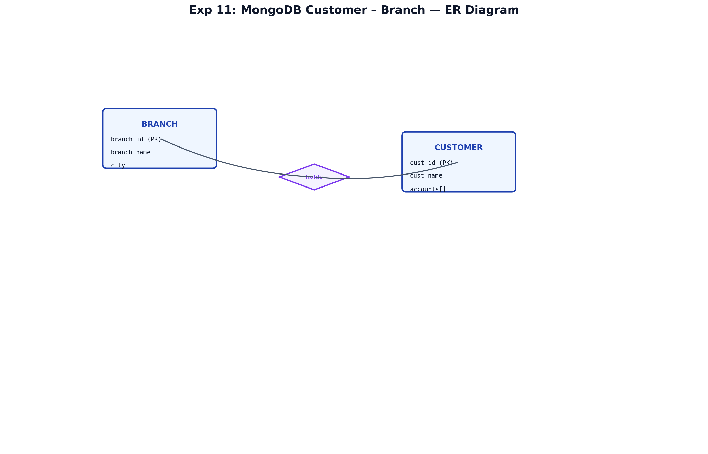
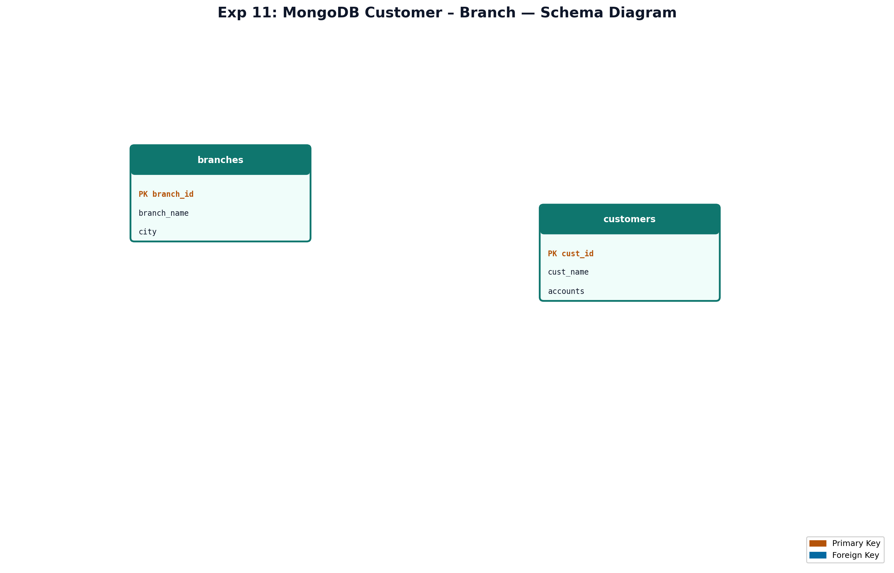

# EXPERIMENT NUMBER 11


## OBJECTIVES
1. Query branches and customer accounts in MongoDB.
2. Copy Oracle table using explicit cursor.
3. Compare cursor vs INSERT-SELECT.

---

## ENTITY IDENTIFICATION
| Entity | Attributes | PK |
|--------|------------|-----|
| BRANCH | branch_id, branch_name, city | branch_id |
| CUSTOMER | cust_id, cust_name, accounts[] | cust_id |

---

## CONSTRAINTS
Logical FK: accounts.branch_id → branches. Embedded accounts in MongoDB.

---

## ER DIAGRAM

### ER Diagram (Figure)


*Figure: Entity–Relationship diagram (Chen notation). PK = Primary Key, FK = Foreign Key.*

---


## SCHEMA DIAGRAM

### Schema Diagram (Figure)


*Figure: Relational schema with referential links. Orange = PK, Blue = FK.*

---


## TITLE
MongoDB Customer–Branch + Cursor Table Copy Program


---


## AIM
To query banking data in MongoDB and demonstrate copying table contents from one Oracle table to another using explicit cursors.


---


## MONGODB IMPLEMENTATION
```javascript
use bank_db;
db.branches.insertMany([
  { branch_id: "B001", branch_name: "MG Road", city: "Bangalore", assets: 5000000 },
  { branch_id: "B002", branch_name: "Park Street", city: "Kolkata", assets: 3200000 }
]);
db.customers.insertMany([
  { cust_id: "C001", cust_name: "Ravi Kumar", city: "Bangalore",
    accounts: [{ acc_no: "A1001", branch_id: "B001", type: "Savings" },
               { acc_no: "A1002", branch_id: "B001", type: "Current" }] },
  { cust_id: "C002", cust_name: "Priya Shah", city: "Pune",
    accounts: [{ acc_no: "A2001", branch_id: "B002", type: "Savings" }] }
]);
```

### i – Branch name for B001
```javascript
db.branches.findOne({ branch_id: "B001" }, { _id: 0, branch_name: 1 });
```

### ii – Total accounts per customer
```javascript
db.customers.aggregate([
  { $project: { cust_name: 1, total_accounts: { $size: "$accounts" } } }
]);
```


---


## CURSOR PROGRAMS
```sql
DROP TABLE ACCOUNT_COPY CASCADE CONSTRAINTS;
DROP TABLE ACCOUNT CASCADE CONSTRAINTS;
-- Assume ACCOUNT(AccNo, BranchName, Balance, AccType) exists with data

CREATE TABLE ACCOUNT_COPY AS SELECT * FROM ACCOUNT WHERE 1=0;

SET SERVEROUTPUT ON;
DECLARE
    CURSOR cur_account IS
        SELECT AccNo, BranchName, Balance, AccType FROM ACCOUNT;
    v_rec cur_account%ROWTYPE;
    v_count NUMBER := 0;
BEGIN
    OPEN cur_account;
    LOOP
        FETCH cur_account INTO v_rec;
        EXIT WHEN cur_account%NOTFOUND;
        INSERT INTO ACCOUNT_COPY VALUES (v_rec.AccNo, v_rec.BranchName, v_rec.Balance, v_rec.AccType);
        v_count := v_count + 1;
    END LOOP;
    CLOSE cur_account;
    COMMIT;
    DBMS_OUTPUT.PUT_LINE('Rows copied: ' || v_count);
END;
/
```

### Cursor Steps Explained
1. **DECLARE CURSOR** – defines SELECT for iteration
2. **OPEN** – executes query, prepares result set
3. **FETCH** – retrieves next row into %ROWTYPE record
4. **CLOSE** – releases cursor resources

---

## STEP-BY-STEP EXECUTION
1. Create `bank_db` and insert branch/customer documents in MongoDB.
2. Run branch lookup and account-count aggregation queries.
3. Create Oracle `ACCOUNT` and `ACCOUNT_COPY` tables; populate ACCOUNT.
4. Execute cursor PL/SQL block; verify with `SELECT COUNT(*) FROM ACCOUNT_COPY`.

---

## VIVA QUESTIONS & ANSWERS
1. **Explicit cursor?** User-declared cursor with OPEN/FETCH/CLOSE control.
2. **%NOTFOUND?** Attribute true when FETCH finds no more rows.
3. **Alternative to cursor for copy?** `INSERT INTO copy SELECT * FROM source;`
4. **$size in MongoDB?** Returns array length in aggregation/projection.
5. **Embedded accounts advantage?** Single read gets customer + all accounts.
6–15. (Implicit cursor, SQL%ROWCOUNT, branch PK, FK logical link, etc.)

---

## FREQUENTLY ASKED LAB EXAM QUESTIONS
1. Copy only Savings accounts using cursor + WHERE.
2. MongoDB: customers with more than 2 accounts.
3. List branches in Bangalore.
4. Explain cursor attributes %FOUND, %ISOPEN.
5–10. Bulk COLLECT, exception in cursor loop, branch assets sum.

---

## RESULT
MongoDB branch lookup and per-customer account counts executed successfully. The explicit cursor program copied all rows from ACCOUNT to ACCOUNT_COPY and displayed the row count via DBMS_OUTPUT.
