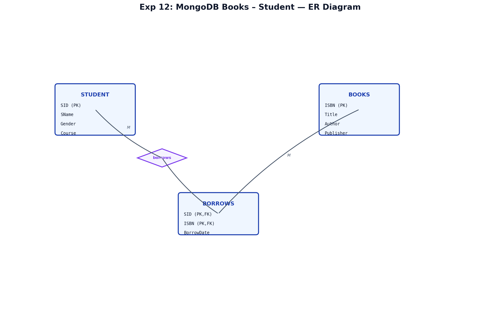
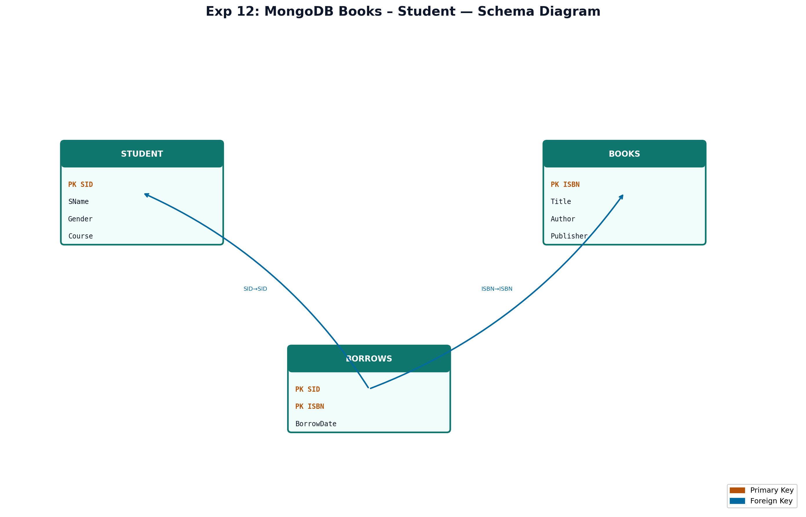

# EXPERIMENT NUMBER 12


## OBJECTIVES
1. Query books and borrows in MongoDB.
2. Implement user-defined exception e_bigger in PL/SQL.
3. Handle exception with custom message.

---

## ENTITY IDENTIFICATION
| Entity | Attributes | PK |
|--------|------------|-----|
| BOOKS | ISBN, Title, Author, Publisher | ISBN |
| STUDENT | SID, SName, Gender, borrows[] | SID |

---

## CONSTRAINTS
Partial participation: students may have zero borrows. M:N via borrows array.

---

## ER DIAGRAM

### ER Diagram (Figure)


*Figure: Entity–Relationship diagram (Chen notation). PK = Primary Key, FK = Foreign Key.*

---


## SCHEMA DIAGRAM

### Schema Diagram (Figure)


*Figure: Relational schema with referential links. Orange = PK, Blue = FK.*

---


## TITLE
MongoDB Books–Student + User Defined Exception Program


---


## AIM
To query library data in MongoDB and write a PL/SQL program that accepts two numbers and raises user-defined exception `e_bigger` when the first is larger than the second.


---


## MONGODB IMPLEMENTATION
```javascript
use library_db;
db.books.insertMany([
  { isbn: "123", title: "Database Systems", author: "Korth", publisher: "McGraw" },
  { isbn: "124", title: "Advanced DBMS", author: "Elmasri", publisher: "Pearson" },
  { isbn: "125", title: "Operating Systems", author: "Silberschatz", publisher: "Wiley" }
]);
db.students.insertMany([
  { sid: "S01", sname: "Anita", gender: "F",
    borrows: [{ isbn: "123", bdate: ISODate("2026-05-01") }] },
  { sid: "S02", sname: "Rahul", gender: "M",
    borrows: [{ isbn: "124", bdate: ISODate("2026-05-02") }] },
  { sid: "S03", sname: "Meera", gender: "F",
    borrows: [{ isbn: "123", bdate: ISODate("2026-05-03") }, { isbn: "125", bdate: ISODate("2026-05-04") }] }
]);
```

### i – Books by author Korth
```javascript
db.books.find({ author: "Korth" }, { _id: 0 });
```

### ii – Students who borrowed Database books
```javascript
db.students.find(
  { "borrows.isbn": { $in: ["123", "124"] } },
  { _id: 0, sname: 1, gender: 1 }
);
// Or match title via lookup
```


---


## EXCEPTION HANDLING

### Complete Program
```sql
SET SERVEROUTPUT ON;
DECLARE
    e_bigger EXCEPTION;
    PRAGMA EXCEPTION_INIT(e_bigger, -20010);
    num1 NUMBER := &num1;
    num2 NUMBER := &num2;
BEGIN
    IF num1 > num2 THEN
        RAISE e_bigger;
    END IF;
    DBMS_OUTPUT.PUT_LINE('First number is not larger. Sum = ' || (num1 + num2));
EXCEPTION
    WHEN e_bigger THEN
        DBMS_OUTPUT.PUT_LINE('Error: First number is larger than second number.');
END;
/
```

### Alternative (explicit code)
```sql
DECLARE
    e_bigger EXCEPTION;
BEGIN
    IF num1 > num2 THEN
        RAISE_APPLICATION_ERROR(-20010, 'First number is larger than second number.');
    END IF;
END;
/
```

### Sample Output
```text
Enter num1: 50
Enter num2: 20
Error: First number is larger than second number.
```

---

## EXCEPTION HANDLING
1. **User-defined exception:** `e_bigger` declared in DECLARE section.
2. **Raise:** `RAISE e_bigger` when `num1 > num2`.
3. **Handler:** `WHEN e_bigger THEN` displays custom message.
4. **Output:** Error message instead of sum when first number is larger.

---

## STEP-BY-STEP EXECUTION
1. Load `library_db` books and students in MongoDB.
2. Run author and Database-book borrower queries.
3. In SQL Developer, run PL/SQL block; enter values at prompts.
4. Test with (50, 20) and (10, 25) to verify exception and normal paths.

---

## VIVA QUESTIONS & ANSWERS
1. **Predefined vs user-defined exception?** Predefined: NO_DATA_FOUND; user: declared in block.
2. **RAISE vs RAISE_APPLICATION_ERROR?** RAISE uses named exception; RAE assigns error code/message.
3. **PRAGMA EXCEPTION_INIT?** Associates exception name with Oracle error number.
4. **Can handler appear before BEGIN?** No — handlers only in EXCEPTION section.
5. **MongoDB $in operator?** Matches any value in array: `{ isbn: { $in: ["123","124"] } }`.
6–15. (OTHERS handler, WHEN clause order, partial participation, ISBN PK, etc.)

---

## FREQUENTLY ASKED LAB EXAM QUESTIONS
1. Write program with e_negative for negative input.
2. List students who borrowed zero books.
3. Count books per publisher in MongoDB.
4. Handle OTHERS in exception block.
5–10. Nested exceptions, RAISE in procedure, borrow date filter.

---

## RESULT
MongoDB returned books by author and students who borrowed database-related titles. The PL/SQL program correctly raised `e_bigger` when the first number was larger than the second and displayed the appropriate message.
