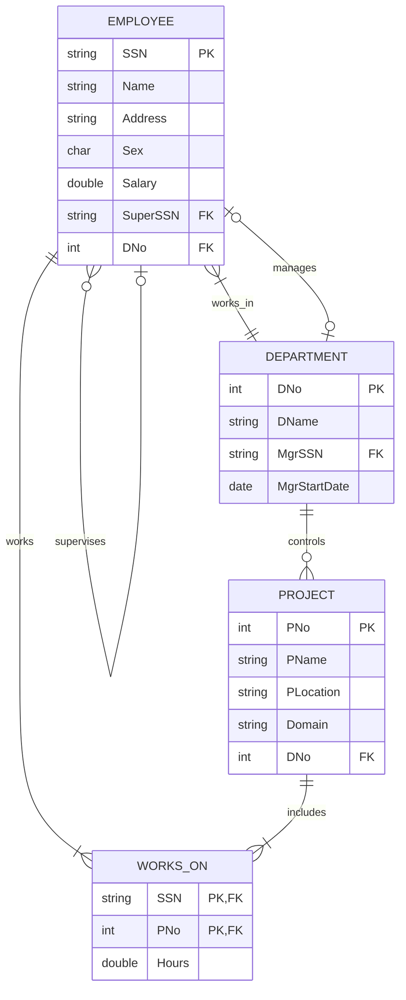

# EXPERIMENT NUMBER 1

## TITLE
Employee – Department – Project Database


---


## AIM
To design, implement, and query an Employee-Department-Project database schema using Oracle SQL, including ER mapping, constraint enforcement, and multi-table joins.


---


## PROBLEM STATEMENT
An organization needs a database to manage its workforce, departments, and projects. 
* Each employee is uniquely identified by a Social Security Number (SSN) and has a Name, Address, Gender, and Salary.
* A department has a unique Department Number (DNo), a name (DName), and is managed by an employee (Manager) with a specific manager start date. 
* A project is identified by a unique Project Number (PNo) and has a Name, Location, Domain (e.g., Database, Cloud), and is controlled by a single department.
* Employees can work on multiple projects, with a specific number of hours allocated for each. An employee may also have a supervisor (another employee).
Develop a relational database system to represent this scenario and write Oracle SQL queries to perform operational queries.


---


## OBJECTIVES
1. Learn relational database modeling and schema definition using SQL DDL commands.
2. Implement primary keys, foreign keys, check constraints, and referential integrity.
3. Master multi-table joins, aggregation (`GROUP BY`), and table updates.


---


## THEORY
### DBMS Concepts Involved
A Relational Database Management System (RDBMS) stores data in tables (relations) consisting of rows (tuples) and columns (attributes). In this schema, we represent the standard employee-department-project architecture:
* **Entities**: `EMPLOYEE` (strong entity), `DEPARTMENT` (strong entity), and `PROJECT` (strong entity).
* **Relationships**:
  * **Works_In** (Employee to Department): Many-to-One (N:1) relationship. An employee belongs to one department; a department contains many employees.
  * **Manages** (Employee to Department): One-to-One (1:1) relationship. An employee manages at most one department.
  * **Controls** (Department to Project): One-to-Many (1:N) relationship. A department controls multiple projects.
  * **Works_On** (Employee to Project): Many-to-Many (M:N) relationship. An employee can work on multiple projects, and a project can have multiple employees. The attribute `Hours` belongs to this relationship.
  * **Supervises** (Employee to Employee): Unary/Recursive One-to-Many (1:N) relationship. An employee can supervise multiple employees, but an employee has at most one supervisor.

### Constraints
1. **Entity Integrity**: Primary keys must be unique and non-null (e.g., `SSN` in `EMPLOYEE`, `DNo` in `DEPARTMENT`).
2. **Referential Integrity**: Foreign keys must match a primary key in the referenced table or be null (e.g., `DNo` in `EMPLOYEE` referencing `DNo` in `DEPARTMENT`).
3. **Domain Constraints**: Attribute values must lie within valid ranges (e.g., `Sex` must be 'M' or 'F', `Salary` must be positive).


---


## ENTITY IDENTIFICATION
| Entity Name | Attributes | Primary Key | Foreign Key(s) |
|---|---|---|---|
| **EMPLOYEE** | SSN, Name, Address, Sex, Salary, SuperSSN, DNo | SSN | SuperSSN (refs EMPLOYEE), DNo (refs DEPARTMENT) |
| **DEPARTMENT** | DNo, DName, MgrSSN, MgrStartDate | DNo | MgrSSN (refs EMPLOYEE) |
| **PROJECT** | PNo, PName, PLocation, Domain, DNo | PNo | DNo (refs DEPARTMENT) |
| **WORKS_ON** | SSN, PNo, Hours | (SSN, PNo) | SSN (refs EMPLOYEE), PNo (refs PROJECT) |


---


## CONSTRAINTS
* **Domain Constraints**:
  * `Sex` in `EMPLOYEE`: `CHECK (Sex IN ('M', 'F'))`
  * `Salary` in `EMPLOYEE`: `CHECK (Salary > 0)`
  * `Hours` in `WORKS_ON`: `CHECK (Hours > 0)`
* **Participation Constraints**:
  * Every department must have a manager (total participation).
  * Every employee must belong to a department (total participation, modeled by `DNo NOT NULL`).
* **Cardinality Ratios**:
  * Employee to Department: N:1
  * Employee to Employee (Supervisor): N:1
  * Department to Project: 1:N
  * Employee to Project: M:N


---


## ER DIAGRAM


### ER Diagram (Figure)


*Figure: Entity–Relationship diagram (Chen notation). PK = Primary Key, FK = Foreign Key.*
*Figure: Entity–Relationship diagram (Chen notation). PK = Primary Key, FK = Foreign Key.*
### Mermaid Notation


### ASCII Diagram
```text
  +------------------+                    +------------------+
  |     EMPLOYEE     |1                  1|    DEPARTMENT    |
  |------------------|------------------->|------------------|
  | SSN (PK)         |   (Works_In)       | DNo (PK)         |
  | Name, Address    |                    | DName            |
  | Sex, Salary      |                    | MgrSSN (FK)      |
  | SuperSSN (FK)    |                    | MgrStartDate     |
  | DNo (FK)         |                    +------------------+
  +------------------+                             |
         | ^                                       |
         | | (Supervises)                          |1
         +-+                                       |
          N                                        v N (Controls)
  +------------------+                    +------------------+
  |     WORKS_ON     |                    |     PROJECT      |
  |------------------|                    |------------------|
  | SSN (PK, FK)     |N                  1| PNo (PK)         |
  | PNo (PK, FK)     |<-------------------| PName, PLocation |
  | Hours            |    (Works_On)      | Domain           |
  +------------------+                    | DNo (FK)         |
                                          +------------------+
```


---


## SCHEMA DIAGRAM


### Schema Diagram (Figure)


*Figure: Relational schema with referential links. Orange = PK, Blue = FK.*
*Figure: Relational schema with referential links. Orange = PK, Blue = FK.*
* **EMPLOYEE** ( [SSN] (PK), Name, Address, Sex, Salary, SuperSSN (FK), DNo (FK) )
* **DEPARTMENT** ( [DNo] (PK), DName, MgrSSN (FK), MgrStartDate )
* **PROJECT** ( [PNo] (PK), PName, PLocation, Domain, DNo (FK) )
* **WORKS_ON** ( [SSN] (PK, FK), [PNo] (PK, FK), Hours )


---


## RELATIONAL MODEL
* The **EMPLOYEE** relation has `SSN` as the primary key. `DNo` is a foreign key referencing `DEPARTMENT(DNo)`, and `SuperSSN` is a self-referencing foreign key referencing `EMPLOYEE(SSN)`.
* The **DEPARTMENT** relation has `DNo` as the primary key. `MgrSSN` is a foreign key referencing `EMPLOYEE(SSN)`.
* The **PROJECT** relation has `PNo` as the primary key. `DNo` is a foreign key referencing `DEPARTMENT(DNo)`.
* The **WORKS_ON** relation has a composite primary key `(SSN, PNo)`. `SSN` references `EMPLOYEE(SSN)` and `PNo` references `PROJECT(PNo)`.


---


## SQL IMPLEMENTATION
```sql
-- Dropping existing tables to ensure clean execution
DROP TABLE WORKS_ON CASCADE CONSTRAINTS;
DROP TABLE PROJECT CASCADE CONSTRAINTS;
DROP TABLE EMPLOYEE CASCADE CONSTRAINTS;
DROP TABLE DEPARTMENT CASCADE CONSTRAINTS;

-- 1. Create Department table (without foreign key to Employee first)
CREATE TABLE DEPARTMENT (
    DNo INT PRIMARY KEY,
    DName VARCHAR2(50) NOT NULL,
    MgrSSN CHAR(9),
    MgrStartDate DATE
);

-- 2. Create Employee table
CREATE TABLE EMPLOYEE (
    SSN CHAR(9) PRIMARY KEY,
    Name VARCHAR2(50) NOT NULL,
    Address VARCHAR2(100),
    Sex CHAR(1) CHECK (Sex IN ('M', 'F')),
    Salary NUMBER(10,2) CHECK (Salary > 0),
    SuperSSN CHAR(9) REFERENCES EMPLOYEE(SSN),
    DNo INT REFERENCES DEPARTMENT(DNo)
);

-- 3. Add foreign key from Department to Employee (for MgrSSN)
ALTER TABLE DEPARTMENT ADD CONSTRAINT fk_dept_mgr FOREIGN KEY (MgrSSN) REFERENCES EMPLOYEE(SSN);

-- 4. Create Project table
CREATE TABLE PROJECT (
    PNo INT PRIMARY KEY,
    PName VARCHAR2(50) NOT NULL,
    PLocation VARCHAR2(50),
    Domain VARCHAR2(30),
    DNo INT REFERENCES DEPARTMENT(DNo)
);

-- 5. Create Works_On table
CREATE TABLE WORKS_ON (
    SSN CHAR(9) REFERENCES EMPLOYEE(SSN) ON DELETE CASCADE,
    PNo INT REFERENCES PROJECT(PNo) ON DELETE CASCADE,
    Hours NUMBER(4,1) CHECK (Hours > 0),
    PRIMARY KEY (SSN, PNo)
);

-- Inserting Data
-- Insert Departments first (temporarily leaving MgrSSN as NULL)
INSERT INTO DEPARTMENT VALUES (1, 'Research', NULL, TO_DATE('2025-01-01', 'YYYY-MM-DD'));
INSERT INTO DEPARTMENT VALUES (2, 'Administration', NULL, TO_DATE('2025-02-15', 'YYYY-MM-DD'));
INSERT INTO DEPARTMENT VALUES (3, 'Development', NULL, TO_DATE('2025-03-20', 'YYYY-MM-DD'));

-- Insert Employees
-- Research Dept
INSERT INTO EMPLOYEE VALUES ('101', 'Alice Johnson', '123 Pine St, Bangalore', 'F', 80000, NULL, 1);
INSERT INTO EMPLOYEE VALUES ('102', 'Bob Smith', '456 Oak Rd, Bangalore', 'M', 75000, '101', 1);
INSERT INTO EMPLOYEE VALUES ('103', 'Charlie Brown', '789 Maple Dr, Mumbai', 'M', 60000, '101', 1);

-- Admin Dept
INSERT INTO EMPLOYEE VALUES ('201', 'Diana Prince', '101 Segway Ave, Chennai', 'F', 95000, NULL, 2);
INSERT INTO EMPLOYEE VALUES ('202', 'Evan Wright', '202 Lincoln Rd, Chennai', 'M', 55000, '201', 2);

-- Dev Dept
INSERT INTO EMPLOYEE VALUES ('301', 'Fiona Gallagher', '303 Sunset Blvd, Pune', 'F', 110000, NULL, 3);
INSERT INTO EMPLOYEE VALUES ('302', 'George Miller', '404 Forest Ave, Pune', 'M', 90000, '301', 3);
INSERT INTO EMPLOYEE VALUES ('303', 'Hannah Abbott', '505 Ridge Rd, Bangalore', 'F', 85000, '301', 3);
INSERT INTO EMPLOYEE VALUES ('304', 'Ian Malcolm', '606 Chaos St, Pune', 'M', 45000, '302', 3);
INSERT INTO EMPLOYEE VALUES ('305', 'Julia Roberts', '707 Hollywood Blvd, Bangalore', 'F', 98000, '301', 3);

-- Update Department Manager SSNs
UPDATE DEPARTMENT SET MgrSSN = '101' WHERE DNo = 1;
UPDATE DEPARTMENT SET MgrSSN = '201' WHERE DNo = 2;
UPDATE DEPARTMENT SET MgrSSN = '301' WHERE DNo = 3;

-- Insert Projects
INSERT INTO PROJECT VALUES (10, 'Database Migration', 'Bangalore', 'Database', 3);
INSERT INTO PROJECT VALUES (11, 'Cloud Infrastructure', 'Pune', 'Cloud', 3);
INSERT INTO PROJECT VALUES (12, 'Big Data Analysis', 'Bangalore', 'Database', 1);
INSERT INTO PROJECT VALUES (13, 'HR Portal', 'Chennai', 'Web', 2);
INSERT INTO PROJECT VALUES (14, 'AI Chatbot', 'Bangalore', 'AI', 3);

-- Insert Works_On relationships
INSERT INTO WORKS_ON VALUES ('101', 12, 20.0);
INSERT INTO WORKS_ON VALUES ('102', 12, 40.0);
INSERT INTO WORKS_ON VALUES ('103', 12, 35.0);
INSERT INTO WORKS_ON VALUES ('201', 13, 10.0);
INSERT INTO WORKS_ON VALUES ('202', 13, 40.0);
INSERT INTO WORKS_ON VALUES ('301', 10, 15.0);
INSERT INTO WORKS_ON VALUES ('301', 11, 20.0);
INSERT INTO WORKS_ON VALUES ('301', 14, 10.0);
INSERT INTO WORKS_ON VALUES ('302', 10, 30.0);
INSERT INTO WORKS_ON VALUES ('302', 11, 10.0);
INSERT INTO WORKS_ON VALUES ('303', 10, 40.0);
INSERT INTO WORKS_ON VALUES ('304', 14, 45.0);
INSERT INTO WORKS_ON VALUES ('305', 10, 25.0);
```


---


## QUERY IMPLEMENTATION

### i. Obtain the details of employees assigned to “Database” project.
#### SQL:
```sql
SELECT DISTINCT E.SSN, E.Name, E.Address, E.Sex, E.Salary, E.DNo 
FROM EMPLOYEE E
JOIN WORKS_ON W ON E.SSN = W.SSN
JOIN PROJECT P ON W.PNo = P.PNo
WHERE P.Domain = 'Database' OR P.PName LIKE '%Database%';
```
#### Explanation:
We join the `EMPLOYEE`, `WORKS_ON`, and `PROJECT` tables using the common keys `SSN` and `PNo`. Then, we apply a filter on the `Domain` or `PName` columns of the `PROJECT` table to match the string "Database".
#### Expected Output:
| SSN | Name | Address | Sex | Salary | DNo |
|---|---|---|---|---|---|
| 101 | Alice Johnson | 123 Pine St, Bangalore | F | 80000 | 1 |
| 102 | Bob Smith | 456 Oak Rd, Bangalore | M | 75000 | 1 |
| 103 | Charlie Brown | 789 Maple Dr, Mumbai | M | 60000 | 1 |
| 301 | Fiona Gallagher | 303 Sunset Blvd, Pune | F | 110000 | 3 |
| 302 | George Miller | 404 Forest Ave, Pune | M | 90000 | 3 |
| 303 | Hannah Abbott | 505 Ridge Rd, Bangalore | F | 85000 | 3 |
| 305 | Julia Roberts | 707 Hollywood Blvd, Bangalore | F | 98000 | 3 |


---


### ii. Find the number of employees working in each department with department details.
#### SQL:
```sql
SELECT D.DNo, D.DName, COUNT(E.SSN) AS Number_of_Employees, AVG(E.Salary) AS Average_Salary
FROM DEPARTMENT D
LEFT JOIN EMPLOYEE E ON D.DNo = E.DNo
GROUP BY D.DNo, D.DName
ORDER BY D.DNo;
```
#### Explanation:
We perform a `LEFT JOIN` between `DEPARTMENT` and `EMPLOYEE` on `DNo` so that even departments with no employees are included in the result. We use the `GROUP BY` clause on the department details and use `COUNT(E.SSN)` to calculate the size of the workforce.
#### Expected Output:
| DNo | DName | Number_of_Employees | Average_Salary |
|---|---|---|---|
| 1 | Research | 3 | 71666.67 |
| 2 | Administration | 2 | 75000.00 |
| 3 | Development | 5 | 85600.00 |


---


### iii. Update the Project details of Employee bearing SSN = '304' to ProjectNo = 10 and display the same.
#### SQL:
```sql
-- Step 1: Update the record in WORKS_ON
UPDATE WORKS_ON 
SET PNo = 10 
WHERE SSN = '304' AND PNo = 14;

-- Step 2: Select to display updated record
SELECT E.SSN, E.Name, W.PNo, P.PName, W.Hours
FROM EMPLOYEE E
JOIN WORKS_ON W ON E.SSN = W.SSN
JOIN PROJECT P ON W.PNo = P.PNo
WHERE E.SSN = '304';
```
#### Explanation:
The `UPDATE` statement targets the `WORKS_ON` table, changing the `PNo` value from its previous project (14) to 10 for the employee whose `SSN` is '304'. We join the tables back to display the changed project assignments.
#### Expected Output:
| SSN | Name | PNo | PName | Hours |
|---|---|---|---|---|
| 304 | Ian Malcolm | 10 | Database Migration | 45 |


---


## VIVA QUESTIONS & ANSWERS
1. **Q:** What is the difference between a primary key and a unique key?
   * **A:** A table can have only one Primary Key, which cannot accept NULL values. It can have multiple Unique Keys, which can accept NULL values.
2. **Q:** What is a foreign key?
   * **A:** A foreign key is a column or set of columns in one table that references the primary key of another table to maintain referential integrity.
3. **Q:** What is the recursive relationship in the Employee table?
   * **A:** The supervisor-supervisee relationship, modeled by `SuperSSN` referencing `SSN` in the same table.
4. **Q:** What does `ON DELETE CASCADE` do?
   * **A:** When a referenced row in the parent table is deleted, all matching rows in the child table are automatically deleted.
5. **Q:** Why did we add the MgrSSN constraint using `ALTER TABLE` instead of directly in `CREATE TABLE`?
   * **A:** To avoid a circular dependency deadlock, as `EMPLOYEE` references `DEPARTMENT` and `DEPARTMENT` references `EMPLOYEE`.
6. **Q:** What is a composite primary key?
   * **A:** A primary key consisting of more than one column (e.g., `(SSN, PNo)` in `WORKS_ON`).
7. **Q:** What is the difference between `CHAR` and `VARCHAR2`?
   * **A:** `CHAR` is fixed-length, padding empty spaces, while `VARCHAR2` is variable-length and space-efficient.
8. **Q:** What are aggregate functions?
   * **A:** Functions like `COUNT`, `SUM`, `AVG`, `MIN`, and `MAX` that operate on a set of values to return a single summary value.
9. **Q:** When do we use the `HAVING` clause?
   * **A:** To filter groups created by the `GROUP BY` clause. It cannot be used without `GROUP BY` (conceptually).
10. **Q:** What is the default join type in SQL?
    * **A:** An `INNER JOIN`.
11. **Q:** What is the purpose of the `CHECK` constraint?
    * **A:** To restrict the range of values that can be placed in a column (e.g., checking `Sex` or `Salary`).
12. **Q:** What is a schema?
    * **A:** A logical description of the database structure, tables, columns, data types, and constraints.
13. **Q:** What is a candidate key?
    * **A:** A column or group of columns that can uniquely identify a row in a table. The primary key is chosen from the candidate keys.
14. **Q:** What does `SELECT DISTINCT` do?
    * **A:** It removes duplicate rows from the query result set.
15. **Q:** What is referential integrity?
    * **A:** A rule stating that every foreign key value must either point to a valid primary key value or be NULL.


---


## LAB EXAM QUESTIONS
1. Write a query to find the names of employees who do not manage any department.
2. List the names of all employees who have no supervisor.
3. Write a query to display the manager name and department name for all departments.
4. Retrieve the project names controlled by the 'Development' department.
5. List the employees working more than 30 hours on any project.
6. Display the department details with the maximum average salary.
7. Retrieve employees whose names start with 'A'.
8. Find the total hours spent on all projects controlled by department 3.
9. Write a query to display employee details who work on more than two projects.
10. Delete the project 'AI Chatbot' and verify the changes in the `WORKS_ON` table.


---


## RESULT
The Employee-Department-Project database was successfully designed, implemented with all integrity constraints, populated with data, and verified by running the multi-table join and update queries.
