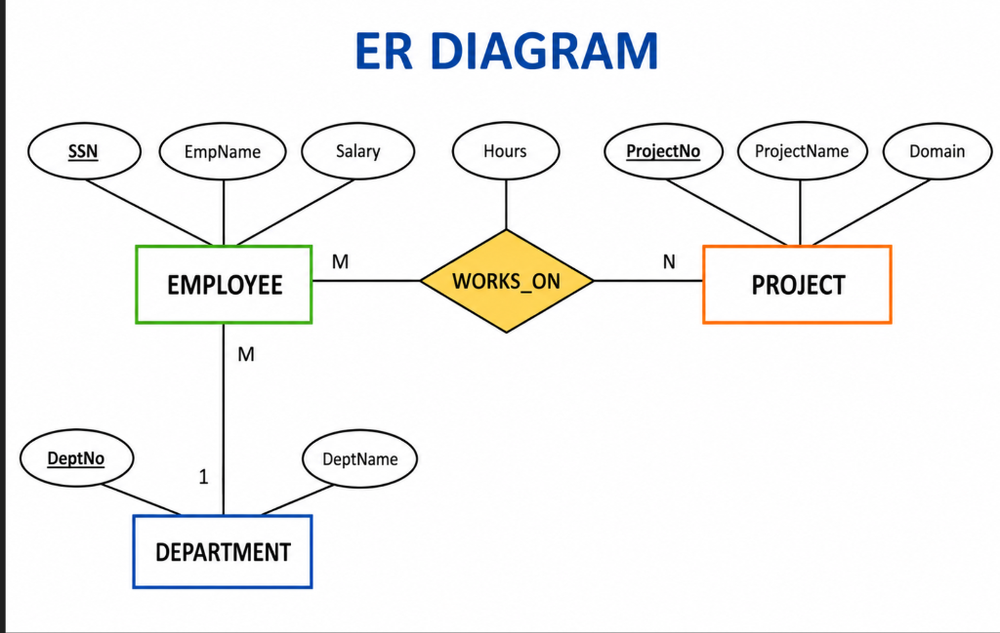
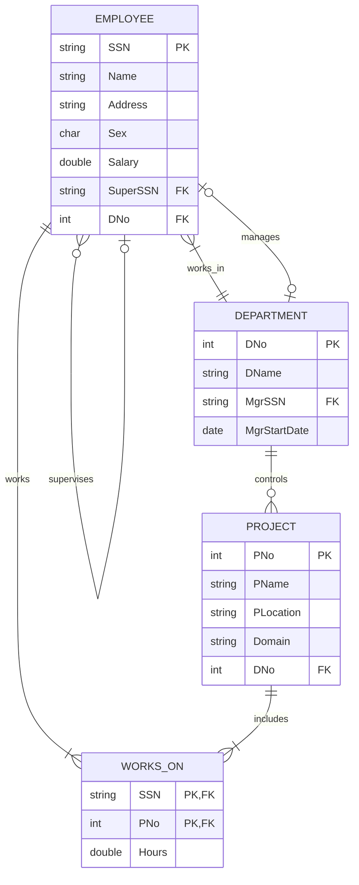
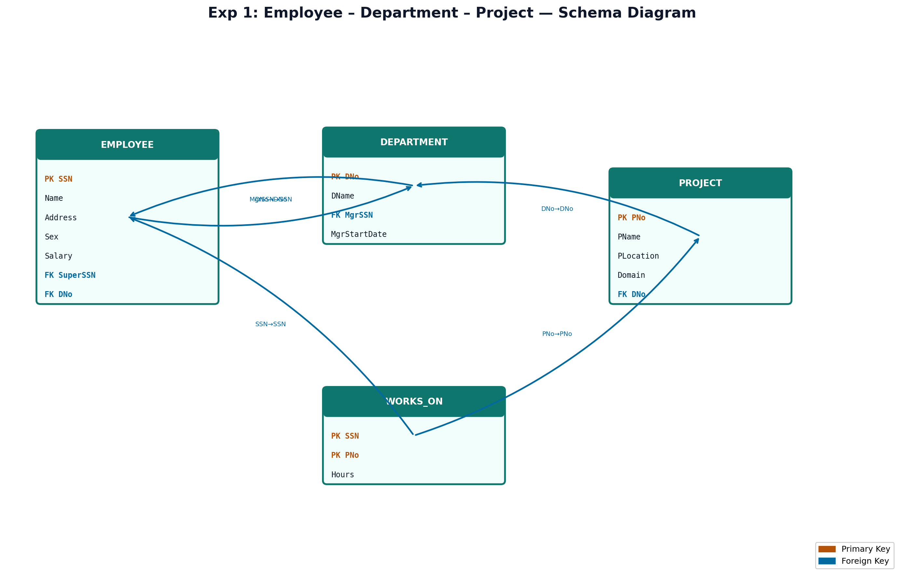

# EXPERIMENT NUMBER 1

## TITLE
Employee – Department – Project Database (Integrated SQL, MongoDB & PL/SQL)

---

## AIM
To design, implement, and query an Employee–Department–Project database schema using Oracle SQL (PART A) and MongoDB/PL/SQL (PART B), including ER mapping, constraint enforcement, document indexing, and PL/SQL procedural scripting.

---

## PROBLEM STATEMENT
An organization needs to manage its workforce, departments, and projects.
* Each employee is uniquely identified by a Social Security Number (SSN) and has a Name, Address, Gender, and Salary.
* A department has a unique Department Number (DNo), a name (DName), and is managed by an employee (Manager) with a specific manager start date.
* A project is identified by a unique Project Number (PNo) and has a Name, Location, Domain (e.g., Database, Cloud), and is controlled by a single department.
* Employees can work on multiple projects, with a specific number of hours allocated for each. An employee may also have a supervisor (another employee).
* Develop a database system to represent this scenario and perform the required operations in SQL, MongoDB, and PL/SQL.

---

## OBJECTIVES
1. Learn relational database modeling, schema definition, and referential integrity using SQL DDL/DML.
2. Master multi-table joins, aggregation (`GROUP BY`), and updates in SQL.
3. Implement document-based collections in MongoDB and write find queries using variables.
4. Implement procedural control flows and updates using PL/SQL anonymous blocks.

---

## THEORY
### Relational DBMS Concepts (SQL)
A Relational Database Management System (RDBMS) stores data in tables (relations) consisting of rows (tuples) and columns (attributes).
* **Entities**: `EMPLOYEE`, `DEPARTMENT`, and `PROJECT`.
* **Relationships**:
  * **Works_In** (Employee to Department): Many-to-One (N:1) relationship.
  * **Controls** (Department to Project): One-to-Many (1:N) relationship.
  * **Works_On** (Employee to Project): Many-to-Many (M:N) relationship.

### Document-Oriented DBMS Concepts (MongoDB)
MongoDB is a document-oriented NoSQL database. Data is stored as BSON (Binary JSON) documents inside collections.
* **Schema Design**: Referencing by `Dept_No` to represent relationships, and querying using find with criteria.
* **findOne**: Retrieves a matching document and stores it in a variable for query chaining.

### Procedural SQL (PL/SQL)
PL/SQL is Oracle's procedural extension to SQL. It allows executing procedural constructs (variables, conditionals, loops) alongside SQL DML.
* **SQL%ROWCOUNT**: An implicit cursor attribute that returns the number of rows affected by the most recent SQL DML statement.

---

## ENTITY IDENTIFICATION
| Entity Name | Attributes | Primary Key | Foreign Key(s) |
|---|---|---|---|
| **EMPLOYEE** | SSN, Name, Address, Sex, Salary, SuperSSN, DNo | SSN | SuperSSN (refs EMPLOYEE), DNo (refs DEPARTMENT) |
| **DEPARTMENT** | DNo, DName, MgrSSN, MgrStartDate | DNo | MgrSSN (refs EMPLOYEE) |
| **PROJECT** | PNo, PName, PLocation, Domain, DNo | PNo | DNo (refs DEPARTMENT) |
| **WORKS_ON** | SSN, PNo, Hours | (SSN, PNo) | SSN (refs EMPLOYEE), PNo (refs PROJECT) |

---

## CONSTRAINTS
* **Domain Constraints**:
  * `Sex` in `EMPLOYEE`: `CHECK (Sex IN ('M', 'F'))`
  * `Salary` in `EMPLOYEE`: `CHECK (Salary > 0)`
  * `Hours` in `WORKS_ON`: `CHECK (Hours > 0)`
* **Participation Constraints**:
  * Every employee must belong to a department (modeled by `DNo NOT NULL`).
* **Cardinality Ratios**:
  * Employee to Department: N:1
  * Department to Project: 1:N
  * Employee to Project: M:N

---

## ER DIAGRAM
### ER Diagram (Figure)


*Figure: Entity–Relationship diagram (Chen notation).*

### Mermaid Notation


---

## SCHEMA DIAGRAM
### Schema Diagram (Figure)


*Figure: Relational schema with referential links.*

---

## PART A — SQL IMPLEMENTATION

### DDL: Create Table Statements
```sql
DROP TABLE WORKS_ON CASCADE CONSTRAINTS;
DROP TABLE PROJECT CASCADE CONSTRAINTS;
DROP TABLE EMPLOYEE CASCADE CONSTRAINTS;
DROP TABLE DEPARTMENT CASCADE CONSTRAINTS;

CREATE TABLE Department(
    DeptNo NUMBER PRIMARY KEY,
    DeptName VARCHAR2(30) NOT NULL
);

CREATE TABLE Project(
    ProjectNo NUMBER PRIMARY KEY,
    ProjectName VARCHAR2(30) NOT NULL,
    Domain VARCHAR2(30)
);

CREATE TABLE Employee(
    SSN NUMBER PRIMARY KEY,
    EmpName VARCHAR2(30) NOT NULL,
    Salary NUMBER CHECK (Salary > 0),
    DeptNo NUMBER,
    ProjectNo NUMBER,
    FOREIGN KEY(DeptNo) REFERENCES Department(DeptNo),
    FOREIGN KEY(ProjectNo) REFERENCES Project(ProjectNo)
);

CREATE TABLE Works_On(
    SSN NUMBER,
    ProjectNo NUMBER,
    Hours NUMBER CHECK (Hours > 0),
    PRIMARY KEY(SSN, ProjectNo),
    FOREIGN KEY(SSN) REFERENCES Employee(SSN) ON DELETE CASCADE,
    FOREIGN KEY(ProjectNo) REFERENCES Project(ProjectNo) ON DELETE CASCADE
);
```

### DML: Insert Sample Data
```sql
INSERT INTO Department VALUES(10, 'CSE');
INSERT INTO Department VALUES(20, 'ISE');
INSERT INTO Department VALUES(30, 'ECE');

INSERT INTO Project VALUES(101, 'Library System', 'Database');
INSERT INTO Project VALUES(102, 'AWS Portal', 'Cloud');
INSERT INTO Project VALUES(103, 'ERP Software', 'Database');

INSERT INTO Employee VALUES(1001, 'Ananth', 50000, 10, 101);
INSERT INTO Employee VALUES(1002, 'Rahul', 55000, 10, 103);
INSERT INTO Employee VALUES(1003, 'Sneha', 60000, 20, 102);
INSERT INTO Employee VALUES(1004, 'Asha', 65000, 30, 101);

INSERT INTO Works_On VALUES(1001, 101, 20);
INSERT INTO Works_On VALUES(1002, 103, 40);
INSERT INTO Works_On VALUES(1003, 102, 30);
INSERT INTO Works_On VALUES(1004, 101, 25);
COMMIT;
```

### SQL Queries

#### i. Obtain the details of employees assigned to “Database” project.
```sql
SELECT E.SSN, E.EmpName, E.Salary, E.DeptNo, E.ProjectNo
FROM Employee E
JOIN Project P ON E.ProjectNo = P.ProjectNo
WHERE P.Domain = 'Database';
```
*Expected Output:*
| SSN | EmpName | Salary | DeptNo | ProjectNo |
|---|---|---|---|---|
| 1001 | Ananth | 50000 | 10 | 101 |
| 1002 | Rahul | 55000 | 10 | 103 |
| 1004 | Asha | 65000 | 30 | 101 |

#### ii. Find the number of employees working in each department with department details.
```sql
SELECT D.DeptNo, D.DeptName, COUNT(E.SSN) AS Employee_Count
FROM Department D
LEFT JOIN Employee E ON D.DeptNo = E.DeptNo
GROUP BY D.DeptNo, D.DeptName;
```
*Expected Output:*
| DeptNo | DeptName | Employee_Count |
|---|---|---|
| 10 | CSE | 2 |
| 20 | ISE | 1 |
| 30 | ECE | 1 |

#### iii. Update the Project details of Employee bearing SSN = 1001 to ProjectNo = 102 and display the same.
```sql
UPDATE Employee
SET ProjectNo = 102
WHERE SSN = 1001;

SELECT * FROM Employee WHERE SSN = 1001;
```
*Expected Output:*
| SSN | EmpName | Salary | DeptNo | ProjectNo |
|---|---|---|---|---|
| 1001 | Ananth | 50000 | 10 | 102 |

---

## PART B — NOSQL & PROCEDURAL IMPLEMENTATION

### MongoDB Implementation
```javascript
// Switch to Database
use company_db;

db.Employee.insertMany([
  { Emp_ID: 101, Emp_Name: "Ravi", Dept_No: 10, Salary: 50000, Project_No: "P101" },
  { Emp_ID: 102, Emp_Name: "Rani", Dept_No: 20, Salary: 60000, Project_No: "P102" },
  { Emp_ID: 103, Emp_Name: "Kushal", Dept_No: 10, Salary: 55000, Project_No: "P101" }
]);

db.Department.insertMany([
  { Dept_No: 10, Dept_Name: "HR" },
  { Dept_No: 20, Dept_Name: "IT" }
]);
```

#### Query i: List all the employees of Department named "HR".
```javascript
var dept = db.Department.findOne(
   { Dept_Name: "HR" }
);

db.Employee.find(
   { Dept_No: dept.Dept_No }
);
```
*Expected Output:*
```json
[
  {
    "_id": ObjectId("6a20078bbc1cfd02008ce5af"),
    "Emp_ID": 101,
    "Emp_Name": "Ravi",
    "Dept_No": 10,
    "Salary": 50000,
    "Project_No": "P101"
  },
  {
    "_id": ObjectId("6a20078bbc1cfd02008ce5b1"),
    "Emp_ID": 103,
    "Emp_Name": "Kushal",
    "Dept_No": 10,
    "Salary": 55000,
    "Project_No": "P101"
  }
]
```

#### Query ii: Name the employees working on Project Number: "P101".
```javascript
db.Employee.find(
  { Project_No: "P101" },
  { Emp_Name: 1, _id: 0 }
);
```
*Expected Output:*
```json
[
  { "Emp_Name": "Ravi" },
  { "Emp_Name": "Kushal" }
]
```

### PL/SQL Implementation
```sql
CREATE TABLE Employee (
    Emp_ID NUMBER(5) PRIMARY KEY,
    Emp_Name VARCHAR2(20),
    Dept_No NUMBER(8),
    Salary NUMBER(10)
);

INSERT INTO Employee VALUES (101, 'Ravi', 10, 50000);
INSERT INTO Employee VALUES (102, 'Anu', 20, 60000);
INSERT INTO Employee VALUES (103, 'Kiran', 10, 55000);
INSERT INTO Employee VALUES (104, 'Priya', 30, 45000);
COMMIT;

SET SERVEROUTPUT ON;
DECLARE
   v_count NUMBER;
BEGIN
   UPDATE Employee
   SET Salary = Salary * 1.15
   WHERE Dept_No = 10;

   v_count := SQL%ROWCOUNT;
   DBMS_OUTPUT.PUT_LINE(v_count || ' employees awarded 15% increase');
END;
/
```
*Expected Output:*
```text
2 employees awarded 15% increase
```

---

## VIVA QUESTIONS & ANSWERS
1. **Q: What is a schema?**
   * *A:* A schema is the logical description of a database structure, including its tables, columns, constraints, and data types.
2. **Q: What is the purpose of `findOne` in MongoDB?**
   * *A:* It returns the first document matching the query criteria, which can be stored in a variable for query chaining.
3. **Q: What is `SQL%ROWCOUNT`?**
   * *A:* It is a PL/SQL cursor attribute that returns the number of rows affected by the most recent SQL DML statement.
4. **Q: What are integrity constraints?**
   * *A:* Integrity constraints ensure accuracy and consistency of data (e.g. Primary Key, Foreign Key, Check constraints).
5. **Q: How does NoSQL differ from Relational databases?**
   * *A:* Relational databases use schemas and tables, whereas NoSQL (like MongoDB) uses flexible schema-less documents.

---

## RESULT
The Employee–Department–Project database was successfully designed and implemented in Oracle SQL and MongoDB, and the PL/SQL salary update logic was successfully completed.
