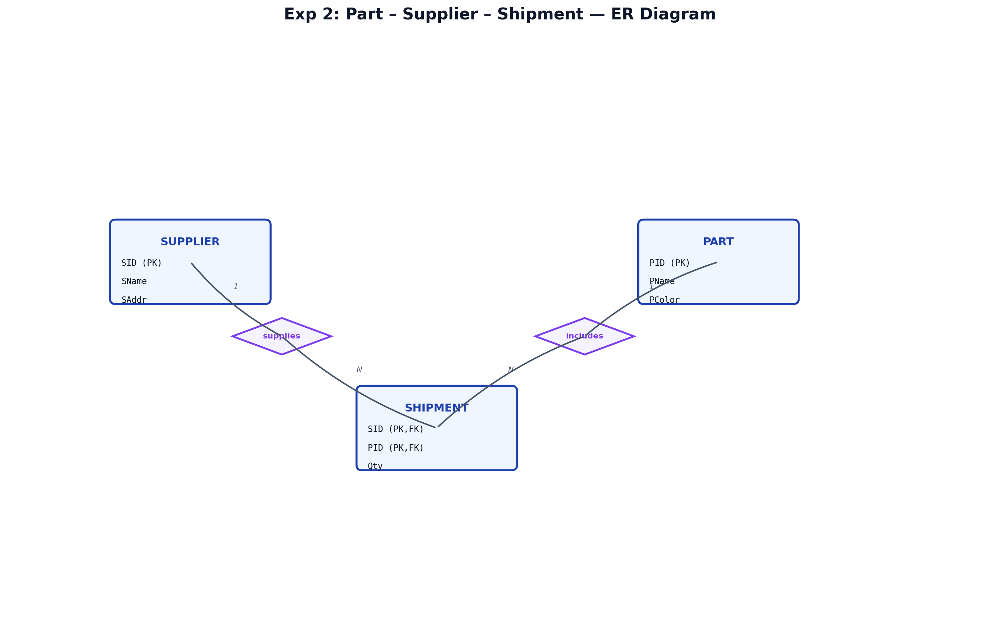
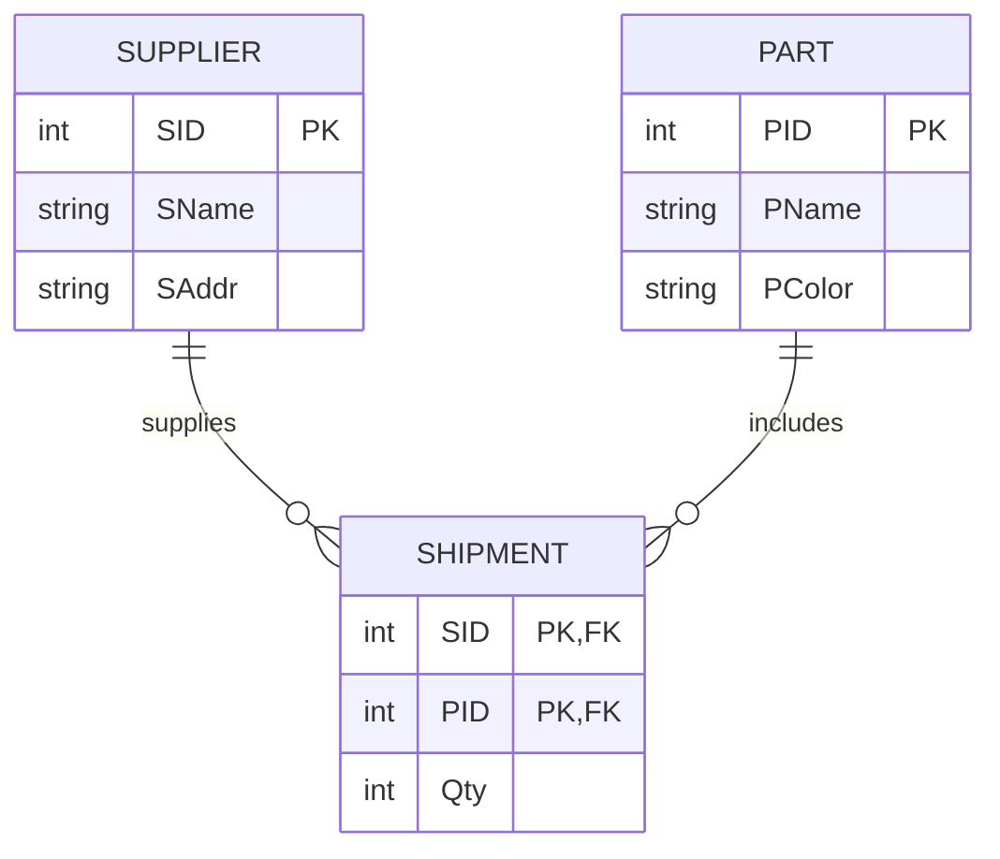
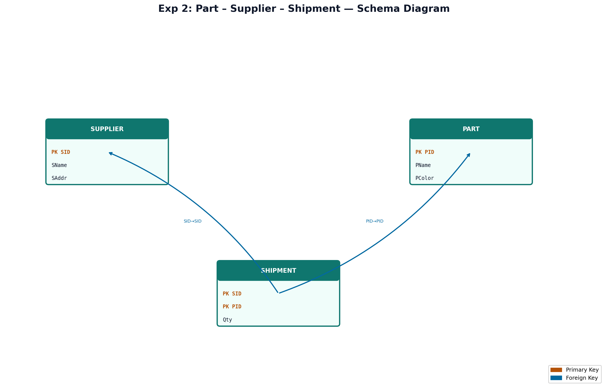

# EXPERIMENT NUMBER 2

## TITLE
Part, Supplier &amp; Shipment Database (Integrated SQL, MongoDB &amp; PL/SQL)

---

## AIM
To design, implement, and query a Part, Supplier, and Shipment (Supply) database schema using Oracle SQL (PART A) and MongoDB/PL/SQL (PART B), including constraint enforcement, update projection, and data copying using PL/SQL.

---

## PROBLEM STATEMENT
Consider the relations: PART, SUPPLIER and SUPPLY. The Supplier relation holds information about suppliers. The attributes SID, SNAME, SADDR describes the supplier. The Part relation holds the attributes such as PID, PNAME and PCOLOR. The Shipment relation holds information about shipments that include SID and PID attributes identifying the supplier of the shipment and the part shipped, respectively. The Shipment relation should contain information on the number of parts shipped.
Perform the required SQL, NoSQL, and PL/SQL operations.

---

## OBJECTIVES
1. Learn relational database modeling, composite primary keys, and referential integrity using SQL DDL/DML.
2. Master multi-table joins, subqueries, and deletion cascading in SQL.
3. Implement document collections in MongoDB, updates using `$set`, and projections using find filter.
4. Implement data replication/backup via PL/SQL anonymous blocks.

---

## THEORY
### Relational DBMS Concepts (SQL)
A Relational Database Management System (RDBMS) stores data in tables. In this schema, we model:
* **Entities**: `Supplier` (strong), `Part` (strong).
* **Relationships**:
  * **Shipment** (Supplier to Part): Many-to-Many (M:N) relationship. The composite primary key is `(SID, PID)`.

### Document-Oriented DBMS Concepts (MongoDB)
Data is stored as BSON documents inside collections.
* **updateOne**: Modifies existing documents matching filters.
* **Dot notation**: Evaluates matching fields directly to retrieve results.

### Procedural SQL (PL/SQL)
* **INSERT INTO ... SELECT**: Executes query and copies the output directly into another table.
* **SQL%ROWCOUNT**: Counts the number of rows inserted during the query copy.

---

## ENTITY IDENTIFICATION
| Entity Name | Attributes | Primary Key | Foreign Key(s) |
|---|---|---|---|
| **SUPPLIER** | SID, SName, SAddr | SID | - |
| **PART** | PID, PName, PColor | PID | - |
| **SHIPMENT** | SID, PID, Qty | (SID, PID) | SID (refs SUPPLIER), PID (refs PART) |

---

## CONSTRAINTS
* **Domain Constraints**:
  * `Qty` in `SHIPMENT`: `CHECK (Qty > 0)`
* **Entity Integrity**:
  * `SID` in `Supplier` and `PID` in `Part` must be unique and non-null.
* **Referential Integrity**:
  * `SID` and `PID` in `Shipment` reference the primary keys in their respective master tables.

---

## ER DIAGRAM
### ER Diagram (Figure)


*Figure: Entity–Relationship diagram (Chen notation).*

### Mermaid Notation


---

## SCHEMA DIAGRAM
### Schema Diagram (Figure)


*Figure: Relational schema with referential links.*

---

## PART A — SQL IMPLEMENTATION

### DDL: Create Table Statements
```sql
DROP TABLE Shipment CASCADE CONSTRAINTS;
DROP TABLE Part CASCADE CONSTRAINTS;
DROP TABLE Supplier CASCADE CONSTRAINTS;

CREATE TABLE Supplier(
    SID NUMBER PRIMARY KEY,
    SName VARCHAR2(30) NOT NULL,
    SAddr VARCHAR2(50)
);

CREATE TABLE Part(
    PID NUMBER PRIMARY KEY,
    PName VARCHAR2(30) NOT NULL,
    PColor VARCHAR2(20) NOT NULL
);

CREATE TABLE Shipment(
    SID NUMBER REFERENCES Supplier(SID) ON DELETE CASCADE,
    PID NUMBER REFERENCES Part(PID) ON DELETE CASCADE,
    Qty NUMBER CHECK (Qty > 0),
    PRIMARY KEY(SID, PID)
);
```

### DML: Insert Sample Data
```sql
INSERT INTO Supplier VALUES(1, 'Acme Corp', 'Bangalore');
INSERT INTO Supplier VALUES(2, 'Global Parts', 'Mumbai');
INSERT INTO Supplier VALUES(3, 'Titan Tools', 'Chennai');

INSERT INTO Part VALUES(101, 'Bolt', 'Red');
INSERT INTO Part VALUES(102, 'Nut', 'Blue');
INSERT INTO Part VALUES(103, 'Screw', 'Red');
INSERT INTO Part VALUES(104, 'Washer', 'Green');

INSERT INTO Shipment VALUES(1, 101, 500);
INSERT INTO Shipment VALUES(1, 102, 300);
INSERT INTO Shipment VALUES(2, 102, 1000);
INSERT INTO Shipment VALUES(3, 101, 200);
INSERT INTO Shipment VALUES(3, 103, 400);
COMMIT;
```

### SQL Queries

#### i. Obtain the details of parts supplied by supplier Acme Corp.
```sql
SELECT P.PID, P.PName, P.PColor, S.Qty
FROM Part P
JOIN Shipment S ON P.PID = S.PID
JOIN Supplier Sup ON S.SID = Sup.SID
WHERE Sup.SName = 'Acme Corp';
```
*Expected Output:*
| PID | PName | PColor | Qty |
|---|---|---|---|
| 101 | Bolt | Red | 500 |
| 102 | Nut | Blue | 300 |

#### ii. Obtain the Names of suppliers who supply Bolt.
```sql
SELECT Sup.SName
FROM Supplier Sup
JOIN Shipment S ON Sup.SID = S.SID
JOIN Part P ON S.PID = P.PID
WHERE P.PName = 'Bolt';
```
*Expected Output:*
| SName |
|---|
| Acme Corp |
| Titan Tools |

#### iii. Delete the parts which are in Red color.
```sql
DELETE FROM Part
WHERE PColor = 'Red';

SELECT * FROM Part;
```
*Expected Output:*
| PID | PName | PColor |
|---|---|---|
| 102 | Nut | Blue |
| 104 | Washer | Green |

---

## PART B — NOSQL & PROCEDURAL IMPLEMENTATION

### MongoDB Implementation
```javascript
// Switch to Database
use supply_db;

// Insert Part documents
db.Part.insertMany([
  { PID: "P1", PName: "Bolt", Price: 20 },
  { PID: "P2", PName: "Nut", Price: 10 }
]);

// Insert Supplier documents
db.Supplier.insertMany([
  { SID: 1, SName: "ABC Suppliers", PID: "P1" },
  { SID: 2, SName: "XYZ Suppliers", PID: "P1" },
  { SID: 3, SName: "Global Parts", PID: "P2" }
]);
```

#### Query i: Update the details of parts for a given part identifier: "P1".
```javascript
db.Part.updateOne(
  { PID: "P1" },
  { $set: { Price: 25 } }
);
```
*Expected Output:*
```json
{
  "acknowledged" : true,
  "insertedId" : null,
  "matchedCount" : 1,
  "modifiedCount" : 1,
  "upsertedCount" : 0
}
```

#### Query ii: Display all suppliers who supply the part with part identifier: "P1".
```javascript
db.Supplier.find(
  { PID: "P1" },
  { SName: 1, _id: 0 }
);
```
*Expected Output:*
```json
[ { "SName": "ABC Suppliers" }, { "SName": "XYZ Suppliers" } ]
```

### PL/SQL Implementation
```sql
CREATE TABLE Shipment (
    SID NUMBER(5),
    PID VARCHAR2(5),
    Qty NUMBER(5)
);

CREATE TABLE Shipment_Backup (
    SID NUMBER(5),
    PID VARCHAR2(5),
    Qty NUMBER(5)
);

INSERT INTO Shipment VALUES (101, 'P1', 50);
INSERT INTO Shipment VALUES (102, 'P2', 40);
INSERT INTO Shipment VALUES (103, 'P1', 30);
INSERT INTO Shipment VALUES (104, 'P3', 20);
COMMIT;

SET SERVEROUTPUT ON;
BEGIN
   INSERT INTO Shipment_Backup
   SELECT *
   FROM Shipment
   WHERE PID = 'P1';

   DBMS_OUTPUT.PUT_LINE('Records copied successfully');
END;
/
```
*Expected Output:*
```text
Records copied successfully
```

---

## VIVA QUESTIONS & ANSWERS
1. **Q: What is a composite primary key?**
   * *A:* A primary key composed of two or more columns, which together uniquely identify a record in a table.
2. **Q: What does `$set` do in MongoDB?**
   * *A:* It updates or adds fields with specified values in matched documents without replacing the whole document.
3. **Q: What is the benefit of using `ON DELETE CASCADE`?**
   * *A:* It maintains referential integrity automatically by deleting child records when the referenced parent record is deleted.
4. **Q: How do you perform updates in MongoDB?**
   * *A:* By using `updateOne()` or `updateMany()` with operators like `$set`.
5. **Q: Why use a backup table?**
   * *A:* Backup tables preserve data snapshots, allow recovery from unintended deletions, and create audit trails.

---

## RESULT
The Supplier, Part, and Shipment database was successfully implemented in Oracle SQL and MongoDB, and the PL/SQL program successfully copied records to the backup table.
