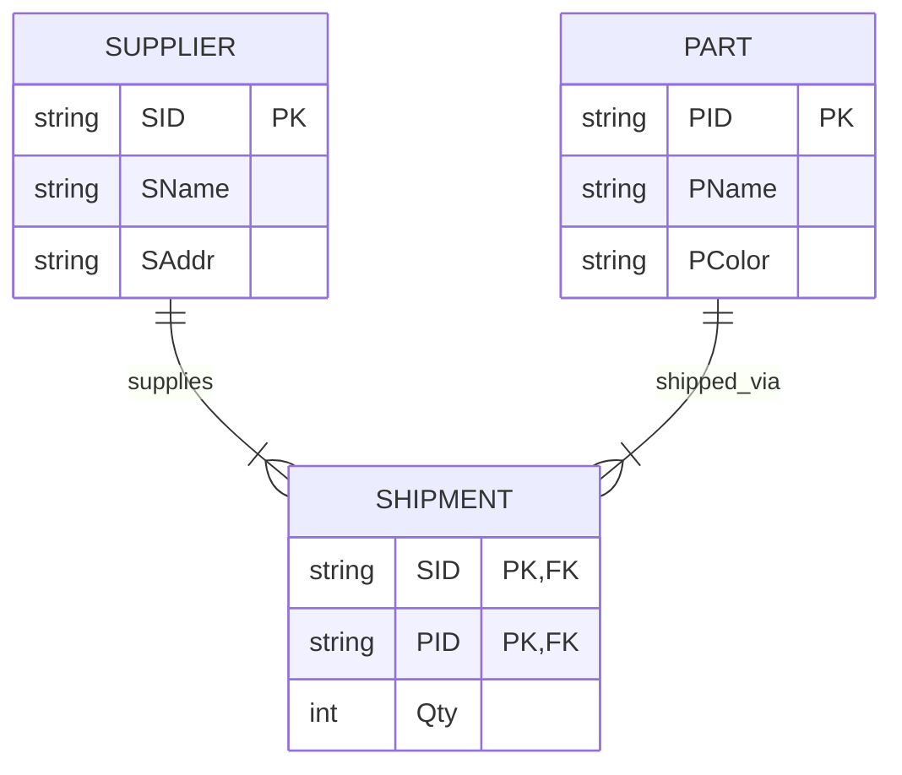

# EXPERIMENT NUMBER 2

## TITLE
Part – Supplier – Supply Database


---


## AIM
To design, implement, and query a Part-Supplier-Shipment database schema using Oracle SQL, including entity constraints, relationship management, and cascading delete operations.


---


## PROBLEM STATEMENT
A logistics tracking system needs to maintain information about suppliers, parts, and shipments:
* Each supplier is described by a unique Supplier ID (SID), Supplier Name (SName), and Address (SAddr).
* Each part has a unique Part ID (PID), Part Name (PName), and Color (PColor).
* The shipment table (Shipment/Supply) tracks the quantity (Qty) of a specific part supplied by a specific supplier.
Establish a relational database for this schema, enforce all key and reference constraints, and perform the following database operations:
i. Obtain the details of parts supplied by a specific supplier #SNAME.
ii. Obtain the names of suppliers who supply a specific part #PNAME.
iii. Delete parts of a specific color #PCOLOR and observe cascading effects.


---


## OBJECTIVES
1. Master relational modeling of M:N relationships using an intersection table (`SHIPMENT`).
2. Implement primary keys, foreign keys, and cascading delete operations (`ON DELETE CASCADE`).
3. Formulate SQL queries utilizing joins, string comparisons, and deletion tasks.


---


## THEORY
### DBMS Concepts Involved
This database models a supply chain database system containing two primary master tables and one mapping table:
* **Entities**:
  * `SUPPLIER`: Holds master information about suppliers.
  * `PART`: Holds master information about components/parts.
* **Relationship**:
  * `SHIPMENT` (Supply): An M:N relationship linking `SUPPLIER` and `PART` with an attribute `Qty` (Quantity). Each supplier can ship multiple parts, and each part can be shipped by multiple suppliers.

### ON DELETE CASCADE Constraint
When deleting a record from a master table (like `PART`), if there are references to it in a transaction table (like `SHIPMENT`), the database engine will reject the delete command by default to protect referential integrity.
By specifying `ON DELETE CASCADE` on the foreign key:
* If a `PART` (e.g., PID = 'P1') is deleted, the database automatically deletes all rows in `SHIPMENT` where `PID` = 'P1'.
* This prevents orphaned records in the `SHIPMENT` table.


---


## ENTITY IDENTIFICATION
| Entity Name | Attributes | Primary Key | Foreign Key(s) |
|---|---|---|---|
| **SUPPLIER** | SID, SName, SAddr | SID | None |
| **PART** | PID, PName, PColor | PID | None |
| **SHIPMENT** | SID, PID, Qty | (SID, PID) | SID (refs SUPPLIER), PID (refs PART) |


---


## CONSTRAINTS
* **Domain Constraints**:
  * `Qty` in `SHIPMENT`: `CHECK (Qty > 0)`
  * `PColor` in `PART`: `NOT NULL`
* **Referential Constraints**:
  * `SHIPMENT(SID)` references `SUPPLIER(SID)` with `ON DELETE CASCADE`
  * `SHIPMENT(PID)` references `PART(PID)` with `ON DELETE CASCADE`


---


## ER DIAGRAM


### ER Diagram (Figure)


*Figure: Entity–Relationship diagram (Chen notation). PK = Primary Key, FK = Foreign Key.*
*Figure: Entity–Relationship diagram (Chen notation). PK = Primary Key, FK = Foreign Key.*
### Mermaid Notation


### ASCII Diagram
```text
  +------------------+                   +------------------+
  |     SUPPLIER     |1                 1|       PART       |
  |------------------|                   |------------------|
  | SID (PK)         |                   | PID (PK)         |
  | SName, SAddr     |                   | PName, PColor    |
  +------------------+                   +------------------+
          |                                       |
          |1                                      |1
          |           +------------------+        |
          |           |     SHIPMENT     |        |
          +---------->|------------------|<-------+
           (supplies) | SID (PK, FK)     | (shipped_via)
                     N| PID (PK, FK)     |N
                      | Qty              |
                      +------------------+
```


---


## SCHEMA DIAGRAM


### Schema Diagram (Figure)


*Figure: Relational schema with referential links. Orange = PK, Blue = FK.*
*Figure: Relational schema with referential links. Orange = PK, Blue = FK.*
* **SUPPLIER** ( [SID] (PK), SName, SAddr )
* **PART** ( [PID] (PK), PName, PColor )
* **SHIPMENT** ( [SID] (PK, FK1), [PID] (PK, FK2), Qty )


---


## RELATIONAL MODEL
* **SUPPLIER**: `SID` uniquely identifies a supplier.
* **PART**: `PID` uniquely identifies a part.
* **SHIPMENT**: The key is `(SID, PID)`. `SID` references `SUPPLIER(SID)` and `PID` references `PART(PID)`. Both have cascade delete rules enabled.


---


## SQL IMPLEMENTATION
```sql
-- Dropping tables to ensure clean runs
DROP TABLE SHIPMENT CASCADE CONSTRAINTS;
DROP TABLE PART CASCADE CONSTRAINTS;
DROP TABLE SUPPLIER CASCADE CONSTRAINTS;

-- 1. Create Supplier table
CREATE TABLE SUPPLIER (
    SID CHAR(5) PRIMARY KEY,
    SName VARCHAR2(50) NOT NULL,
    SAddr VARCHAR2(100) NOT NULL
);

-- 2. Create Part table
CREATE TABLE PART (
    PID CHAR(5) PRIMARY KEY,
    PName VARCHAR2(50) NOT NULL,
    PColor VARCHAR2(20) NOT NULL
);

-- 3. Create Shipment table with cascading deletes
CREATE TABLE SHIPMENT (
    SID CHAR(5) REFERENCES SUPPLIER(SID) ON DELETE CASCADE,
    PID CHAR(5) REFERENCES PART(PID) ON DELETE CASCADE,
    Qty INT CHECK (Qty > 0),
    PRIMARY KEY (SID, PID)
);

-- Inserting Supplier Records (10+ records)
INSERT INTO SUPPLIER VALUES ('S001', 'Acme Corp', '12 Industry Way, Mumbai');
INSERT INTO SUPPLIER VALUES ('S002', 'Global Parts Ltd', '45 Science Park, Bangalore');
INSERT INTO SUPPLIER VALUES ('S003', 'Apex Industries', '78 Heavy Zone, Chennai');
INSERT INTO SUPPLIER VALUES ('S004', 'Zenith Supply', '99 Metro St, Delhi');
INSERT INTO SUPPLIER VALUES ('S005', 'Matrix Logistical', '101 Cyber Link, Hyderabad');
INSERT INTO SUPPLIER VALUES ('S006', 'Vortex Manufacturing', '505 Ring Rd, Pune');
INSERT INTO SUPPLIER VALUES ('S007', 'Titan Tools', '88 Factory Lane, Bangalore');
INSERT INTO SUPPLIER VALUES ('S008', 'Alpha Distributing', '14 Ocean Blvd, Cochin');
INSERT INTO SUPPLIER VALUES ('S009', 'Prime Logistics', '27 Highway Ave, Kolkata');
INSERT INTO SUPPLIER VALUES ('S010', 'Delta Supplies', '40 Park St, Noida');

-- Inserting Part Records (10+ records)
INSERT INTO PART VALUES ('P001', 'Gear', 'Red');
INSERT INTO PART VALUES ('P002', 'Bolt', 'Blue');
INSERT INTO PART VALUES ('P003', 'Nut', 'Black');
INSERT INTO PART VALUES ('P004', 'Screw', 'Red');
INSERT INTO PART VALUES ('P005', 'Washer', 'Silver');
INSERT INTO PART VALUES ('P006', 'Bracket', 'Black');
INSERT INTO PART VALUES ('P007', 'Pin', 'Silver');
INSERT INTO PART VALUES ('P008', 'Shaft', 'Blue');
INSERT INTO PART VALUES ('P009', 'Valve', 'Green');
INSERT INTO PART VALUES ('P010', 'Spring', 'Silver');

-- Inserting Shipment Records (12+ records)
INSERT INTO SHIPMENT VALUES ('S001', 'P001', 500);
INSERT INTO SHIPMENT VALUES ('S001', 'P002', 300);
INSERT INTO SHIPMENT VALUES ('S002', 'P002', 1000);
INSERT INTO SHIPMENT VALUES ('S002', 'P003', 1500);
INSERT INTO SHIPMENT VALUES ('S003', 'P001', 200);
INSERT INTO SHIPMENT VALUES ('S003', 'P004', 800);
INSERT INTO SHIPMENT VALUES ('S004', 'P005', 2500);
INSERT INTO SHIPMENT VALUES ('S005', 'P006', 400);
INSERT INTO SHIPMENT VALUES ('S006', 'P007', 600);
INSERT INTO SHIPMENT VALUES ('S007', 'P001', 1200);
INSERT INTO SHIPMENT VALUES ('S007', 'P008', 350);
INSERT INTO SHIPMENT VALUES ('S008', 'P009', 100);
INSERT INTO SHIPMENT VALUES ('S009', 'P010', 900);
INSERT INTO SHIPMENT VALUES ('S010', 'P001', 450);
INSERT INTO SHIPMENT VALUES ('S010', 'P004', 600);
```


---


## QUERY IMPLEMENTATION

### i. Obtain the details of parts supplied by supplier 'Acme Corp'.
#### SQL:
```sql
SELECT P.PID, P.PName, P.PColor, S.Qty 
FROM PART P
JOIN SHIPMENT S ON P.PID = S.PID
JOIN SUPPLIER SU ON S.SID = SU.SID
WHERE SU.SName = 'Acme Corp';
```
#### Explanation:
We perform an inner join between `PART`, `SHIPMENT`, and `SUPPLIER` using their primary/foreign key connections (`PID` and `SID`). Then we filter the records where the supplier's name is 'Acme Corp' and display the parts.
#### Expected Output:
| PID | PName | PColor | Qty |
|---|---|---|---|
| P001 | Gear | Red | 500 |
| P002 | Bolt | Blue | 300 |


---


### ii. Obtain the Names of suppliers who supply 'Gear'.
#### SQL:
```sql
SELECT DISTINCT SU.SName, SU.SAddr
FROM SUPPLIER SU
JOIN SHIPMENT S ON SU.SID = S.SID
JOIN PART P ON S.PID = P.PID
WHERE P.PName = 'Gear';
```
#### Explanation:
By joining `SUPPLIER`, `SHIPMENT`, and `PART`, we filter the joined tuples for part names matching 'Gear'. We project only the supplier's name and address.
#### Expected Output:
| SName | SAddr |
|---|---|
| Acme Corp | 12 Industry Way, Mumbai |
| Apex Industries | 78 Heavy Zone, Chennai |
| Titan Tools | 88 Factory Lane, Bangalore |
| Delta Supplies | 40 Park St, Noida |


---


### iii. Delete the parts which are in 'Red'.
#### SQL:
```sql
-- Check shipments before deletion
SELECT * FROM SHIPMENT WHERE PID IN (SELECT PID FROM PART WHERE PColor = 'Red');

-- Perform deletion
DELETE FROM PART WHERE PColor = 'Red';

-- Verify shipments after deletion (should be empty due to CASCADE)
SELECT * FROM SHIPMENT WHERE PID IN (SELECT PID FROM PART WHERE PColor = 'Red');

-- Verify Part Table
SELECT * FROM PART;
```
#### Explanation:
First, we observe which shipments exist for Red parts ('P001', 'P004'). When we issue the `DELETE` query against `PART` where the color is 'Red', the database engine automatically fires cascades, deleting those related records in the `SHIPMENT` table.
#### Expected Output (Verification):
`0 rows selected` from shipment verification query, confirming Cascade Delete worked successfully.
Part table listing:
| PID | PName | PColor |
|---|---|---|
| P002 | Bolt | Blue |
| P003 | Nut | Black |
| P005 | Washer | Silver |
| P006 | Bracket | Black |
| P007 | Pin | Silver |
| P008 | Shaft | Blue |
| P009 | Valve | Green |
| P010 | Spring | Silver |


---


## VIVA QUESTIONS & ANSWERS
1. **Q:** What is the relational database term for a row and a column?
   * **A:** A row is called a "tuple" and a column is called an "attribute".
2. **Q:** What is the difference between `DELETE` and `TRUNCATE`?
   * **A:** `DELETE` is a DML command that can be rolled back and deletes rows based on conditions, firing triggers. `TRUNCATE` is a DDL command that deallocates data pages, is faster, cannot have a WHERE clause, and doesn't fire delete triggers.
3. **Q:** What is referential integrity?
   * **A:** It requires that any foreign key column value must match an existing primary key value in the parent table.
4. **Q:** What are the alternatives to `ON DELETE CASCADE`?
   * **A:** `ON DELETE SET NULL` (sets the foreign key columns to NULL) and `RESTRICT`/`NO ACTION` (rejects the delete operation).
5. **Q:** What is a composite key?
   * **A:** A key that consists of two or more attributes to uniquely identify a record.
6. **Q:** How do we write a pattern matching query in SQL?
   * **A:** Using the `LIKE` operator along with wildcards `%` (zero or more characters) and `_` (exactly one character).
7. **Q:** Can a foreign key reference a non-primary key?
   * **A:** Yes, but it must reference a column that has a `UNIQUE` constraint on it.
8. **Q:** What is the difference between `INNER JOIN` and `OUTER JOIN`?
   * **A:** `INNER JOIN` returns rows with matching values in both tables. `OUTER JOIN` returns matching rows plus unmatched rows from one or both tables (Left, Right, or Full).
9. **Q:** What are the properties of a transaction (ACID)?
   * **A:** Atomicity, Consistency, Isolation, and Durability.
10. **Q:** What is a natural join?
    * **A:** A join that joins tables based on columns with the same name and data type in both tables.
11. **Q:** What is the purpose of the `COMMIT` statement?
    * **A:** It permanently saves all database changes made during the current transaction.
12. **Q:** What is the role of a database catalog?
    * **A:** It store metadata containing details about the structures, files, relationships, and constraints of the database.
13. **Q:** Can we have duplicate records in a table with a primary key?
    * **A:** No, primary keys guarantee row uniqueness.
14. **Q:** What is the use of the `IN` operator?
    * **A:** It allows checking if a value matches any value in a specified list or subquery.
15. **Q:** What does `CASCADE` mean?
    * **A:** It means the change (delete or update) propagates dynamically to all dependent tables.


---


## LAB EXAM QUESTIONS
1. Write a query to find the total quantity of all parts shipped by supplier 'S001'.
2. List the names of suppliers who do not supply any parts.
3. Find the part with the maximum quantity shipped in a single order.
4. Display suppliers who reside in 'Bangalore'.
5. Obtain the number of parts supplied of each color.
6. Display part details that have never been shipped.
7. Write a query to increase shipment quantity by 10% for supplier 'S002' and part 'P002'.
8. Find suppliers who supply more than 2 parts.
9. List the details of parts whose colors are either Red or Blue.
10. Show how to drop the foreign key constraint on the `SHIPMENT` table.


---


## RESULT
The Part-Supplier-Shipment database was successfully created, populated with 10+ records, and verified. Deleting red parts successfully triggered cascading deletes in the shipment table as expected.
