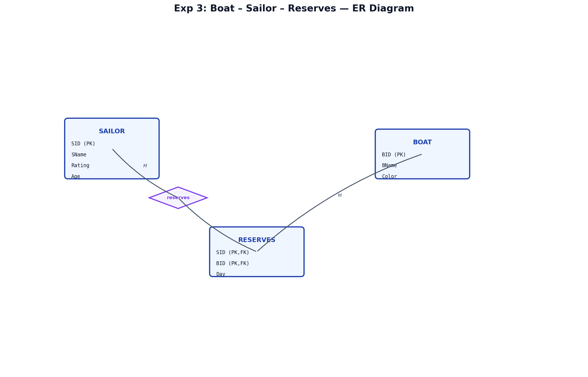
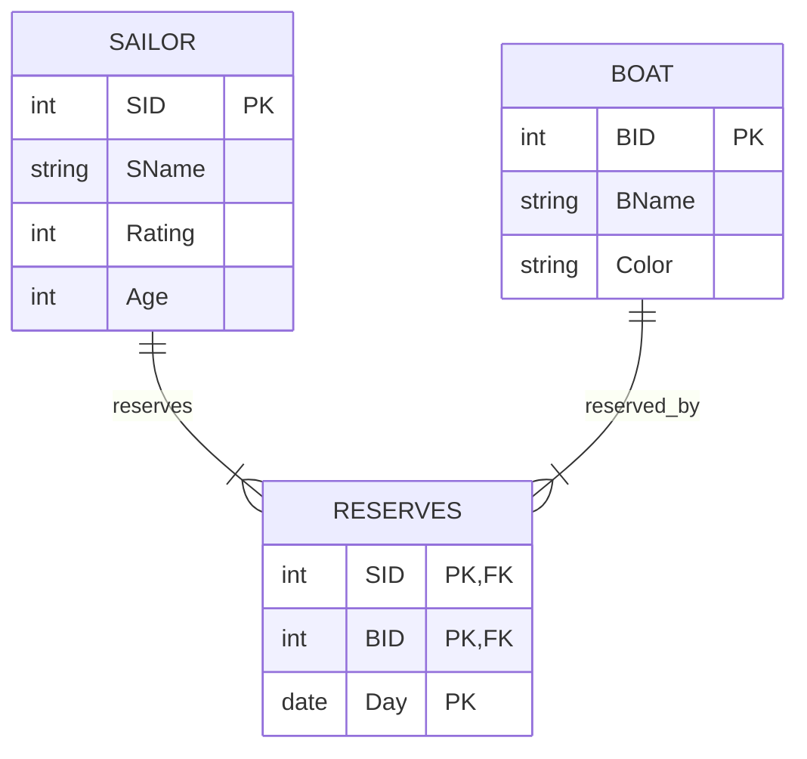
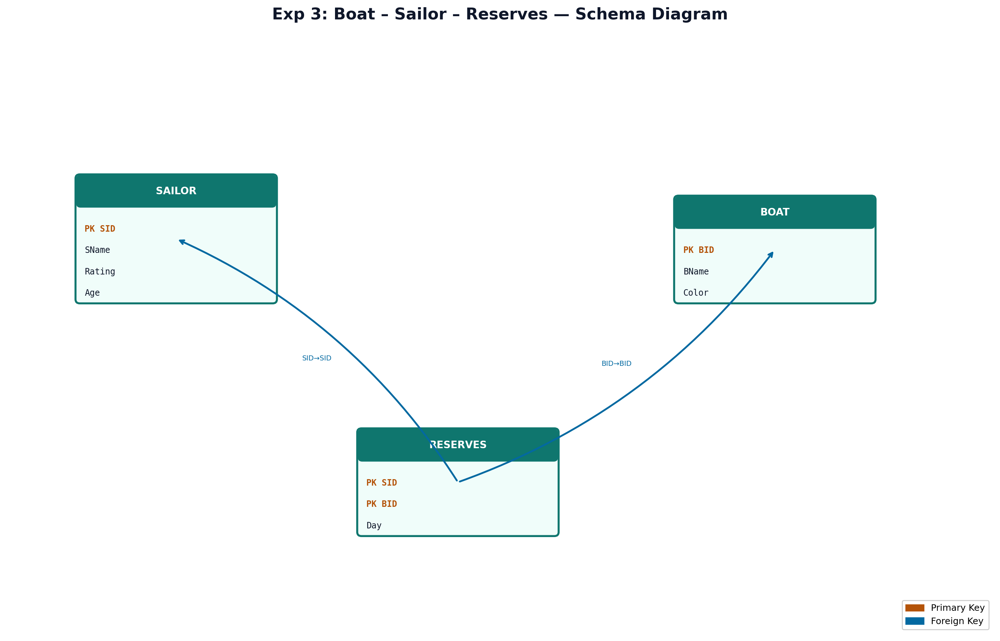

# EXPERIMENT NUMBER 3

## TITLE
Boat – Sailor – Reserves Database


---


## AIM
To design, implement, and query a Boat-Sailor-Reserves schema using Oracle SQL, and perform relational division queries, reserves calculations, and group aggregations.


---


## PROBLEM STATEMENT
A yacht club needs a database to keep track of its operations:
* Each sailor has a unique Sailor ID (SID), Name (SName), Rating (an integer representing skill), and Age.
* Each boat is identified by a unique Boat ID (BID), Boat Name (BName), and Color.
* The reservation system (Reserves) logs reservations by recording which sailor (SID) reserved which boat (BID) on which Day (Date).
Establish a relational database, apply constraints, and write SQL queries to:
i. Obtain the details of boats reserved by a specific sailor #Sailor_Name.
ii. Retrieve the BID of boats that have been reserved by ALL sailors (Relational Division).
iii. Find the total number of boats reserved by each sailor, displaying the sailor's name with their reservation count.


---


## OBJECTIVES
1. Implement M:N relationships containing composite primary keys and date columns.
2. Master the concept of **Relational Division** in SQL using double `NOT EXISTS` or `MINUS` set operations.
3. Use aggregation (`GROUP BY` and `COUNT`) with `LEFT JOIN` to avoid omitting sailors with zero reservations.


---


## THEORY
### DBMS Concepts Involved
This schema manages yacht rental activities.
* **Entities**:
  * `SAILOR`: Strong entity storing member information (rating, age).
  * `BOAT`: Strong entity storing fleet data.
* **Relationships**:
  * `RESERVES`: Many-to-Many mapping table recording date-stamped boat rentals.

### Relational Division
Relational division (R ÷ S) is a relational algebra operation that finds values in one relation that are associated with all values in another relation. In SQL, there is no direct `DIVIDE BY` operator. Instead, we implement it using:
1. **Double Negation (Double NOT EXISTS)**: "Find boats where there does not exist a sailor for whom there does not exist a reservation of this boat."
2. **Set Differences (MINUS)**: "Find boats where the set of all sailors MINUS the set of sailors who reserved this boat is empty."


---


## ENTITY IDENTIFICATION
| Entity Name | Attributes | Primary Key | Foreign Key(s) |
|---|---|---|---|
| **SAILOR** | SID, SName, Rating, Age | SID | None |
| **BOAT** | BID, BName, Color | BID | None |
| **RESERVES** | SID, BID, Day | (SID, BID, Day) | SID (refs SAILOR), BID (refs BOAT) |


---


## CONSTRAINTS
* **Domain Constraints**:
  * `Rating` in `SAILOR`: `CHECK (Rating BETWEEN 1 AND 10)`
  * `Age` in `SAILOR`: `CHECK (Age > 0)`
* **Key Constraints**:
  * The primary key of `RESERVES` is `(SID, BID, Day)` to allow the same sailor to reserve the same boat on different days.


---


## ER DIAGRAM


### ER Diagram (Figure)


*Figure: Entity–Relationship diagram (Chen notation). PK = Primary Key, FK = Foreign Key.*
*Figure: Entity–Relationship diagram (Chen notation). PK = Primary Key, FK = Foreign Key.*
### Mermaid Notation


### ASCII Diagram
```text
  +------------------+                   +------------------+
  |      SAILOR      |1                 1|       BOAT       |
  |------------------|                   |------------------|
  | SID (PK)         |                   | BID (PK)         |
  | SName, Rating    |                   | BName, Color     |
  | Age              |                   +------------------+
  +------------------+                            |
           |                                      |
           |1                                     |1
           |           +------------------+       |
           |           |     RESERVES     |       |
           +---------->|------------------|<------+
            (reserves) | SID (PK, FK)     | (reserved_by)
                      N| BID (PK, FK)     |N
                       | Day (PK)         |
                       +------------------+
```


---


## SCHEMA DIAGRAM


### Schema Diagram (Figure)


*Figure: Relational schema with referential links. Orange = PK, Blue = FK.*
*Figure: Relational schema with referential links. Orange = PK, Blue = FK.*
* **SAILOR** ( [SID] (PK), SName, Rating, Age )
* **BOAT** ( [BID] (PK), BName, Color )
* **RESERVES** ( [SID] (PK, FK1), [BID] (PK, FK2), [Day] (PK) )


---


## RELATIONAL MODEL
* **SAILOR**: Primary key is `SID`.
* **BOAT**: Primary key is `BID`.
* **RESERVES**: Composite primary key `(SID, BID, Day)`. If `Day` is not part of the primary key, a sailor could only reserve a specific boat once in the entire system history.


---


## SQL IMPLEMENTATION
```sql
-- Dropping tables to ensure clean runs
DROP TABLE RESERVES CASCADE CONSTRAINTS;
DROP TABLE BOAT CASCADE CONSTRAINTS;
DROP TABLE SAILOR CASCADE CONSTRAINTS;

-- 1. Create Sailor table
CREATE TABLE SAILOR (
    SID INT PRIMARY KEY,
    SName VARCHAR2(50) NOT NULL,
    Rating INT CHECK (Rating BETWEEN 1 AND 10),
    Age INT CHECK (Age > 0)
);

-- 2. Create Boat table
CREATE TABLE BOAT (
    BID INT PRIMARY KEY,
    BName VARCHAR2(50) NOT NULL,
    Color VARCHAR2(20) NOT NULL
);

-- 3. Create Reserves table
CREATE TABLE RESERVES (
    SID INT REFERENCES SAILOR(SID) ON DELETE CASCADE,
    BID INT REFERENCES BOAT(BID) ON DELETE CASCADE,
    Day DATE,
    PRIMARY KEY (SID, BID, Day)
);

-- Inserting Sailor Records (10+ records)
INSERT INTO SAILOR VALUES (1001, 'Dustin', 7, 45);
INSERT INTO SAILOR VALUES (1002, 'Brutus', 1, 33);
INSERT INTO SAILOR VALUES (1003, 'Lubber', 8, 55);
INSERT INTO SAILOR VALUES (1004, 'Andy', 8, 25);
INSERT INTO SAILOR VALUES (1005, 'Rusty', 10, 35);
INSERT INTO SAILOR VALUES (1006, 'Horatio', 7, 16);
INSERT INTO SAILOR VALUES (1007, 'Zorba', 10, 16);
INSERT INTO SAILOR VALUES (1008, 'Art', 3, 25);
INSERT INTO SAILOR VALUES (1009, 'Bob', 9, 29);
INSERT INTO SAILOR VALUES (1010, 'Alice', 9, 28);

-- Inserting Boat Records (5+ records)
INSERT INTO BOAT VALUES (101, 'Interlake', 'Blue');
INSERT INTO BOAT VALUES (102, 'Interlake', 'Red');
INSERT INTO BOAT VALUES (103, 'Clipper', 'Green');
INSERT INTO BOAT VALUES (104, 'Marine', 'Red');
INSERT INTO BOAT VALUES (105, 'Enterprise', 'Blue');

-- Inserting Reserves Records (15+ records)
-- Let's make Boat 103 reserved by ALL 10 sailors for division testing
INSERT INTO RESERVES VALUES (1001, 103, TO_DATE('2026-05-01', 'YYYY-MM-DD'));
INSERT INTO RESERVES VALUES (1002, 103, TO_DATE('2026-05-01', 'YYYY-MM-DD'));
INSERT INTO RESERVES VALUES (1003, 103, TO_DATE('2026-05-01', 'YYYY-MM-DD'));
INSERT INTO RESERVES VALUES (1004, 103, TO_DATE('2026-05-02', 'YYYY-MM-DD'));
INSERT INTO RESERVES VALUES (1005, 103, TO_DATE('2026-05-03', 'YYYY-MM-DD'));
INSERT INTO RESERVES VALUES (1006, 103, TO_DATE('2026-05-04', 'YYYY-MM-DD'));
INSERT INTO RESERVES VALUES (1007, 103, TO_DATE('2026-05-04', 'YYYY-MM-DD'));
INSERT INTO RESERVES VALUES (1008, 103, TO_DATE('2026-05-05', 'YYYY-MM-DD'));
INSERT INTO RESERVES VALUES (1009, 103, TO_DATE('2026-05-05', 'YYYY-MM-DD'));
INSERT INTO RESERVES VALUES (1010, 103, TO_DATE('2026-05-06', 'YYYY-MM-DD'));

-- Other reservations
INSERT INTO RESERVES VALUES (1001, 101, TO_DATE('2026-05-10', 'YYYY-MM-DD'));
INSERT INTO RESERVES VALUES (1001, 102, TO_DATE('2026-05-11', 'YYYY-MM-DD'));
INSERT INTO RESERVES VALUES (1002, 102, TO_DATE('2026-05-12', 'YYYY-MM-DD'));
INSERT INTO RESERVES VALUES (1004, 101, TO_DATE('2026-05-15', 'YYYY-MM-DD'));
INSERT INTO RESERVES VALUES (1005, 105, TO_DATE('2026-05-16', 'YYYY-MM-DD'));
INSERT INTO RESERVES VALUES (1006, 102, TO_DATE('2026-05-17', 'YYYY-MM-DD'));
```


---


## QUERY IMPLEMENTATION

### i. Obtain the details of the boats reserved by 'Dustin'.
#### SQL:
```sql
SELECT B.BID, B.BName, B.Color, R.Day
FROM BOAT B
JOIN RESERVES R ON B.BID = R.BID
JOIN SAILOR S ON R.SID = S.SID
WHERE S.SName = 'Dustin';
```
#### Explanation:
We join the `BOAT`, `RESERVES`, and `SAILOR` tables and filter using the condition `S.SName = 'Dustin'`.
#### Expected Output:
| BID | BName | Color | Day |
|---|---|---|---|
| 103 | Clipper | Green | 01-MAY-26 |
| 101 | Interlake | Blue | 10-MAY-26 |
| 102 | Interlake | Red | 11-MAY-26 |


---


### ii. Retrieve the BID of the boats reserved necessarily by all the sailors.
#### SQL (Using NOT EXISTS Division):
```sql
SELECT B.BID, B.BName
FROM BOAT B
WHERE NOT EXISTS (
    SELECT S.SID 
    FROM SAILOR S
    WHERE NOT EXISTS (
        SELECT R.SID 
        FROM RESERVES R
        WHERE R.BID = B.BID AND R.SID = S.SID
    )
);
```
#### SQL (Using MINUS Division):
```sql
SELECT B.BID, B.BName
FROM BOAT B
WHERE NOT EXISTS (
    SELECT S.SID FROM SAILOR S
    MINUS
    SELECT R.SID FROM RESERVES R WHERE R.BID = B.BID
);
```
#### Explanation:
The division query identifies a boat where there is zero sailors who haven't reserved it. The `MINUS` query takes the set of all sailors and subtracts the set of sailors who have reserved boat `B.BID`. If this difference is empty (`NOT EXISTS`), it means all sailors have reserved that boat.
#### Expected Output:
| BID | BName |
|---|---|
| 103 | Clipper |


---


### iii. Find the number of boats reserved by each sailor. Display the Sailor_Name along with the number of boats reserved.
#### SQL:
```sql
SELECT S.SID, S.SName, COUNT(R.BID) AS Total_Reservations
FROM SAILOR S
LEFT JOIN RESERVES R ON S.SID = R.SID
GROUP BY S.SID, S.SName
ORDER BY Total_Reservations DESC;
```
#### Explanation:
We use a `LEFT JOIN` starting from the `SAILOR` table so that sailors who have never reserved a boat (like `1003` if they didn't reserve 103, but in our case, everyone reserved 103 so count is at least 1) are still listed with a count of 0. We group the results by the sailor's primary identifier and name.
#### Expected Output:
| SID | SName | Total_Reservations |
|---|---|---|
| 1001 | Dustin | 3 |
| 1002 | Brutus | 2 |
| 1004 | Andy | 2 |
| 1005 | Rusty | 2 |
| 1006 | Horatio | 2 |
| 1007 | Zorba | 1 |
| 1003 | Lubber | 1 |
| 1008 | Art | 1 |
| 1009 | Bob | 1 |
| 1010 | Alice | 1 |


---


## VIVA QUESTIONS & ANSWERS
1. **Q:** What is relational division?
   * **A:** It is a binary operator in relational algebra used to express queries involving the phrase "for all" or "every".
2. **Q:** How is relational division represented in relational algebra?
   * **A:** By the division symbol (÷). `R ÷ S` yields all values of attributes in R but not in S that are associated with all tuples in S.
3. **Q:** Why do we use `LEFT JOIN` in aggregation queries?
   * **A:** To ensure that rows from the left table (e.g., `SAILOR`) are not discarded even if they have no matching records in the right table (e.g., `RESERVES`).
4. **Q:** What happens if `Day` is omitted from the primary key of `RESERVES`?
   * **A:** A sailor would be restricted to reserving a specific boat at most once ever.
5. **Q:** How does `MINUS` operator work?
   * **A:** It returns all unique rows from the first query that are not present in the second query.
6. **Q:** Is `DATE` a standard data type in Oracle?
   * **A:** Yes, it stores both date and time information.
7. **Q:** What is the difference between `COUNT(*)` and `COUNT(column_name)`?
   * **A:** `COUNT(*)` counts all rows including NULLs, whereas `COUNT(column_name)` counts only non-NULL values in that column.
8. **Q:** What is the purpose of `GROUP BY`?
   * **A:** To partition the table rows into groups based on matching values in the grouping columns, allowing aggregate operations per group.
9. **Q:** Can we use alias names in the `WHERE` clause?
   * **A:** No, because the `WHERE` clause is evaluated before select list expressions.
10. **Q:** What does double negation represent logically?
    * **A:** $orall x P(x) \equiv 
eg \exists x 
eg P(x)$ ("For all x, P(x)" is logically equivalent to "There does not exist x for which P(x) is false").
11. **Q:** How do you insert a date value in Oracle?
    * **A:** Using the `TO_DATE` function or using date literals (e.g., `DATE '2026-05-01'`).
12. **Q:** What is referential integrity in this schema?
    * **A:** Ensuring `SID` in `RESERVES` exists in `SAILOR` and `BID` in `RESERVES` exists in `BOAT`.
13. **Q:** What is the rating check constraint in this schema?
    * **A:** `Rating CHECK (Rating BETWEEN 1 AND 10)`.
14. **Q:** Does Oracle support the `LIMIT` clause?
    * **A:** In older versions, we use `ROWNUM` or `FETCH FIRST n ROWS ONLY` in Oracle 12c+.
15. **Q:** What is a weak entity?
    * **A:** An entity that does not have a primary key of its own and depends on a parent identifying entity for its existence.


---


## LAB EXAM QUESTIONS
1. Find the names of sailors who have reserved a Red or Green boat.
2. Find the names of sailors who have reserved at least two boats.
3. List the BIDs of boats that have never been reserved.
4. Display the average age of all sailors.
5. Find the oldest sailor in the yacht club.
6. Retrieve sailors with rating greater than 7 who reserved a Red boat.
7. Find the number of reservations made on each day.
8. List boats that have been reserved on consecutive days by the same sailor.
9. Delete reservations made before '2026-05-02' and verify changes.
10. Show the query to find sailors who have reserved only Red boats.


---


## RESULT
The Boat-Sailor-Reserves database was successfully designed, implemented, and queried. The relational division queries using set operators and nested exists correctly identified the boat reserved by all sailors.
