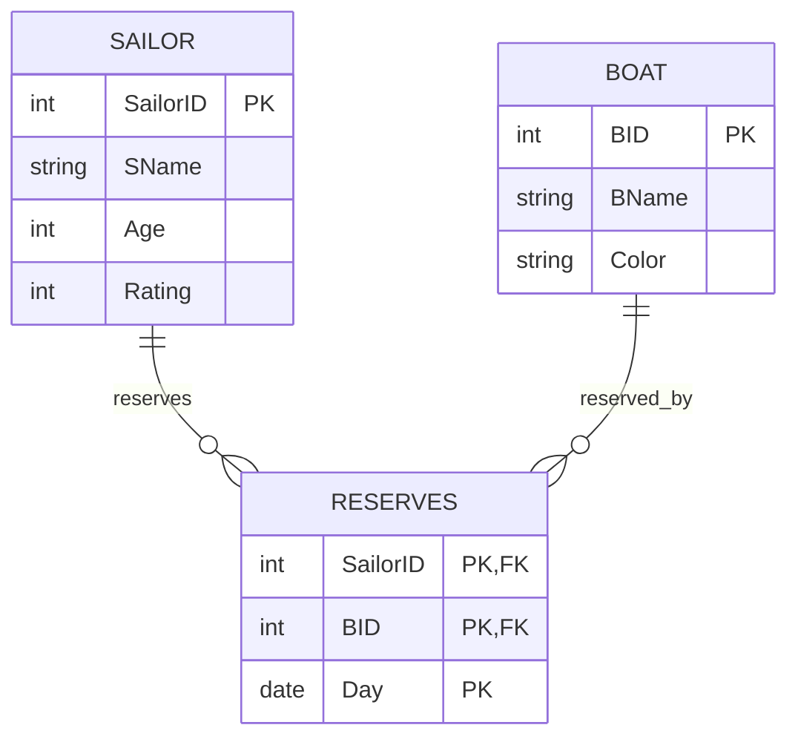

# EXPERIMENT NUMBER 3

## TITLE
Boat, Sailor &amp; Reserves Database (Integrated SQL, MongoDB &amp; PL/SQL)

---

## AIM
To design, implement, and query a Boat, Sailor, and Reserves database schema using Oracle SQL (PART A) and MongoDB/PL/SQL (PART B), including reservation matching, aggregate counts, and table count scripting in PL/SQL.

---

## PROBLEM STATEMENT
Consider the relations BOAT, SAILOR and RESERVES. The relation BOAT identifies the features of a boat such as unique identifier, color and a name. The list of sailors with attributes such as SailorID, name, age etc., are stored in the relation SAILOR. The sailors are allowed to reserve any number of boats on any day of the week and the records are to be updated in the RESERVES table.
Perform the required SQL, NoSQL, and PL/SQL operations.

---

## OBJECTIVES
1. Enforce composite key constraints, domain constraints, and check conditions in Oracle SQL.
2. Master SQL aggregate queries (`COUNT`), grouping (`GROUP BY`), division concepts (all-referencing joins), and filtering.
3. Design Sailor, Boat, and Reserve collections in MongoDB, count reservations using references, and match by color.
4. Implement procedural counting logics in PL/SQL.

---

## THEORY
### Relational Division (SQL)
Query ii ("boats reserved by *all* sailors") represents a **relational division** problem. In SQL, this is implemented using `GROUP BY` and `HAVING COUNT(DISTINCT SailorID) = (SELECT COUNT(*) FROM Sailor)`.

### Document-Oriented Model (MongoDB)
Modeling in MongoDB can also follow a relational-style referencing pattern where a separate `Reserve` collection contains references to both `SID` and `BID` documents.
* **countDocuments**: Returns the count of documents that match the query criteria.

---

## ENTITY IDENTIFICATION
| Entity Name | Attributes | Primary Key | Foreign Key(s) |
|---|---|---|---|
| **BOAT** | BID, BName, Color | BID | - |
| **SAILOR** | SailorID, SName, Age, Rating | SailorID | - |
| **RESERVES** | SailorID, BID, Day | (SailorID, BID, Day) | SailorID (refs SAILOR), BID (refs BOAT) |

---

## CONSTRAINTS
* **Domain Constraints**:
  * `Age` in `SAILOR`: `CHECK (Age >= 18)`
  * `Rating` in `SAILOR`: `CHECK (Rating >= 1 AND Rating <= 10)`
* **Referential Constraints**:
  * Reserves table must maintain referential integrity with both Sailor and Boat master tables.

---

## ER DIAGRAM
### ER Diagram (Figure)


*Figure: Entity–Relationship diagram (Chen notation).*

### Mermaid Notation


---

## SCHEMA DIAGRAM
### Schema Diagram (Figure)


*Figure: Relational schema with referential links.*

---

## PART A — SQL IMPLEMENTATION

### DDL: Create Table Statements
```sql
DROP TABLE Reserves CASCADE CONSTRAINTS;
DROP TABLE Sailor CASCADE CONSTRAINTS;
DROP TABLE Boat CASCADE CONSTRAINTS;

CREATE TABLE Boat(
    BID NUMBER PRIMARY KEY,
    BName VARCHAR2(30) NOT NULL,
    Color VARCHAR2(20) NOT NULL
);

CREATE TABLE Sailor(
    SailorID NUMBER PRIMARY KEY,
    SName VARCHAR2(30) NOT NULL,
    Age NUMBER CHECK (Age >= 18),
    Rating NUMBER CHECK (Rating >= 1 AND Rating <= 10)
);

CREATE TABLE Reserves(
    SailorID NUMBER REFERENCES Sailor(SailorID) ON DELETE CASCADE,
    BID NUMBER REFERENCES Boat(BID) ON DELETE CASCADE,
    Day DATE,
    PRIMARY KEY(SailorID, BID, Day)
);
```

### DML: Insert Sample Data
```sql
INSERT INTO Boat VALUES(101, 'Sea Queen', 'Red');
INSERT INTO Boat VALUES(102, 'Ocean Star', 'Blue');
INSERT INTO Boat VALUES(103, 'Wave Rider', 'Red');
INSERT INTO Boat VALUES(104, 'Wind Surf', 'Green');

INSERT INTO Sailor VALUES(1, 'Rahul', 20, 8);
INSERT INTO Sailor VALUES(2, 'Ananth', 22, 9);
INSERT INTO Sailor VALUES(3, 'Sneha', 19, 7);

INSERT INTO Reserves VALUES(1, 101, DATE '2025-01-10');
INSERT INTO Reserves VALUES(1, 102, DATE '2025-01-11');
INSERT INTO Reserves VALUES(2, 101, DATE '2025-01-12');
INSERT INTO Reserves VALUES(3, 103, DATE '2025-01-10');
COMMIT;
```

### SQL Queries

#### i. Obtain the details of the boats reserved by ‘Rahul’.
```sql
SELECT B.BID, B.BName, B.Color, R.Day
FROM Boat B
JOIN Reserves R ON B.BID = R.BID
JOIN Sailor S ON R.SailorID = S.SailorID
WHERE S.SName = 'Rahul';
```
*Expected Output:*
| BID | BName | Color | Day |
|---|---|---|---|
| 101 | Sea Queen | Red | 10-JAN-25 |
| 102 | Ocean Star | Blue | 11-JAN-25 |

#### ii. Retrieve the BID of the boats reserved necessarily by all the sailors.
```sql
SELECT R.BID
FROM Reserves R
GROUP BY R.BID
HAVING COUNT(DISTINCT R.SailorID) = (SELECT COUNT(*) FROM Sailor);
```
*Expected Output:*
| BID |
|---|
| 101 |

#### iii. Find the number of boats reserved by each sailor. Display the Sailor_Name along with the number of boats reserved.
```sql
SELECT S.SName, COUNT(R.BID) AS Boats_Reserved
FROM Sailor S
LEFT JOIN Reserves R ON S.SailorID = R.SailorID
GROUP BY S.SailorID, S.SName;
```
*Expected Output:*
| SName | Boats_Reserved |
|---|---|
| Rahul | 2 |
| Ananth | 1 |
| Sneha | 1 |

---

## PART B — NOSQL & PROCEDURAL IMPLEMENTATION

### MongoDB Implementation
```javascript
// Switch to Database
use boat_db;

// Insert Sailor documents
db.Sailor.insertMany([
  { SID: 1, SName: "Ramesh" },
  { SID: 2, SName: "Suresh" }
]);

// Insert Boat documents
db.Boat.insertMany([
  { BID: 101, BName: "Sea King", Color: "Red" },
  { BID: 102, BName: "Ocean Star", Color: "Blue" }
]);

// Insert Reserve documents
db.Reserve.insertMany([
  { SID: 1, BID: 101 },
  { SID: 1, BID: 102 },
  { SID: 2, BID: 102 }
]);
```

#### Query i: Obtain the number of boats reserved by sailor "Ramesh".
```javascript
var sailor = db.Sailor.findOne(
  { SName: "Ramesh" }
);

db.Reserve.countDocuments(
  { SID: sailor.SID }
);
```
*Expected Output:*
```text
2
```

#### Query ii: Retrieve boats of color "Blue".
```javascript
db.Boat.find(
  { Color: "Blue" }
);
```
*Expected Output:*
```json
[
  {
    "_id": ObjectId("6a215a462dbc9d54be8ce5b2"),
    "BID": 102,
    "BName": "Ocean Star",
    "Color": "Blue"
  }
]
```

### PL/SQL Implementation
```sql
CREATE TABLE Boat (
    BID NUMBER(5) PRIMARY KEY,
    BName VARCHAR2(30),
    Color VARCHAR2(20)
);

INSERT INTO Boat VALUES (1, 'BoatA', 'Red');
INSERT INTO Boat VALUES (2, 'BoatB', 'Blue');
INSERT INTO Boat VALUES (3, 'BoatC', 'Green');
COMMIT;

SET SERVEROUTPUT ON;
DECLARE
   v_count NUMBER;
BEGIN
   SELECT COUNT(*)
   INTO v_count
   FROM Boat;
   
   DBMS_OUTPUT.PUT_LINE('Total Boats = ' || v_count);
END;
/
```
*Expected Output:*
```text
Total Boats = 3
```

---

## VIVA QUESTIONS & ANSWERS
1. **Q: What is a relational division query?**
   * *A:* A query that finds items in one table associated with all items in another table (e.g. boats reserved by all sailors).
2. **Q: How do you count matching documents in MongoDB?**
   * *A:* By using `db.collection.countDocuments({ filter })`.
3. **Q: What does `LEFT JOIN` do in SQL?**
   * *A:* It returns all records from the left table, and matching records from the right table. If there is no match, it returns NULL for the right side columns.
4. **Q: What is an anonymous PL/SQL block?**
   * *A:* A block of PL/SQL code that is not stored in the database schema. It consists of `DECLARE`, `BEGIN`, and `EXCEPTION` sections.
5. **Q: How is data grouped in SQL?**
   * *A:* By using the `GROUP BY` clause, which groups rows having identical values in specified columns into summary rows.

---

## RESULT
The boat reservation database was successfully designed and queried using SQL and NoSQL, and the PL/SQL program successfully returned the total count of boats.
