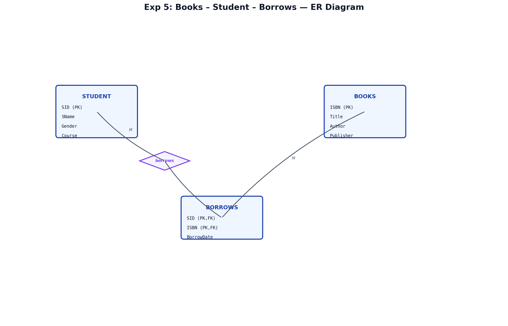
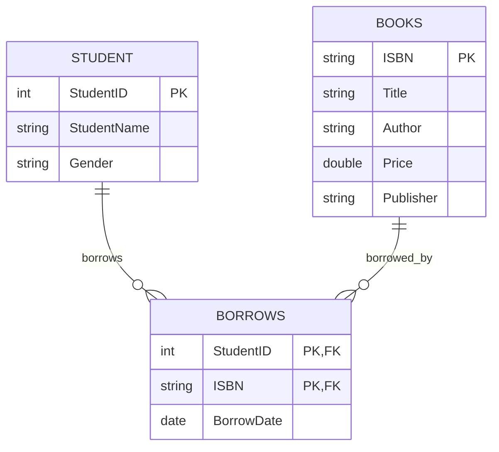

# EXPERIMENT NUMBER 4

## TITLE
Library Book Lending System (Integrated SQL, MongoDB & PL/SQL)

---

## AIM
To design, implement, and query a Library Book Lending database schema using Oracle SQL (PART A) and MongoDB/PL/SQL (PART B), including check constraints, aggregate listings, and global price modifications in PL/SQL.

---

## PROBLEM STATEMENT
Consider the Book Lending system from the library- BOOKS, STUDENT, BORROWS. The students are allowed to borrow any number of books on a given date from the library. The details of the book should include ISBN, Title of the Book, author, price and publisher. All students need not compulsorily borrow books.
Perform the required SQL, NoSQL, and PL/SQL operations.

---

## OBJECTIVES
1. Enforce primary, foreign, and domain checks on string fields and currency fields.
2. Master SQL aggregate grouping and filtering queries, particularly left joins, to handle optional borrow relationships.
3. Design collections representing student borrowing in MongoDB using flat references, and execute find queries with variables.
4. Implement bulk updates using PL/SQL scripting blocks.

---

## THEORY
### Relational Constraints (SQL)
To handle the requirement "All students need not compulsorily borrow books", we use a `LEFT JOIN` from `Student` to `Borrows` when counting borrowed books.

### MongoDB Collections Design
In MongoDB, the relation is represented using:
* **Book Collection**: Each document stores info about a book.
* **Student Collection**: References the borrowed book using a single `Book_ID` field, representing a direct borrow link.

---

## ENTITY IDENTIFICATION
| Entity Name | Attributes | Primary Key | Foreign Key(s) |
|---|---|---|---|
| **BOOKS** | ISBN, Title, Author, Price, Publisher | ISBN | - |
| **STUDENT** | StudentID, StudentName, Gender | StudentID | - |
| **BORROWS** | StudentID, ISBN, BorrowDate | (StudentID, ISBN) | StudentID (refs STUDENT), ISBN (refs BOOKS) |

---

## CONSTRAINTS
* **Domain Constraints**:
  * `Price` in `Books`: `CHECK (Price > 0)`
  * `Gender` in `Student`: `CHECK (Gender IN ('Male', 'Female'))`
* **Referential Constraints**:
  * Every record in the `Borrows` table must point to a valid book `ISBN` and a valid `StudentID`.

---

## ER DIAGRAM
### ER Diagram (Figure)


*Figure: Entity–Relationship diagram (Chen notation).*

### Mermaid Notation


---

## SCHEMA DIAGRAM
### Schema Diagram (Figure)


*Figure: Relational schema with referential links.*

---

## PART A — SQL IMPLEMENTATION

### DDL: Create Table Statements
```sql
DROP TABLE Borrows CASCADE CONSTRAINTS;
DROP TABLE Student CASCADE CONSTRAINTS;
DROP TABLE Books CASCADE CONSTRAINTS;

CREATE TABLE Books(
    ISBN VARCHAR2(10) PRIMARY KEY,
    Title VARCHAR2(50) NOT NULL,
    Author VARCHAR2(30) NOT NULL,
    Price NUMBER CHECK (Price > 0),
    Publisher VARCHAR2(30)
);

CREATE TABLE Student(
    StudentID NUMBER PRIMARY KEY,
    StudentName VARCHAR2(30) NOT NULL,
    Gender VARCHAR2(10) CHECK (Gender IN ('Male', 'Female'))
);

CREATE TABLE Borrows(
    StudentID NUMBER REFERENCES Student(StudentID) ON DELETE CASCADE,
    ISBN VARCHAR2(10) REFERENCES Books(ISBN) ON DELETE CASCADE,
    BorrowDate DATE,
    PRIMARY KEY(StudentID, ISBN)
);
```

### DML: Insert Sample Data
```sql
INSERT INTO Books VALUES('123', 'Database Systems', 'Navathe', 500, 'McGrawHill');
INSERT INTO Books VALUES('124', 'Operating System', 'Galvin', 650, 'Wiley');
INSERT INTO Books VALUES('125', 'Computer Networks', 'Tanenbaum', 600, 'Pearson');

INSERT INTO Student VALUES(1, 'Rahul', 'Male');
INSERT INTO Student VALUES(2, 'Sneha', 'Female');
INSERT INTO Student VALUES(3, 'Asha', 'Female');

INSERT INTO Borrows VALUES(1, '123', DATE '2025-01-10');
INSERT INTO Borrows VALUES(2, '123', DATE '2025-01-11');
INSERT INTO Borrows VALUES(2, '124', DATE '2025-01-12');
COMMIT;
```

### SQL Queries

#### i. Obtain the names of the student who has borrowed either book bearing ISBN ‘123’ or ISBN ‘124’.
```sql
SELECT DISTINCT S.StudentName
FROM Student S
JOIN Borrows B ON S.StudentID = B.StudentID
WHERE B.ISBN IN ('123', '124');
```
*Expected Output:*
| StudentName |
|---|
| Rahul |
| Sneha |

#### ii. Obtain the Names of female students who have borrowed “Database Systems” books.
```sql
SELECT S.StudentName
FROM Student S
JOIN Borrows B ON S.StudentID = B.StudentID
JOIN Books BK ON B.ISBN = BK.ISBN
WHERE S.Gender = 'Female' AND BK.Title = 'Database Systems';
```
*Expected Output:*
| StudentName |
|---|
| Sneha |

#### iii. Find the number of books borrowed by each student. Display the student details along with the number of books.
```sql
SELECT S.StudentID, S.StudentName, COUNT(B.ISBN) AS Books_Borrowed
FROM Student S
LEFT JOIN Borrows B ON S.StudentID = B.StudentID
GROUP BY S.StudentID, S.StudentName;
```
*Expected Output:*
| StudentID | StudentName | Books_Borrowed |
|---|---|---|
| 1 | Rahul | 1 |
| 2 | Sneha | 2 |
| 3 | Asha | 0 |

---

## PART B — NOSQL & PROCEDURAL IMPLEMENTATION

### MongoDB Implementation
```javascript
// Switch to Database
use library_db;

// Insert Book documents
db.Book.insertMany([
  { Book_ID: 1, Title: "Database Systems", Author: "Navathe", Price: 500 },
  { Book_ID: 2, Title: "Python Programming", Author: "John", Price: 400 }
]);

// Insert Student documents
db.Student.insertMany([
  { SID: 1, SName: "Kushal", Book_ID: 1 },
  { SID: 2, SName: "Priya", Book_ID: 2 }
]);
```

#### Query i: Obtain the book details authored by “Navathe”.
```javascript
db.Book.find(
  { Author: "Navathe" }
);
```
*Expected Output:*
```json
[
  {
    "_id": ObjectId("6a2272c847771f32118ce5af"),
    "Book_ID": 1,
    "Title": "Database Systems",
    "Author": "Navathe",
    "Price": 500
  }
]
```

#### Query ii: Obtain the Names of students who have borrowed “Database Systems” books.
```javascript
var book = db.Book.findOne(
  { Title: "Database Systems" }
);

db.Student.find(
  { Book_ID: book.Book_ID },
  { SName: 1, _id: 0 }
);
```
*Expected Output:*
```json
[ { "SName": "Kushal" } ]
```

### PL/SQL Implementation
```sql
CREATE TABLE Book (
    Book_ID NUMBER(5) PRIMARY KEY,
    Title VARCHAR2(50),
    Author VARCHAR2(50),
    Price NUMBER(8,2)
);

INSERT INTO Book VALUES (101, 'Database Systems', 'Navathe', 500);
INSERT INTO Book VALUES (102, 'Operating Systems', 'Galvin', 600);
INSERT INTO Book VALUES (103, 'Python Programming', 'John', 450);
INSERT INTO Book VALUES (104, 'Computer Networks', 'Tanenbaum', 550);
COMMIT;

SET SERVEROUTPUT ON;
BEGIN
   UPDATE Book
   SET Price = Price * 1.10;
   
   DBMS_OUTPUT.PUT_LINE('Book prices updated');
END;
/
```
*Expected Output:*
```text
Book prices updated
```

---

## VIVA QUESTIONS & ANSWERS
1. **Q: How can we ensure that students who have not borrowed books are included in the counts?**
   * *A:* By using a `LEFT JOIN` from the `Student` table to the `Borrows` table.
2. **Q: What is a referential constraint?**
   * *A:* It is a constraint that establishes relationships between tables using foreign keys to ensure referential integrity.
3. **Q: How does `findOne` work in MongoDB?**
   * *A:* It returns the first document matching query filter or null if not found.
4. **Q: How do you perform an OR filter in SQL?**
   * *A:* By using the `IN` operator (e.g. `ISBN IN ('123', '124')`) or using the `OR` keyword.
5. **Q: What does `COMMIT` do in database transactions?**
   * *A:* It saves all changes made during the current transaction permanently.

---

## RESULT
The Library Book Lending database was successfully implemented in Oracle SQL and MongoDB, and the PL/SQL program successfully completed the book price updates.
