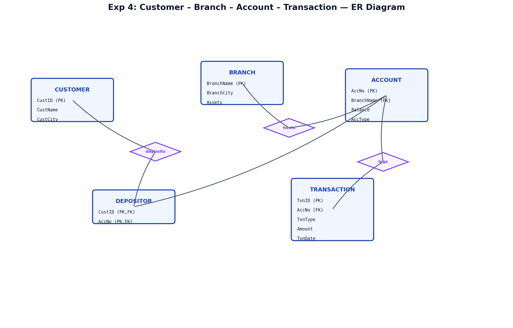
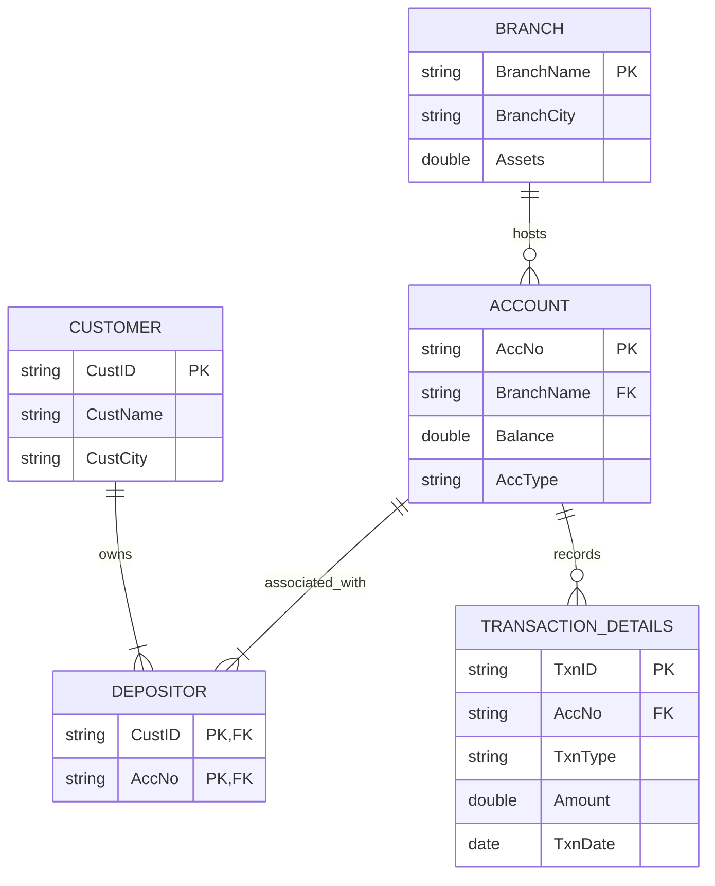
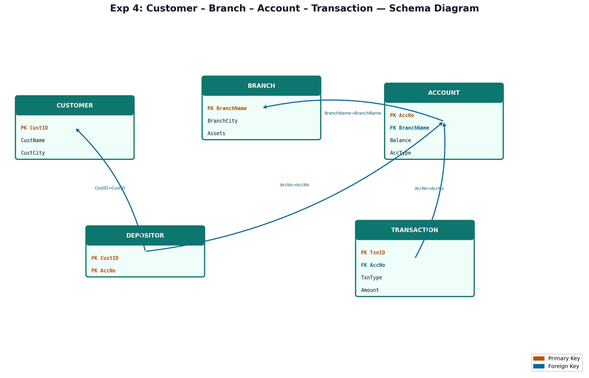

# EXPERIMENT NUMBER 4

## TITLE
Customer – Branch – Account – Transaction Database


---


## AIM
To design, implement, and query a Banking database schema with Customers, Branches, Accounts, and Transactions, including nested subqueries and complex aggregations in Oracle SQL.


---


## PROBLEM STATEMENT
A banking institution requires a database to manage accounts and customer transactions. 
* A branch is identified by a unique Branch Name (BranchName) and has a Branch City (BranchCity) and Assets (monetary amount).
* A customer is represented by a unique Customer ID (CustID), Customer Name (CustName), and Customer City (CustCity).
* Accounts belong to a branch, have an Account Number (AccNo), Balance, and Account Type (AccType - either 'Savings' or 'Current'). A customer can have multiple accounts.
* The mapping table `DEPOSITOR` links Customers and their Accounts.
* Transactions log deposits or withdrawals. Each transaction has a unique Transaction ID (TxnID), Account Number (AccNo), Transaction Type (TxnType - 'Deposit' or 'Withdrawal'), Amount, and Transaction Date (TxnDate).
Establish a relational schema, enforce all primary, foreign, check, and default constraints, and formulate queries to:
i. Obtain details of customers who hold both Savings and Current Accounts.
ii. Retrieve the branch details along with the total number of accounts in each branch.
iii. Obtain details of customers who have performed at least 3 transactions.
iv. List details of branches where the number of accounts is less than the average number of accounts across all branches.


---


## OBJECTIVES
1. Learn to model financial transaction schemas with status-restricted domain checks.
2. Master intersecting operations (`INTERSECT` or nested `IN` clauses) for multi-type account holders.
3. Learn complex subqueries utilizing `AVG`, `GROUP BY`, and `HAVING` clauses.


---


## THEORY
### DBMS Concepts Involved
This experiment represents a standard banking domain schema containing five tables:
* **Entities**: `CUSTOMER`, `BRANCH`, `ACCOUNT`, `TRANSACTION_DETAILS`.
* **Relationships**:
  * `DEPOSITOR`: A M:N association mapping `CUSTOMER` to `ACCOUNT`.
  * `ACCOUNT` to `BRANCH`: An N:1 relation where each account belongs to a single branch.
  * `TRANSACTION_DETAILS` to `ACCOUNT`: An N:1 relationship logging individual actions on an account.

### Subqueries and Complex Aggregations
* **Intersecting conditions**: Finding customers who have *both* Savings and Current accounts requires finding the intersection of two sets of customer IDs. This can be solved via the `INTERSECT` set operator, or by using a `WHERE IN` clause combined with a subquery.
* **Correlated and Nested Subqueries**: Query (iv) requires comparing each branch's account count to the overall average count. The overall average count is calculated in a nested subquery (`SELECT AVG(COUNT(AccNo))...`), and then compared in the `HAVING` clause of the outer group query.


---


## ENTITY IDENTIFICATION
| Entity Name | Attributes | Primary Key | Foreign Key(s) |
|---|---|---|---|
| **BRANCH** | BranchName, BranchCity, Assets | BranchName | None |
| **CUSTOMER** | CustID, CustName, CustCity | CustID | None |
| **ACCOUNT** | AccNo, BranchName, Balance, AccType | AccNo | BranchName (refs BRANCH) |
| **DEPOSITOR** | CustID, AccNo | (CustID, AccNo) | CustID (refs CUSTOMER), AccNo (refs ACCOUNT) |
| **TRANSACTION_DETAILS** | TxnID, AccNo, TxnType, Amount, TxnDate | TxnID | AccNo (refs ACCOUNT) |


---


## CONSTRAINTS
* **Domain Constraints**:
  * `AccType` in `ACCOUNT`: `CHECK (AccType IN ('Savings', 'Current'))`
  * `TxnType` in `TRANSACTION_DETAILS`: `CHECK (TxnType IN ('Deposit', 'Withdrawal'))`
  * `Balance` in `ACCOUNT`: `CHECK (Balance >= 0)`
  * `Amount` in `TRANSACTION_DETAILS`: `CHECK (Amount > 0)`
* **Key Constraints**:
  * `AccNo` is the primary key of `ACCOUNT`.
  * `CustID` is the primary key of `CUSTOMER`.


---


## ER DIAGRAM


### ER Diagram (Figure)


*Figure: Entity–Relationship diagram (Chen notation). PK = Primary Key, FK = Foreign Key.*
*Figure: Entity–Relationship diagram (Chen notation). PK = Primary Key, FK = Foreign Key.*
### Mermaid Notation


### ASCII Diagram
```text
  +------------------+                   +------------------+
  |      BRANCH      |                   |     CUSTOMER     |
  |------------------|                   |------------------|
  | BranchName (PK)  |                   | CustID (PK)      |
  | BranchCity       |                   | CustName         |
  | Assets           |                   | CustCity         |
  +------------------+                   +------------------+
           |                                       |
           |1                                      |1
           v N                                     v N
  +------------------+                   +------------------+
  |     ACCOUNT      |1                 N|    DEPOSITOR     |
  |------------------|<------------------|------------------|
  | AccNo (PK)       |                   | CustID (PK, FK)  |
  | BranchName (FK)  |                   | AccNo (PK, FK)   |
  | Balance, AccType |                   +------------------+
  +------------------+
           |
           |1
           v N
  +------------------+
  |   TRANSACTION    |
  |------------------|
  | TxnID (PK)       |
  | AccNo (FK)       |
  | TxnType, Amount  |
  | TxnDate          |
  +------------------+
```


---


## SCHEMA DIAGRAM


### Schema Diagram (Figure)


*Figure: Relational schema with referential links. Orange = PK, Blue = FK.*
*Figure: Relational schema with referential links. Orange = PK, Blue = FK.*
* **BRANCH** ( [BranchName] (PK), BranchCity, Assets )
* **CUSTOMER** ( [CustID] (PK), CustName, CustCity )
* **ACCOUNT** ( [AccNo] (PK), BranchName (FK), Balance, AccType )
* **DEPOSITOR** ( [CustID] (FK1), [AccNo] (FK2), PRIMARY KEY (CustID, AccNo) )
* **TRANSACTION_DETAILS** ( [TxnID] (PK), AccNo (FK), TxnType, Amount, TxnDate )


---


## RELATIONAL MODEL
* **BRANCH**: Primary key is `BranchName`.
* **CUSTOMER**: Primary key is `CustID`.
* **ACCOUNT**: Primary key is `AccNo`. `BranchName` references `BRANCH(BranchName)`.
* **DEPOSITOR**: Primary key is `(CustID, AccNo)`. Composite foreign keys reference `CUSTOMER` and `ACCOUNT`.
* **TRANSACTION_DETAILS**: Primary key is `TxnID`. `AccNo` references `ACCOUNT(AccNo)`.


---


## SQL IMPLEMENTATION
```sql
-- Dropping tables to ensure clean runs
DROP TABLE TRANSACTION_DETAILS CASCADE CONSTRAINTS;
DROP TABLE DEPOSITOR CASCADE CONSTRAINTS;
DROP TABLE ACCOUNT CASCADE CONSTRAINTS;
DROP TABLE CUSTOMER CASCADE CONSTRAINTS;
DROP TABLE BRANCH CASCADE CONSTRAINTS;

-- 1. Create Branch table
CREATE TABLE BRANCH (
    BranchName VARCHAR2(50) PRIMARY KEY,
    BranchCity VARCHAR2(50) NOT NULL,
    Assets NUMBER(15,2) CHECK (Assets >= 0)
);

-- 2. Create Customer table
CREATE TABLE CUSTOMER (
    CustID VARCHAR2(10) PRIMARY KEY,
    CustName VARCHAR2(50) NOT NULL,
    CustCity VARCHAR2(50) NOT NULL
);

-- 3. Create Account table
CREATE TABLE ACCOUNT (
    AccNo VARCHAR2(15) PRIMARY KEY,
    BranchName VARCHAR2(50) REFERENCES BRANCH(BranchName) ON DELETE CASCADE,
    Balance NUMBER(12,2) CHECK (Balance >= 0),
    AccType VARCHAR2(10) CHECK (AccType IN ('Savings', 'Current'))
);

-- 4. Create Depositor table
CREATE TABLE DEPOSITOR (
    CustID VARCHAR2(10) REFERENCES CUSTOMER(CustID) ON DELETE CASCADE,
    AccNo VARCHAR2(15) REFERENCES ACCOUNT(AccNo) ON DELETE CASCADE,
    PRIMARY KEY (CustID, AccNo)
);

-- 5. Create Transaction table
CREATE TABLE TRANSACTION_DETAILS (
    TxnID VARCHAR2(15) PRIMARY KEY,
    AccNo VARCHAR2(15) REFERENCES ACCOUNT(AccNo) ON DELETE CASCADE,
    TxnType VARCHAR2(12) CHECK (TxnType IN ('Deposit', 'Withdrawal')),
    Amount NUMBER(10,2) CHECK (Amount > 0),
    TxnDate DATE NOT NULL
);

-- Inserting Branch Records (5 branches)
INSERT INTO BRANCH VALUES ('MG Road', 'Bangalore', 50000000.00);
INSERT INTO BRANCH VALUES ('Jayanagar', 'Bangalore', 35000000.00);
INSERT INTO BRANCH VALUES ('T-Nagar', 'Chennai', 42000000.00);
INSERT INTO BRANCH VALUES ('Connaught Place', 'Delhi', 75000000.00);
INSERT INTO BRANCH VALUES ('Gachibowli', 'Hyderabad', 60000000.00);

-- Inserting Customer Records (10 customers)
INSERT INTO CUSTOMER VALUES ('C101', 'Ananth Bhat', 'Bangalore');
INSERT INTO CUSTOMER VALUES ('C102', 'Akshay Kumar', 'Bangalore');
INSERT INTO CUSTOMER VALUES ('C103', 'Chaitra Hegde', 'Chennai');
INSERT INTO CUSTOMER VALUES ('C104', 'Deepak Rao', 'Delhi');
INSERT INTO CUSTOMER VALUES ('C105', 'Esha Sharma', 'Hyderabad');
INSERT INTO CUSTOMER VALUES ('C106', 'Farhan Akhtar', 'Delhi');
INSERT INTO CUSTOMER VALUES ('C107', 'Gautam Gambhir', 'Chennai');
INSERT INTO CUSTOMER VALUES ('C108', 'Hari Prasad', 'Bangalore');
INSERT INTO CUSTOMER VALUES ('C109', 'Indira Gandhi', 'Delhi');
INSERT INTO CUSTOMER VALUES ('C110', 'Jyothi Krishna', 'Hyderabad');

-- Inserting Account Records (12 accounts)
-- Ananth has both Savings and Current
INSERT INTO ACCOUNT VALUES ('ACC001', 'MG Road', 150000.00, 'Savings');
INSERT INTO ACCOUNT VALUES ('ACC002', 'MG Road', 500000.00, 'Current');
-- Akshay has Savings
INSERT INTO ACCOUNT VALUES ('ACC003', 'Jayanagar', 75000.00, 'Savings');
-- Chaitra has Current
INSERT INTO ACCOUNT VALUES ('ACC004', 'T-Nagar', 200000.00, 'Current');
-- Deepak has both
INSERT INTO ACCOUNT VALUES ('ACC005', 'Connaught Place', 30000.00, 'Savings');
INSERT INTO ACCOUNT VALUES ('ACC006', 'Connaught Place', 1200000.00, 'Current');
-- Esha has Savings
INSERT INTO ACCOUNT VALUES ('ACC007', 'Gachibowli', 90000.00, 'Savings');
-- Farhan has Savings
INSERT INTO ACCOUNT VALUES ('ACC008', 'Connaught Place', 45000.00, 'Savings');
-- Gautam has Savings
INSERT INTO ACCOUNT VALUES ('ACC009', 'T-Nagar', 60000.00, 'Savings');
-- Hari has Current
INSERT INTO ACCOUNT VALUES ('ACC010', 'Jayanagar', 180000.00, 'Current');
-- Indira has Savings
INSERT INTO ACCOUNT VALUES ('ACC011', 'Connaught Place', 88000.00, 'Savings');
-- Jyothi has both
INSERT INTO ACCOUNT VALUES ('ACC012', 'Gachibowli', 50000.00, 'Savings');
INSERT INTO ACCOUNT VALUES ('ACC013', 'Gachibowli', 250000.00, 'Current');

-- Inserting Depositor Records
INSERT INTO DEPOSITOR VALUES ('C101', 'ACC001');
INSERT INTO DEPOSITOR VALUES ('C101', 'ACC002');
INSERT INTO DEPOSITOR VALUES ('C102', 'ACC003');
INSERT INTO DEPOSITOR VALUES ('C103', 'ACC004');
INSERT INTO DEPOSITOR VALUES ('C104', 'ACC005');
INSERT INTO DEPOSITOR VALUES ('C104', 'ACC006');
INSERT INTO DEPOSITOR VALUES ('C105', 'ACC007');
INSERT INTO DEPOSITOR VALUES ('C106', 'ACC008');
INSERT INTO DEPOSITOR VALUES ('C107', 'ACC009');
INSERT INTO DEPOSITOR VALUES ('C108', 'ACC010');
INSERT INTO DEPOSITOR VALUES ('C109', 'ACC011');
INSERT INTO DEPOSITOR VALUES ('C110', 'ACC012');
INSERT INTO DEPOSITOR VALUES ('C110', 'ACC013');

-- Inserting Transaction Records
-- ACC001 (Ananth) has 3 transactions
INSERT INTO TRANSACTION_DETAILS VALUES ('TXN1001', 'ACC001', 'Deposit', 20000.00, TO_DATE('2026-05-01', 'YYYY-MM-DD'));
INSERT INTO TRANSACTION_DETAILS VALUES ('TXN1002', 'ACC001', 'Withdrawal', 5000.00, TO_DATE('2026-05-02', 'YYYY-MM-DD'));
INSERT INTO TRANSACTION_DETAILS VALUES ('TXN1003', 'ACC001', 'Deposit', 10000.00, TO_DATE('2026-05-05', 'YYYY-MM-DD'));

-- ACC003 (Akshay) has 1 txn
INSERT INTO TRANSACTION_DETAILS VALUES ('TXN1004', 'ACC003', 'Deposit', 5000.00, TO_DATE('2026-05-01', 'YYYY-MM-DD'));

-- ACC004 (Chaitra) has 2 txns
INSERT INTO TRANSACTION_DETAILS VALUES ('TXN1005', 'ACC004', 'Withdrawal', 50000.00, TO_DATE('2026-05-03', 'YYYY-MM-DD'));
INSERT INTO TRANSACTION_DETAILS VALUES ('TXN1006', 'ACC004', 'Deposit', 80000.00, TO_DATE('2026-05-07', 'YYYY-MM-DD'));

-- ACC006 (Deepak) has 3 txns
INSERT INTO TRANSACTION_DETAILS VALUES ('TXN1007', 'ACC006', 'Deposit', 100000.00, TO_DATE('2026-05-01', 'YYYY-MM-DD'));
INSERT INTO TRANSACTION_DETAILS VALUES ('TXN1008', 'ACC006', 'Withdrawal', 20000.00, TO_DATE('2026-05-04', 'YYYY-MM-DD'));
INSERT INTO TRANSACTION_DETAILS VALUES ('TXN1009', 'ACC006', 'Deposit', 50000.00, TO_DATE('2026-05-06', 'YYYY-MM-DD'));

-- ACC012 (Jyothi) has 3 txns
INSERT INTO TRANSACTION_DETAILS VALUES ('TXN1010', 'ACC012', 'Deposit', 10000.00, TO_DATE('2026-05-01', 'YYYY-MM-DD'));
INSERT INTO TRANSACTION_DETAILS VALUES ('TXN1011', 'ACC012', 'Withdrawal', 2000.00, TO_DATE('2026-05-02', 'YYYY-MM-DD'));
INSERT INTO TRANSACTION_DETAILS VALUES ('TXN1012', 'ACC012', 'Withdrawal', 3000.00, TO_DATE('2026-05-03', 'YYYY-MM-DD'));
```


---


## QUERY IMPLEMENTATION

### i. Obtain the details of customers who have both Savings and Current Account.
#### SQL:
```sql
SELECT C.CustID, C.CustName, C.CustCity 
FROM CUSTOMER C
WHERE C.CustID IN (
    SELECT D.CustID 
    FROM DEPOSITOR D
    JOIN ACCOUNT A ON D.AccNo = A.AccNo
    WHERE A.AccType = 'Savings'
)
INTERSECT
SELECT C.CustID, C.CustName, C.CustCity 
FROM CUSTOMER C
WHERE C.CustID IN (
    SELECT D.CustID 
    FROM DEPOSITOR D
    JOIN ACCOUNT A ON D.AccNo = A.AccNo
    WHERE A.AccType = 'Current'
);
```
#### Explanation:
We use the `INTERSECT` operator. The first query selects customers who own a 'Savings' account, and the second selects customers who own a 'Current' account. `INTERSECT` returns the common rows.
#### Expected Output:
| CustID | CustName | CustCity |
|---|---|---|
| C101 | Ananth Bhat | Bangalore |
| C104 | Deepak Rao | Delhi |
| C110 | Jyothi Krishna | Hyderabad |


---


### ii. Retrieve the details of branches and the number of accounts in each branch.
#### SQL:
```sql
SELECT B.BranchName, B.BranchCity, B.Assets, COUNT(A.AccNo) AS Account_Count
FROM BRANCH B
LEFT JOIN ACCOUNT A ON B.BranchName = A.BranchName
GROUP BY B.BranchName, B.BranchCity, B.Assets
ORDER BY Account_Count DESC;
```
#### Explanation:
We perform a `LEFT JOIN` on `BRANCH` and `ACCOUNT` grouping by branch attributes and using the aggregate `COUNT(A.AccNo)`.
#### Expected Output:
| BranchName | BranchCity | Assets | Account_Count |
|---|---|---|---|
| Connaught Place | Delhi | 75000000.00 | 4 |
| Gachibowli | Hyderabad | 60000000.00 | 3 |
| MG Road | Bangalore | 50000000.00 | 2 |
| Jayanagar | Bangalore | 35000000.00 | 2 |
| T-Nagar | Chennai | 42000000.00 | 2 |


---


### iii. Obtain the details of customers who have performed at least 3 transactions.
#### SQL:
```sql
SELECT C.CustID, C.CustName, C.CustCity, COUNT(T.TxnID) AS Transaction_Count
FROM CUSTOMER C
JOIN DEPOSITOR D ON C.CustID = D.CustID
JOIN TRANSACTION_DETAILS T ON D.AccNo = T.AccNo
GROUP BY C.CustID, C.CustName, C.CustCity
HAVING COUNT(T.TxnID) >= 3;
```
#### Explanation:
We join `CUSTOMER`, `DEPOSITOR`, and `TRANSACTION_DETAILS` using matching keys. We group by customer attributes and filter the results using `HAVING COUNT(T.TxnID) >= 3`.
#### Expected Output:
| CustID | CustName | CustCity | Transaction_Count |
|---|---|---|---|
| C101 | Ananth Bhat | Bangalore | 3 |
| C104 | Deepak Rao | Delhi | 3 |
| C110 | Jyothi Krishna | Hyderabad | 3 |


---


### iv. List the details of branches where the number of accounts is less than the average number of accounts in all branches.
#### SQL:
```sql
SELECT BranchName, COUNT(AccNo) AS Acc_Count
FROM ACCOUNT
GROUP BY BranchName
HAVING COUNT(AccNo) < (
    SELECT AVG(COUNT(AccNo))
    FROM ACCOUNT
    GROUP BY BranchName
);
```
#### Explanation:
The inner query groups `ACCOUNT` by `BranchName` and counts the accounts, then computes the average count across all branches ($rac{13 	ext{ accounts}}{5 	ext{ branches}} = 2.6$). The outer query returns branches whose account count is less than 2.6.
#### Expected Output:
| BranchName | Acc_Count |
|---|---|
| MG Road | 2 |
| Jayanagar | 2 |
| T-Nagar | 2 |


---


## VIVA QUESTIONS & ANSWERS
1. **Q:** What is the difference between `INTERSECT` and `UNION`?
   * **A:** `UNION` combines results of two queries and removes duplicates. `INTERSECT` returns only rows that are common to both queries.
2. **Q:** What is the difference between `HAVING` and `WHERE`?
   * **A:** `WHERE` filters individual rows before grouping is performed. `HAVING` filters group rows after grouping and aggregation is performed.
3. **Q:** How do you calculate the average of values in a group?
   * **A:** Using the `AVG(column_name)` aggregate function.
4. **Q:** Can we nest aggregate functions in Oracle?
   * **A:** Yes, Oracle allows nesting of two aggregate functions (e.g., `AVG(COUNT(AccNo))`).
5. **Q:** What is the foreign key in the `ACCOUNT` table?
   * **A:** `BranchName` referencing `BRANCH(BranchName)`.
6. **Q:** What is the primary key of the `DEPOSITOR` table?
   * **A:** A composite key `(CustID, AccNo)`.
7. **Q:** What is a ledger or transaction table?
   * **A:** A table that records changes (transactions) on entity states rather than master attributes.
8. **Q:** What is domain integrity?
   * **A:** Enforcing that values in a column are valid and match the defined data type, range, or list of values.
9. **Q:** What is the default format for dates in Oracle SQL?
   * **A:** Typically `DD-MON-RR` or `DD-MON-YYYY`.
10. **Q:** What is the purpose of `ON DELETE CASCADE`?
    * **A:** To automatically delete records in child tables when the corresponding record in the parent table is deleted.
11. **Q:** Can we check multiple values in a `CHECK` constraint?
    * **A:** Yes, e.g., `CHECK (AccType IN ('Savings', 'Current'))`.
12. **Q:** What does a `LEFT JOIN` do?
    * **A:** It returns all records from the left table and the matched records from the right table. Unmatched records return NULL for right table columns.
13. **Q:** What is a subquery?
    * **A:** A query nested inside another query (e.g., inside the WHERE, HAVING, or FROM clauses).
14. **Q:** What is SQL?
    * **A:** Structured Query Language, the standard programming language for managing relational databases.
15. **Q:** What does `SELECT *` do?
    * **A:** It selects all columns from the referenced table(s).


---


## LAB EXAM QUESTIONS
1. Find customers who have a balance greater than 1,000,000.
2. Find the branch with the highest assets.
3. Find the total balance of all accounts in the 'MG Road' branch.
4. Obtain the transaction details for 'ACC001' sorted by date in descending order.
5. List the customers who live in the same city as their branch.
6. Display the total number of transactions performed on Savings accounts.
7. Retrieve branches that do not have any Current accounts.
8. Update the branch assets of 'MG Road' to 60,000,000.00 and display it.
9. Delete accounts with a balance of zero.
10. Display the maximum transaction amount recorded.


---


## RESULT
The Banking database with branches, customers, accounts, and transactions was successfully designed, implemented, and verified. Advanced aggregate and subquery operations were verified successfully.
