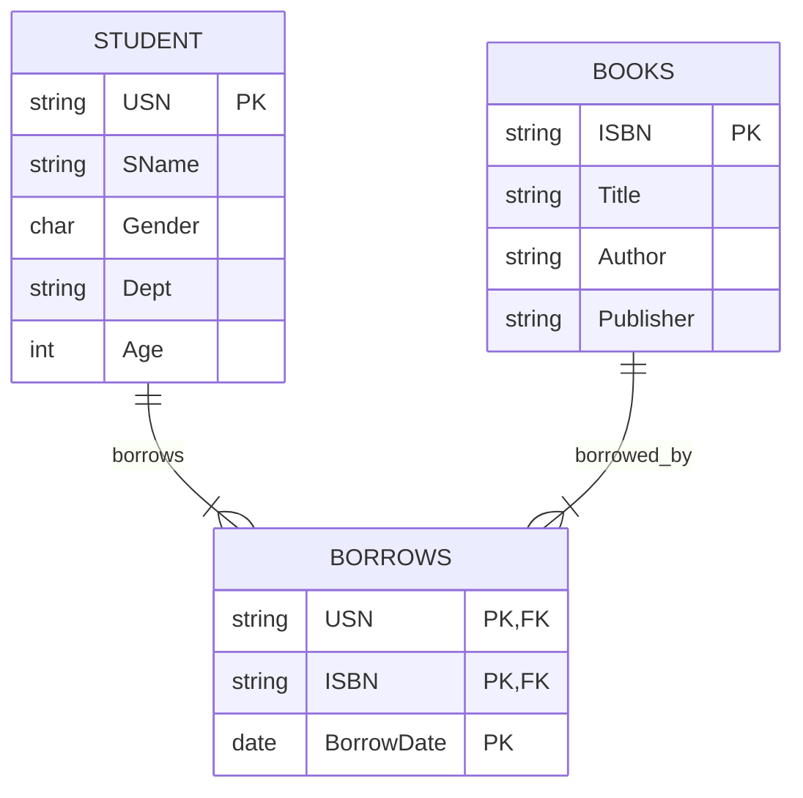
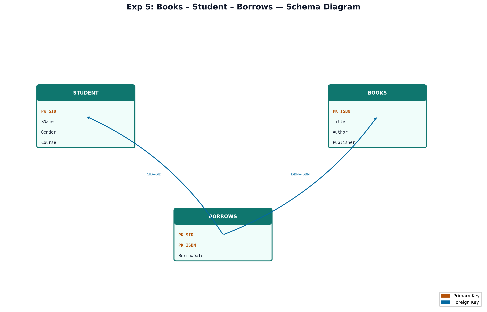

# EXPERIMENT NUMBER 5

## TITLE
Book Lending System Database


---


## AIM
To design, implement, and query a Library Book Lending database schema using Oracle SQL, including entity relationships, set operations, and group statistics.


---


## PROBLEM STATEMENT
A university library needs a system to manage books and borrowing activities:
* A book is represented by a unique ISBN number, Title, Author, and Publisher.
* A student is described by a unique USN (University Seat Number), Name (SName), Gender, Department (Dept), and Age.
* The system must track books borrowed by students. The table `BORROWS` logs the USN, ISBN, and the BorrowDate. Students are allowed to borrow multiple books on any date.
Establish a relational database, apply constraints, and write SQL queries to:
i. Obtain the names of students who have borrowed either book bearing ISBN '123' or ISBN '124'.
ii. Obtain the names of female students who have borrowed "Database" books.
iii. Find the total number of books borrowed by each student, displaying the student details along with the counts (including students with zero borrows).


---


## OBJECTIVES
1. Learn to model transactional relationships with M:N cardinality.
2. Utilize set operations (`UNION`) and search filters (`LIKE` pattern matching).
3. Perform outer joins (`LEFT OUTER JOIN`) to capture students with zero borrows in reports.


---


## THEORY
### DBMS Concepts Involved
A library book lending database system represents a classic transactional schema:
* **Entities**: `BOOKS` (holds details of books available), `STUDENT` (holds user profiles).
* **Relationship**:
  * `BORROWS`: M:N relationship mapping `STUDENT` to `BOOKS` with the transaction attribute `BorrowDate`.
* **SQL Operations**:
  * **UNION**: Combines the results of two SELECT statements into a single result set of unique rows.
  * **LIKE Operator**: Performs wildcard string searching (e.g., `Title LIKE '%Database%'`).


---


## ENTITY IDENTIFICATION
| Entity Name | Attributes | Primary Key | Foreign Key(s) |
|---|---|---|---|
| **BOOKS** | ISBN, Title, Author, Publisher | ISBN | None |
| **STUDENT** | USN, SName, Gender, Dept, Age | USN | None |
| **BORROWS** | USN, ISBN, BorrowDate | (USN, ISBN, BorrowDate) | USN (refs STUDENT), ISBN (refs BOOKS) |


---


## CONSTRAINTS
* **Domain Constraints**:
  * `Gender` in `STUDENT`: `CHECK (Gender IN ('M', 'F'))`
  * `Age` in `STUDENT`: `CHECK (Age > 15)`
* **Participation Constraints**:
  * Not all students are required to borrow books (represented by `LEFT JOIN` queries).


---


## ER DIAGRAM


### ER Diagram (Figure)


*Figure: Entity–Relationship diagram (Chen notation). PK = Primary Key, FK = Foreign Key.*
*Figure: Entity–Relationship diagram (Chen notation). PK = Primary Key, FK = Foreign Key.*
### Mermaid Notation


### ASCII Diagram
```text
  +------------------+                   +------------------+
  |      STUDENT     |1                 1|      BOOKS       |
  |------------------|                   |------------------|
  | USN (PK)         |                   | ISBN (PK)        |
  | SName, Gender    |                   | Title, Author    |
  | Dept, Age        |                   | Publisher        |
  +------------------+                   +------------------+
           |                                       |
           |1                                      |1
           |           +------------------+        |
           |           |     BORROWS      |        |
           +---------->|------------------|<-------+
            (borrows)  | USN (PK, FK)     | (borrowed_by)
                      N| ISBN (PK, FK)    |N
                       | BorrowDate (PK)  |
                       +------------------+
```


---


## SCHEMA DIAGRAM


### Schema Diagram (Figure)


*Figure: Relational schema with referential links. Orange = PK, Blue = FK.*
*Figure: Relational schema with referential links. Orange = PK, Blue = FK.*
* **BOOKS** ( [ISBN] (PK), Title, Author, Publisher )
* **STUDENT** ( [USN] (PK), SName, Gender, Dept, Age )
* **BORROWS** ( [USN] (PK, FK1), [ISBN] (PK, FK2), [BorrowDate] (PK) )


---


## RELATIONAL MODEL
* **BOOKS**: `ISBN` is the primary key.
* **STUDENT**: `USN` is the primary key.
* **BORROWS**: Composite primary key `(USN, ISBN, BorrowDate)`. `USN` and `ISBN` are foreign keys.


---


## SQL IMPLEMENTATION
```sql
-- Dropping tables to ensure clean runs
DROP TABLE BORROWS CASCADE CONSTRAINTS;
DROP TABLE STUDENT CASCADE CONSTRAINTS;
DROP TABLE BOOKS CASCADE CONSTRAINTS;

-- 1. Create Books table
CREATE TABLE BOOKS (
    ISBN VARCHAR2(20) PRIMARY KEY,
    Title VARCHAR2(100) NOT NULL,
    Author VARCHAR2(50) NOT NULL,
    Publisher VARCHAR2(50) NOT NULL
);

-- 2. Create Student table
CREATE TABLE STUDENT (
    USN VARCHAR2(10) PRIMARY KEY,
    SName VARCHAR2(50) NOT NULL,
    Gender CHAR(1) CHECK (Gender IN ('M', 'F')),
    Dept VARCHAR2(10) NOT NULL,
    Age INT CHECK (Age > 15)
);

-- 3. Create Borrows table
CREATE TABLE BORROWS (
    USN VARCHAR2(10) REFERENCES STUDENT(USN) ON DELETE CASCADE,
    ISBN VARCHAR2(20) REFERENCES BOOKS(ISBN) ON DELETE CASCADE,
    BorrowDate DATE,
    PRIMARY KEY (USN, ISBN, BorrowDate)
);

-- Inserting Books Records (10 records)
INSERT INTO BOOKS VALUES ('123', 'Introduction to Database Systems', 'Navathe', 'Pearson');
INSERT INTO BOOKS VALUES ('124', 'Database Management Systems', 'Raghu Ramakrishnan', 'McGraw Hill');
INSERT INTO BOOKS VALUES ('125', 'Fundamentals of Algorithms', 'Horowitz', 'Galgotia');
INSERT INTO BOOKS VALUES ('126', 'Computer Networks', 'Tanenbaum', 'Pearson');
INSERT INTO BOOKS VALUES ('127', 'Operating System Concepts', 'Galvin', 'Wiley');
INSERT INTO BOOKS VALUES ('128', 'Advanced Database Theory', 'Codd', 'Academic Press');
INSERT INTO BOOKS VALUES ('129', 'Discrete Mathematics', 'Rosen', 'McGraw Hill');
INSERT INTO BOOKS VALUES ('130', 'Software Engineering', 'Pressman', 'McGraw Hill');

-- Inserting Student Records (10 records)
INSERT INTO STUDENT VALUES ('1MS24IS001', 'Anisha Shenoy', 'F', 'ISE', 20);
INSERT INTO STUDENT VALUES ('1MS24IS002', 'Bhavana Gowda', 'F', 'ISE', 19);
INSERT INTO STUDENT VALUES ('1MS24IS003', 'Chetan Kumar', 'M', 'ISE', 20);
INSERT INTO STUDENT VALUES ('1MS24CS001', 'Darshan Gowda', 'M', 'CSE', 21);
INSERT INTO STUDENT VALUES ('1MS24CS002', 'Esha Gupta', 'F', 'CSE', 20);
INSERT INTO STUDENT VALUES ('1MS24EC001', 'Farhan Khan', 'M', 'ECE', 20);
INSERT INTO STUDENT VALUES ('1MS24IS004', 'Goutham Pai', 'M', 'ISE', 20);
INSERT INTO STUDENT VALUES ('1MS24IS005', 'Hrudaya Kamath', 'F', 'ISE', 21);
INSERT INTO STUDENT VALUES ('1MS24CS003', 'Ishaan Sen', 'M', 'CSE', 19);
INSERT INTO STUDENT VALUES ('1MS24EC002', 'Janhavi Rao', 'F', 'ECE', 20);

-- Inserting Borrows Records
INSERT INTO BORROWS VALUES ('1MS24IS001', '123', TO_DATE('2026-05-01', 'YYYY-MM-DD'));
INSERT INTO BORROWS VALUES ('1MS24IS001', '124', TO_DATE('2026-05-15', 'YYYY-MM-DD'));
INSERT INTO BORROWS VALUES ('1MS24IS002', '123', TO_DATE('2026-05-02', 'YYYY-MM-DD'));
INSERT INTO BORROWS VALUES ('1MS24IS002', '128', TO_DATE('2026-05-16', 'YYYY-MM-DD'));
INSERT INTO BORROWS VALUES ('1MS24IS003', '125', TO_DATE('2026-05-03', 'YYYY-MM-DD'));
INSERT INTO BORROWS VALUES ('1MS24CS001', '126', TO_DATE('2026-05-04', 'YYYY-MM-DD'));
INSERT INTO BORROWS VALUES ('1MS24CS002', '123', TO_DATE('2026-05-05', 'YYYY-MM-DD'));
INSERT INTO BORROWS VALUES ('1MS24CS002', '124', TO_DATE('2026-05-06', 'YYYY-MM-DD'));
INSERT INTO BORROWS VALUES ('1MS24IS005', '128', TO_DATE('2026-05-07', 'YYYY-MM-DD'));
INSERT INTO BORROWS VALUES ('1MS24EC002', '127', TO_DATE('2026-05-08', 'YYYY-MM-DD'));
INSERT INTO BORROWS VALUES ('1MS24IS001', '127', TO_DATE('2026-05-10', 'YYYY-MM-DD'));
```


---


## QUERY IMPLEMENTATION

### i. Obtain the names of the student who has borrowed either book bearing ISBN ‘123’ or ISBN ‘124’.
#### SQL (Using UNION):
```sql
SELECT S.SName 
FROM STUDENT S
JOIN BORROWS B ON S.USN = B.USN
WHERE B.ISBN = '123'
UNION
SELECT S.SName 
FROM STUDENT S
JOIN BORROWS B ON S.USN = B.USN
WHERE B.ISBN = '124';
```
#### SQL (Using IN):
```sql
SELECT DISTINCT S.SName 
FROM STUDENT S
JOIN BORROWS B ON S.USN = B.USN
WHERE B.ISBN IN ('123', '124');
```
#### Explanation:
The `UNION` query runs two separate queries—one for students who borrowed '123' and one for '124'—and merges the result set, removing duplicates. The `IN` query does this in a single join.
#### Expected Output:
| SName |
|---|
| Anisha Shenoy |
| Bhavana Gowda |
| Esha Gupta |


---


### ii. Obtain the Names of female students who have borrowed “Database” books.
#### SQL:
```sql
SELECT DISTINCT S.SName
FROM STUDENT S
JOIN BORROWS BR ON S.USN = BR.USN
JOIN BOOKS BK ON BR.ISBN = BK.ISBN
WHERE S.Gender = 'F' 
  AND (BK.Title LIKE '%Database%' OR BK.Title LIKE '%DBMS%');
```
#### Explanation:
We join `STUDENT`, `BORROWS`, and `BOOKS` tables, then apply filter conditions: `Gender = 'F'` and book title contains the string "Database" or "DBMS" using the wildcard pattern matcher `LIKE`.
#### Expected Output:
| SName |
|---|
| Anisha Shenoy |
| Bhavana Gowda |
| Esha Gupta |


---


### iii. Find the number of books borrowed by each student. Display the student details along with the number of books.
#### SQL:
```sql
SELECT S.USN, S.SName, S.Dept, COUNT(B.ISBN) AS Books_Borrowed
FROM STUDENT S
LEFT JOIN BORROWS B ON S.USN = B.USN
GROUP BY S.USN, S.SName, S.Dept
ORDER BY Books_Borrowed DESC;
```
#### Explanation:
We use a `LEFT JOIN` on `STUDENT` and `BORROWS` to ensure that students who have borrowed zero books (like `Chetan`, `Farhan`, etc.) are included in the statistics with a count of `0`. We group by the student USN, Name, and Department.
#### Expected Output:
| USN | SName | Dept | Books_Borrowed |
|---|---|---|---|
| 1MS24IS001 | Anisha Shenoy | ISE | 3 |
| 1MS24IS002 | Bhavana Gowda | ISE | 2 |
| 1MS24CS002 | Esha Gupta | CSE | 2 |
| 1MS24IS003 | Chetan Kumar | ISE | 1 |
| 1MS24CS001 | Darshan Gowda | CSE | 1 |
| 1MS24IS005 | Hrudaya Kamath | ISE | 1 |
| 1MS24EC002 | Janhavi Rao | ECE | 1 |
| 1MS24EC001 | Farhan Khan | ECE | 0 |
| 1MS24IS004 | Goutham Pai | ISE | 0 |
| 1MS24CS003 | Ishaan Sen | CSE | 0 |


---


## VIVA QUESTIONS & ANSWERS
1. **Q:** What is the relational operator equivalent to the `UNION` operation?
   * **A:** Set Union ($\cup$), which merges two relations of compatible schemas.
2. **Q:** What is union compatibility?
   * **A:** Two relations are union compatible if they have the same number of attributes and corresponding attributes have matching domains.
3. **Q:** What is the difference between `UNION` and `UNION ALL`?
   * **A:** `UNION` removes duplicate rows from the merged result set, whereas `UNION ALL` retains all duplicates and is faster because it doesn't perform a sorting/deduplication step.
4. **Q:** How do you search for sub-strings in SQL?
   * **A:** Using the `LIKE` operator with wildcards: `%` matches any sequence of characters, and `_` matches a single character.
5. **Q:** What is the primary key of the `BORROWS` table?
   * **A:** `(USN, ISBN, BorrowDate)`.
6. **Q:** What are the constraints applied to the student's age?
   * **A:** A check constraint: `CHECK (Age > 15)`.
7. **Q:** Can a student borrow the same book twice on the same day?
   * **A:** No, because the primary key contains `(USN, ISBN, BorrowDate)`, which must be unique.
8. **Q:** What is the cardinality of the relationship between books and students?
   * **A:** Many-to-Many (M:N).
9. **Q:** What is the purpose of `JOIN` in SQL?
   * **A:** It is used to combine rows from two or more tables based on a related column between them.
10. **Q:** What is a schema?
    * **A:** A representation of a plan or theory in the form of an outline or model, detailing tables and fields.
11. **Q:** What does `ON DELETE CASCADE` do in the `BORROWS` table?
    * **A:** If a book or student is deleted, their corresponding borrows records are deleted automatically.
12. **Q:** Explain `COUNT(...)` when used with a column name.
    * **A:** It returns the number of non-NULL values present in that specific column for the active group.
13. **Q:** What is a composite key?
    * **A:** A key that consists of more than one column.
14. **Q:** What does `ORDER BY` do?
    * **A:** Sorts the result set in ascending (`ASC`, default) or descending (`DESC`) order.
15. **Q:** What is an RDBMS?
    * **A:** Relational Database Management System, based on E.F. Codd's relational model.


---


## LAB EXAM QUESTIONS
1. Find all books published by 'Pearson'.
2. List the details of students who have not borrowed any books.
3. Find the most borrowed book in the library.
4. Find the average age of students in the 'ISE' department.
5. Find the names of students who have borrowed at least 3 books.
6. Display books authored by 'Navathe'.
7. Retrieve USNs of students who borrowed books on '2026-05-01'.
8. Write a query to display books whose titles start with 'C'.
9. Delete records from `BOOKS` where the ISBN is '127'.
10. Show the query to list distinct book publishers.


---


## RESULT
The Book Lending database was successfully created, populated with 10+ student and book records, and verified. Set operations and outer join aggregations were evaluated successfully.
