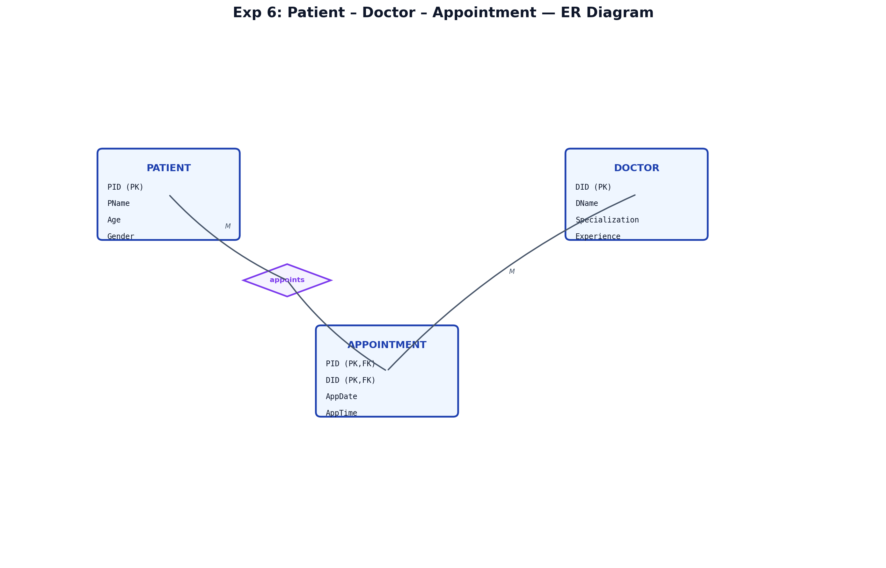
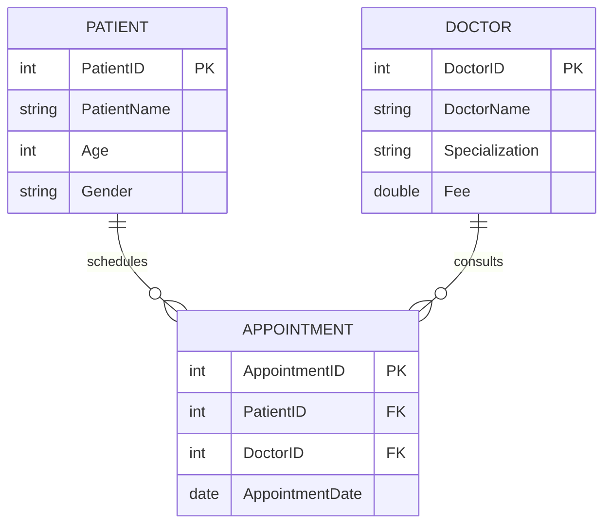

# EXPERIMENT NUMBER 5

## TITLE
Hospital Management System (Integrated SQL, MongoDB & PL/SQL)

---

## AIM
To design, implement, and query a Hospital Management database schema using Oracle SQL (PART A) and MongoDB/PL/SQL (PART B), including appointment scheduling, divisional queries, and targeted specialization fee modifications in PL/SQL.

---

## PROBLEM STATEMENT
Consider the Hospital management system with Patient, Doctor and Appointment. Patient relation holds the Patient ID, Name, Age, Gender. Doctor relation describes with Doctor ID, Name, Specialization. Each patient has given appointment with some doctor on specific date.
Perform the required SQL, NoSQL, and PL/SQL operations.

---

## OBJECTIVES
1. Enforce primary keys, foreign keys, and domain checks on gender and fees.
2. Master SQL aggregate queries, grouping, and division query logic (finding doctors consulted by *all* patients).
3. Implement Doctor and Patient collections in MongoDB, referencing relationships, and query using variables.
4. Implement targeted updates in PL/SQL anonymous blocks.

---

## THEORY
### Relational Division (SQL)
Query ii ("DoctorIDs of doctors consulted by all patients") represents a **relational division** query. In SQL, this is implemented using `GROUP BY` and `HAVING COUNT(DISTINCT PatientID) = (SELECT COUNT(*) FROM Patient)`.

### MongoDB Referencing (NoSQL)
In MongoDB, a normalized referencing pattern is used where the `Patient` document contains the field `Doctor_ID` referencing the Doctor collection.
* **findOne**: Queries a single document matching criteria to extract reference IDs (like Doctor_ID) to use in secondary queries.

---

## ENTITY IDENTIFICATION
| Entity Name | Attributes | Primary Key | Foreign Key(s) |
|---|---|---|---|
| **PATIENT** | PatientID, PatientName, Age, Gender | PatientID | - |
| **DOCTOR** | DoctorID, DoctorName, Specialization, Fee | DoctorID | - |
| **APPOINTMENT** | AppointmentID, PatientID, DoctorID, AppointmentDate | AppointmentID | PatientID (refs PATIENT), DoctorID (refs DOCTOR) |

---

## CONSTRAINTS
* **Domain Constraints**:
  * `Gender` in `Patient`: `CHECK (Gender IN ('Male', 'Female'))`
  * `Fee` in `Doctor`: `CHECK (Fee > 0)`
* **Referential Constraints**:
  * Appointment records must point to valid patients and doctors.

---

## ER DIAGRAM
### ER Diagram (Figure)


*Figure: Entity–Relationship diagram (Chen notation).*

### Mermaid Notation


---

## SCHEMA DIAGRAM
### Schema Diagram (Figure)


*Figure: Relational schema with referential links.*

---

## PART A — SQL IMPLEMENTATION

### DDL: Create Table Statements
```sql
DROP TABLE Appointment CASCADE CONSTRAINTS;
DROP TABLE Doctor CASCADE CONSTRAINTS;
DROP TABLE Patient CASCADE CONSTRAINTS;

CREATE TABLE Patient(
    PatientID NUMBER PRIMARY KEY,
    PatientName VARCHAR2(30) NOT NULL,
    Age NUMBER,
    Gender VARCHAR2(10) CHECK (Gender IN ('Male', 'Female'))
);

CREATE TABLE Doctor(
    DoctorID NUMBER PRIMARY KEY,
    DoctorName VARCHAR2(30) NOT NULL,
    Specialization VARCHAR2(30) NOT NULL,
    Fee NUMBER CHECK (Fee > 0)
);

CREATE TABLE Appointment(
    AppointmentID NUMBER PRIMARY KEY,
    PatientID NUMBER REFERENCES Patient(PatientID) ON DELETE CASCADE,
    DoctorID NUMBER REFERENCES Doctor(DoctorID) ON DELETE CASCADE,
    AppointmentDate DATE
);
```

### DML: Insert Sample Data
```sql
INSERT INTO Patient VALUES(1, 'Rahul', 25, 'Male');
INSERT INTO Patient VALUES(2, 'Sneha', 22, 'Female');
INSERT INTO Patient VALUES(3, 'Ananth', 21, 'Male');

INSERT INTO Doctor VALUES(101, 'Dr. Kumar', 'Cardiology', 500);
INSERT INTO Doctor VALUES(102, 'Dr. Sharma', 'Neurology', 700);
INSERT INTO Doctor VALUES(103, 'Dr. Reddy', 'Cardiology', 600);

INSERT INTO Appointment VALUES(10, 1, 101, DATE '2025-01-10');
INSERT INTO Appointment VALUES(11, 1, 102, DATE '2025-01-11');
INSERT INTO Appointment VALUES(12, 2, 101, DATE '2025-01-10');
INSERT INTO Appointment VALUES(13, 3, 101, DATE '2025-01-12');
COMMIT;
```

### SQL Queries

#### i. Retrieve the details of doctors consulted by ‘Rahul’.
```sql
SELECT D.DoctorID, D.DoctorName, D.Specialization, D.Fee
FROM Doctor D
JOIN Appointment A ON D.DoctorID = A.DoctorID
JOIN Patient P ON A.PatientID = P.PatientID
WHERE P.PatientName = 'Rahul';
```
*Expected Output:*
| DoctorID | DoctorName | Specialization | Fee |
|---|---|---|---|
| 101 | Dr. Kumar | Cardiology | 500 |
| 102 | Dr. Sharma | Neurology | 700 |

#### ii. Find the DoctorIDs of doctors consulted by all patients.
```sql
SELECT DoctorID
FROM Appointment
GROUP BY DoctorID
HAVING COUNT(DISTINCT PatientID) = (SELECT COUNT(*) FROM Patient);
```
*Expected Output:*
| DoctorID |
|---|
| 101 |

#### iii. For each patient, find the number of doctors consulted. Display Patient_Name with the count.
```sql
SELECT P.PatientName, COUNT(A.DoctorID) AS Doctors_Consulted
FROM Patient P
LEFT JOIN Appointment A ON P.PatientID = A.PatientID
GROUP BY P.PatientID, P.PatientName;
```
*Expected Output:*
| PatientName | Doctors_Consulted |
|---|---|
| Rahul | 2 |
| Sneha | 1 |
| Ananth | 1 |

---

## PART B — NOSQL & PROCEDURAL IMPLEMENTATION

### MongoDB Implementation
```javascript
// Switch to Database
use hospital_db;

// Insert Doctor documents
db.Doctor.insertMany([
  { Doctor_ID: 1, Doctor_Name: "Dr. Kumar", Specialization: "Cardiology", Fee: 1000 },
  { Doctor_ID: 2, Doctor_Name: "Dr. Ravi", Specialization: "Neurology", Fee: 1200 }
]);

// Insert Patient documents (references Doctor_ID)
db.Patient.insertMany([
  { Patient_ID: 1, Patient_Name: "Anita", Doctor_ID: 1, Appointment_Date: "2025-05-10" },
  { Patient_ID: 2, Patient_Name: "Shruti", Doctor_ID: 1, Appointment_Date: "2025-05-10" },
  { Patient_ID: 3, Patient_Name: "Meena", Doctor_ID: 2, Appointment_Date: "2025-05-12" }
]);
```

#### Query i: List all the patients treated by the doctor named "Dr. Kumar".
```javascript
var doc = db.Doctor.findOne(
  { Doctor_Name: "Dr. Kumar" }
);

db.Patient.find(
  { Doctor_ID: doc.Doctor_ID },
  { Patient_Name: 1, _id: 0 }
);
```
*Expected Output:*
```json
[ { "Patient_Name": "Anita" }, { "Patient_Name": "Shruti" } ]
```

#### Query ii: Display the names of patients who have an appointment on date "2025-05-10".
```javascript
db.Patient.find(
  { Appointment_Date: "2025-05-10" },
  { Patient_Name: 1, _id: 0 }
);
```
*Expected Output:*
```json
[ { "Patient_Name": "Anita" }, { "Patient_Name": "Shruti" } ]
```

### PL/SQL Implementation
```sql
CREATE TABLE Doctor (
    Doctor_ID NUMBER(5) PRIMARY KEY,
    Doctor_Name VARCHAR2(20),
    Specialization VARCHAR2(20),
    Fee NUMBER(8,2)
);

INSERT INTO Doctor VALUES (101, 'Dr. Kumar', 'Cardiology', 1000);
INSERT INTO Doctor VALUES (102, 'Dr. Ravi', 'Neurology', 1200);
INSERT INTO Doctor VALUES (103, 'Dr. Meena', 'Cardiology', 1500);
INSERT INTO Doctor VALUES (104, 'Dr. Priya', 'Orthopedics', 1300);
COMMIT;

SET SERVEROUTPUT ON;
DECLARE
   v_count NUMBER;
BEGIN
   UPDATE Doctor
   SET Fee = Fee * 1.20
   WHERE Specialization = 'Cardiology';

   v_count := SQL%ROWCOUNT;
   DBMS_OUTPUT.PUT_LINE(v_count || ' doctors updated');
END;
/
```
*Expected Output:*
```text
2 doctors updated
```

---

## VIVA QUESTIONS & ANSWERS
1. **Q: How does MongoDB find nested document matches or reference matches?**
   * *A:* It uses queries like `db.Patient.find({ Doctor_ID: doc.Doctor_ID })` where we first fetch the doctor document and then use its key in the patient search.
2. **Q: What is a relational division query in SQL?**
   * *A:* It retrieves primary key values of a table that are associated with *all* entities in another table.
3. **Q: How do you increase a numeric field by 20% in SQL?**
   * *A:* By multiplying the column by 1.20 in an `UPDATE` statement.
4. **Q: What is `db.collection.findOne()` in MongoDB?**
   * *A:* It returns the first document matching the query criteria or null.
5. **Q: Why use `LEFT JOIN` in patient counting queries?**
   * *A:* So that patients without any appointments are still displayed with a count of 0.

---

## RESULT
The Hospital Management database operations in Oracle SQL and MongoDB were successfully designed and queried, and the PL/SQL program successfully completed the specialization fee adjustments.
