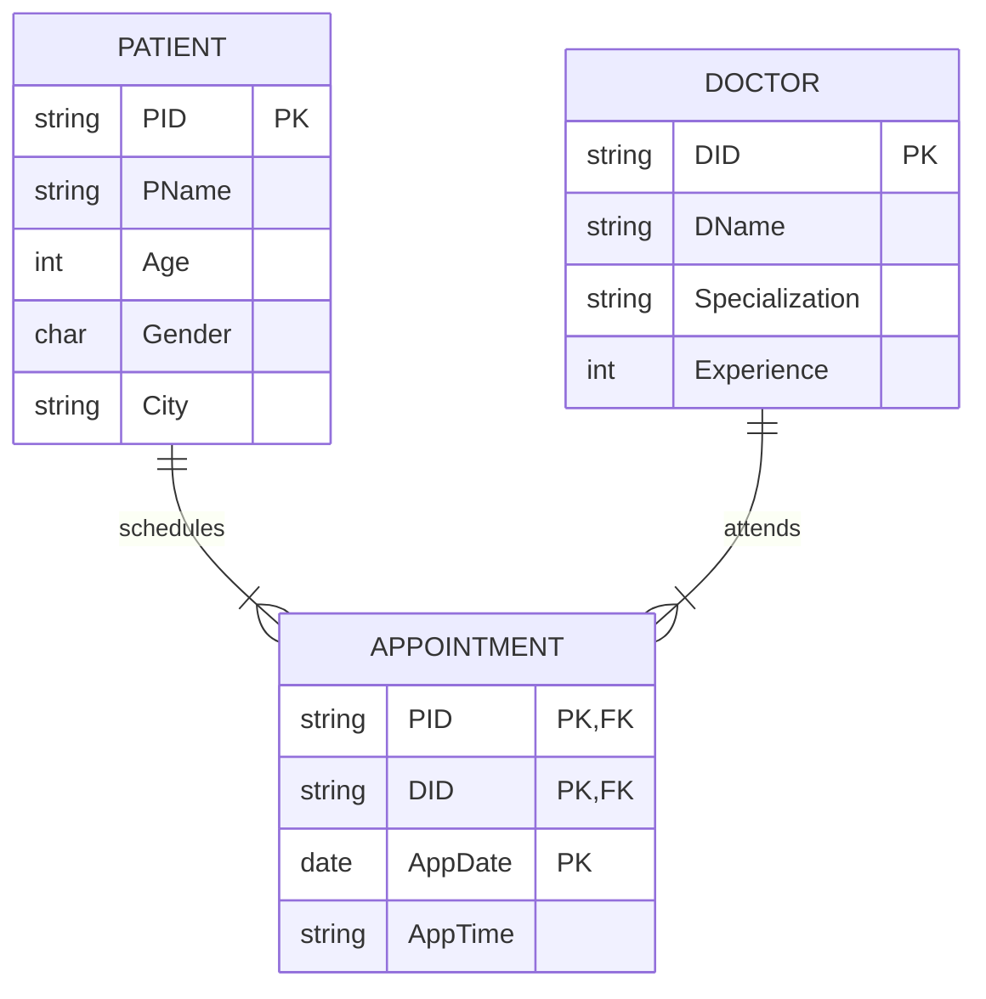
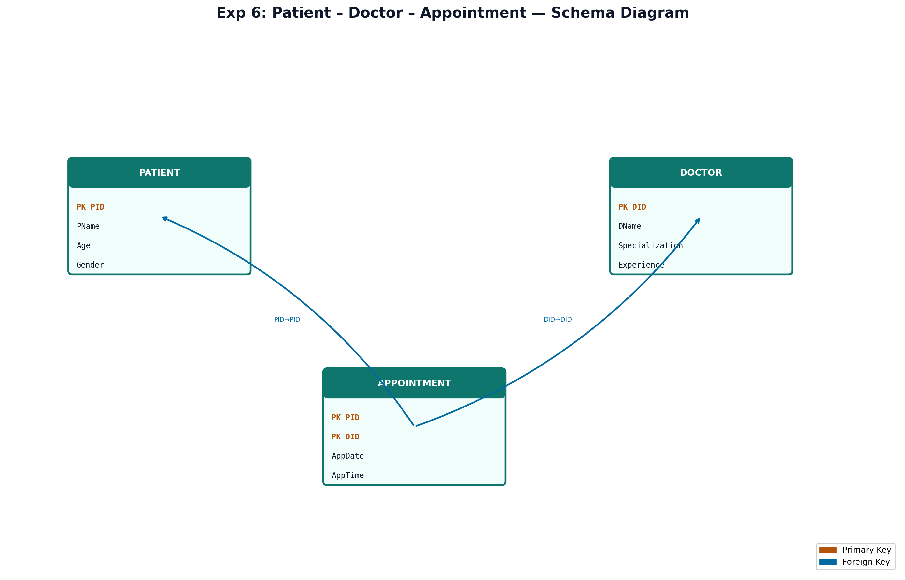

# EXPERIMENT NUMBER 6

## TITLE
Hospital Management System Database


---


## AIM
To design, implement, and query a Hospital database schema containing Patients, Doctors, and Appointments, and evaluate relational division queries and consultation metrics in Oracle SQL.


---


## PROBLEM STATEMENT
A hospital needs a database system to track patient appointments with doctors:
* A patient is described by a Patient ID (PID), Name (PName), Age, Gender, and City.
* A doctor is described by a Doctor ID (DID), Name (DName), Specialization, and Experience (years).
* An appointment logs which patient (PID) is scheduled to consult which doctor (DID) on a specific Date (AppDate) and Time (AppTime).
Establish a relational database, enforce entity and referential constraints, and perform the following queries:
i. Retrieve the details of doctors consulted by a specific patient #Patient_Name.
ii. Find the Doctor IDs of doctors who have been consulted by ALL patients (Relational Division).
iii. For each patient, find the total number of unique doctors consulted. Display the Patient Name along with the counts.


---


## OBJECTIVES
1. Learn to model clinical booking systems with composite relationship keys.
2. Formulate relational division queries to find doctors consulted by all patients.
3. Master unique group counts (`COUNT(DISTINCT DID)`) combined with outer joins.


---


## THEORY
### DBMS Concepts Involved
A clinical appointment system containing master files and matching log relations:
* **Entities**: `PATIENT` (client files), `DOCTOR` (consultant roster).
* **Relationship**:
  * `APPOINTMENT`: M:N relationship mapping `PATIENT` to `DOCTOR` with `AppDate` and `AppTime`.

### Relational Division in Hospital Schema
Relational division is used to identify a doctor who has treated/consulted all patients in the system.
* Concept: We query for doctors for whom there is no patient in the database that has *not* consulted them.
* In Oracle SQL, we use double negation:
  ```sql
  SELECT D.DID FROM DOCTOR D
  WHERE NOT EXISTS (
      SELECT P.PID FROM PATIENT P
      WHERE NOT EXISTS (
          SELECT A.PID FROM APPOINTMENT A
          WHERE A.DID = D.DID AND A.PID = P.PID
      )
  )
  ```
* Alternatively, we can use the `MINUS` set operator to perform division.


---


## ENTITY IDENTIFICATION
| Entity Name | Attributes | Primary Key | Foreign Key(s) |
|---|---|---|---|
| **PATIENT** | PID, PName, Age, Gender, City | PID | None |
| **DOCTOR** | DID, DName, Specialization, Experience | DID | None |
| **APPOINTMENT** | PID, DID, AppDate, AppTime | (PID, DID, AppDate) | PID (refs PATIENT), DID (refs DOCTOR) |


---


## CONSTRAINTS
* **Domain Constraints**:
  * `Gender` in `PATIENT`: `CHECK (Gender IN ('M', 'F'))`
  * `Age` in `PATIENT`: `CHECK (Age >= 0)`
  * `Experience` in `DOCTOR`: `CHECK (Experience >= 0)`
* **Referential Constraints**:
  * `APPOINTMENT(PID)` references `PATIENT(PID)` with `ON DELETE CASCADE`
  * `APPOINTMENT(DID)` references `DOCTOR(DID)` with `ON DELETE CASCADE`


---


## ER DIAGRAM


### ER Diagram (Figure)


*Figure: Entity–Relationship diagram (Chen notation). PK = Primary Key, FK = Foreign Key.*
*Figure: Entity–Relationship diagram (Chen notation). PK = Primary Key, FK = Foreign Key.*
### Mermaid Notation


### ASCII Diagram
```text
  +------------------+                   +------------------+
  |     PATIENT      |1                 1|      DOCTOR      |
  |------------------|                   |------------------|
  | PID (PK)         |                   | DID (PK)         |
  | PName, Age       |                   | DName, Spec      |
  | Gender, City     |                   | Experience       |
  +------------------+                   +------------------+
           |                                       |
           |1                                      |1
           |           +------------------+        |
           |           |   APPOINTMENT    |        |
           +---------->|------------------|<-------+
           (schedules) | PID (PK, FK)     | (attends)
                      N| DID (PK, FK)     |N
                       | AppDate (PK)     |
                       | AppTime          |
                       +------------------+
```


---


## SCHEMA DIAGRAM


### Schema Diagram (Figure)


*Figure: Relational schema with referential links. Orange = PK, Blue = FK.*
*Figure: Relational schema with referential links. Orange = PK, Blue = FK.*
* **PATIENT** ( [PID] (PK), PName, Age, Gender, City )
* **DOCTOR** ( [DID] (PK), DName, Specialization, Experience )
* **APPOINTMENT** ( [PID] (PK, FK1), [DID] (PK, FK2), [AppDate] (PK), AppTime )


---


## RELATIONAL MODEL
* **PATIENT**: Primary key is `PID`.
* **DOCTOR**: Primary key is `DID`.
* **APPOINTMENT**: Primary key is `(PID, DID, AppDate)`. This configuration allows a patient to book the same doctor on different dates.


---


## SQL IMPLEMENTATION
```sql
-- Dropping tables to ensure clean runs
DROP TABLE APPOINTMENT CASCADE CONSTRAINTS;
DROP TABLE DOCTOR CASCADE CONSTRAINTS;
DROP TABLE PATIENT CASCADE CONSTRAINTS;

-- 1. Create Patient table
CREATE TABLE PATIENT (
    PID VARCHAR2(10) PRIMARY KEY,
    PName VARCHAR2(50) NOT NULL,
    Age INT CHECK (Age >= 0),
    Gender CHAR(1) CHECK (Gender IN ('M', 'F')),
    City VARCHAR2(50) NOT NULL
);

-- 2. Create Doctor table
CREATE TABLE DOCTOR (
    DID VARCHAR2(10) PRIMARY KEY,
    DName VARCHAR2(50) NOT NULL,
    Specialization VARCHAR2(50) NOT NULL,
    Experience INT CHECK (Experience >= 0)
);

-- 3. Create Appointment table
CREATE TABLE APPOINTMENT (
    PID VARCHAR2(10) REFERENCES PATIENT(PID) ON DELETE CASCADE,
    DID VARCHAR2(10) REFERENCES DOCTOR(DID) ON DELETE CASCADE,
    AppDate DATE,
    AppTime VARCHAR2(10) NOT NULL,
    PRIMARY KEY (PID, DID, AppDate)
);

-- Inserting Patient Records (6 patients)
INSERT INTO PATIENT VALUES ('P001', 'John Doe', 35, 'M', 'Bangalore');
INSERT INTO PATIENT VALUES ('P002', 'Mary Jane', 28, 'F', 'Bangalore');
INSERT INTO PATIENT VALUES ('P003', 'Robert Downey', 50, 'M', 'Chennai');
INSERT INTO PATIENT VALUES ('P004', 'Scarlett Johansson', 32, 'F', 'Delhi');
INSERT INTO PATIENT VALUES ('P005', 'Chris Evans', 40, 'M', 'Pune');
INSERT INTO PATIENT VALUES ('P006', 'Mark Ruffalo', 55, 'M', 'Hyderabad');

-- Inserting Doctor Records (5 doctors)
INSERT INTO DOCTOR VALUES ('D101', 'Dr. Smith', 'Cardiology', 15);
INSERT INTO DOCTOR VALUES ('D102', 'Dr. Strange', 'Neurology', 12);
INSERT INTO DOCTOR VALUES ('D103', 'Dr. House', 'Internal Medicine', 20);
INSERT INTO DOCTOR VALUES ('D104', 'Dr. Watson', 'Pediatrics', 8);
INSERT INTO DOCTOR VALUES ('D105', 'Dr. Foster', 'Astrophysics', 5);

-- Inserting Appointment Records (12 appointments)
-- Let's make Dr. Strange (D102) consulted by ALL 6 patients for division testing
INSERT INTO APPOINTMENT VALUES ('P001', 'D102', TO_DATE('2026-06-01', 'YYYY-MM-DD'), '10:00 AM');
INSERT INTO APPOINTMENT VALUES ('P002', 'D102', TO_DATE('2026-06-01', 'YYYY-MM-DD'), '10:30 AM');
INSERT INTO APPOINTMENT VALUES ('P003', 'D102', TO_DATE('2026-06-02', 'YYYY-MM-DD'), '11:00 AM');
INSERT INTO APPOINTMENT VALUES ('P004', 'D102', TO_DATE('2026-06-02', 'YYYY-MM-DD'), '11:30 AM');
INSERT INTO APPOINTMENT VALUES ('P005', 'D102', TO_DATE('2026-06-03', 'YYYY-MM-DD'), '09:00 AM');
INSERT INTO APPOINTMENT VALUES ('P006', 'D102', TO_DATE('2026-06-03', 'YYYY-MM-DD'), '09:30 AM');

-- Other appointments
INSERT INTO APPOINTMENT VALUES ('P001', 'D101', TO_DATE('2026-06-05', 'YYYY-MM-DD'), '02:00 PM');
INSERT INTO APPOINTMENT VALUES ('P001', 'D103', TO_DATE('2026-06-06', 'YYYY-MM-DD'), '03:00 PM');
INSERT INTO APPOINTMENT VALUES ('P002', 'D103', TO_DATE('2026-06-05', 'YYYY-MM-DD'), '04:00 PM');
INSERT INTO APPOINTMENT VALUES ('P003', 'D104', TO_DATE('2026-06-07', 'YYYY-MM-DD'), '10:00 AM');
INSERT INTO APPOINTMENT VALUES ('P004', 'D101', TO_DATE('2026-06-08', 'YYYY-MM-DD'), '11:00 AM');
INSERT INTO APPOINTMENT VALUES ('P005', 'D101', TO_DATE('2026-06-09', 'YYYY-MM-DD'), '01:00 PM');
```


---


## QUERY IMPLEMENTATION

### i. Retrieve the details of doctors consulted by 'John Doe'.
#### SQL:
```sql
SELECT DISTINCT D.DID, D.DName, D.Specialization, D.Experience
FROM DOCTOR D
JOIN APPOINTMENT A ON D.DID = A.DID
JOIN PATIENT P ON A.PID = P.PID
WHERE P.PName = 'John Doe';
```
#### Explanation:
We join the `DOCTOR`, `APPOINTMENT`, and `PATIENT` tables and apply a filter condition matching the patient name to 'John Doe'. We project distinct doctor records.
#### Expected Output:
| DID | DName | Specialization | Experience |
|---|---|---|---|
| D101 | Dr. Smith | Cardiology | 15 |
| D102 | Dr. Strange | Neurology | 12 |
| D103 | Dr. House | Internal Medicine | 20 |


---


### ii. Find the DoctorIDs of doctors consulted by all patients.
#### SQL (Using NOT EXISTS Division):
```sql
SELECT D.DID, D.DName
FROM DOCTOR D
WHERE NOT EXISTS (
    SELECT P.PID 
    FROM PATIENT P
    WHERE NOT EXISTS (
        SELECT A.PID 
        FROM APPOINTMENT A
        WHERE A.DID = D.DID AND A.PID = P.PID
    )
);
```
#### SQL (Using MINUS Division):
```sql
SELECT D.DID, D.DName
FROM DOCTOR D
WHERE NOT EXISTS (
    SELECT P.PID FROM PATIENT P
    MINUS
    SELECT A.PID FROM APPOINTMENT A WHERE A.DID = D.DID
);
```
#### Explanation:
The division query finds doctors where the set of all patients minus the set of patients who consulted them is empty (`NOT EXISTS`).
#### Expected Output:
| DID | DName |
|---|---|
| D102 | Dr. Strange |


---


### iii. For each patient, find the number of doctors consulted. Display Patient_Name with the count.
#### SQL:
```sql
SELECT P.PID, P.PName, COUNT(DISTINCT A.DID) AS Doctors_Consulted
FROM PATIENT P
LEFT JOIN APPOINTMENT A ON P.PID = A.PID
GROUP BY P.PID, P.PName
ORDER BY Doctors_Consulted DESC;
```
#### Explanation:
We perform a `LEFT JOIN` between `PATIENT` and `APPOINTMENT` to catch patients who haven't scheduled any consults. We use `COUNT(DISTINCT A.DID)` to ensure that if a patient consults the same doctor multiple times, it is counted as a single unique doctor.
#### Expected Output:
| PID | PName | Doctors_Consulted |
|---|---|---|
| P001 | John Doe | 3 |
| P002 | Mary Jane | 2 |
| P003 | Robert Downey | 2 |
| P004 | Scarlett Johansson | 2 |
| P005 | Chris Evans | 2 |
| P006 | Mark Ruffalo | 1 |


---


## VIVA QUESTIONS & ANSWERS
1. **Q:** What is the purpose of `COUNT(DISTINCT column)`?
   * **A:** It counts only unique, non-null values in that column, ignoring duplicates within each group.
2. **Q:** How do we write a relational division query using `MINUS`?
   * **A:** By subtracting the subset of values associated with a specific entity from the master set of values, and ensuring no records remain.
3. **Q:** What is the index type of primary key in Oracle by default?
   * **A:** A B-Tree Index is automatically created on primary key columns.
4. **Q:** What is the difference between `CHAR` and `VARCHAR2` in Oracle?
   * **A:** `CHAR` is fixed-length, padding with blank spaces. `VARCHAR2` is variable-length.
5. **Q:** What are constraints?
6. **Q:** Why is the appointment primary key `(PID, DID, AppDate)` instead of just `(PID, DID)`?
   * **A:** To allow a patient to consult the same doctor multiple times on different dates.
7. **Q:** Can a foreign key be NULL?
   * **A:** Yes, unless it is restricted by a `NOT NULL` constraint.
8. **Q:** What is the purpose of `GROUP BY`?
   * **A:** To combine rows with identical values in specified columns into aggregate groups.
9. **Q:** What is a data dictionary?
   * **A:** A read-only set of database tables that contain metadata about the database.
10. **Q:** What is the `DUAL` table in Oracle?
    * **A:** A special one-row, one-column dummy table present by default in Oracle, used to evaluate expressions or select values.
11. **Q:** Can we delete a doctor if they have active appointments?
    * **A:** Yes, if the constraint has `ON DELETE CASCADE` enabled. It will delete the doctor and all their appointments.
12. **Q:** What does `sysdate` return in Oracle?
    * **A:** The current date and time of the database server.
13. **Q:** What is the difference between inner join and left outer join?
    * **A:** Inner join returns matching records only. Left outer join returns all records from the left table and matching ones from the right table.
14. **Q:** How do we filter query results based on group calculations?
    * **A:** Using the `HAVING` clause after the `GROUP BY` clause.
15. **Q:** What does relational division accomplish in this schema?
    * **A:** It identifies doctors who have consulted all patients.


---


## LAB EXAM QUESTIONS
1. Find all doctors whose experience is greater than 10 years.
2. Find patients who live in 'Bangalore' and are older than 30.
3. Find the doctor who has the maximum number of appointments.
4. List appointments scheduled for '2026-06-01'.
5. Display the average age of patients who consulted 'Dr. Smith'.
6. List doctors who have not received any appointments.
7. Write a query to change appointment time for patient 'P001' on '2026-06-01' to '11:00 AM'.
8. Find patients who consulted more than 2 doctors.
9. Display doctor specializations without duplicates.
10. Remove all appointments for doctors with experience less than 6 years.


---


## RESULT
The Hospital Management database containing Patients, Doctors, and Appointments was successfully created, populated, and verified. Relational division and unique doctor count queries were successfully evaluated.
