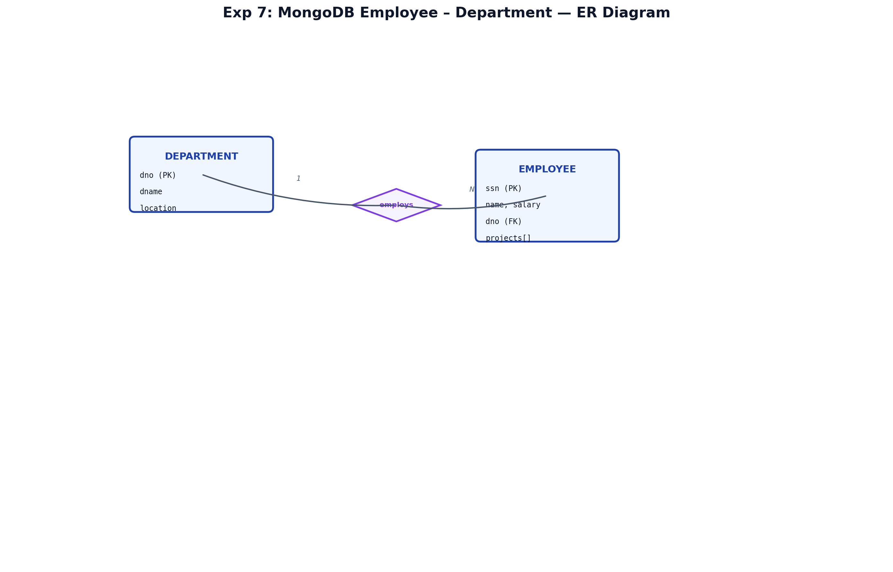
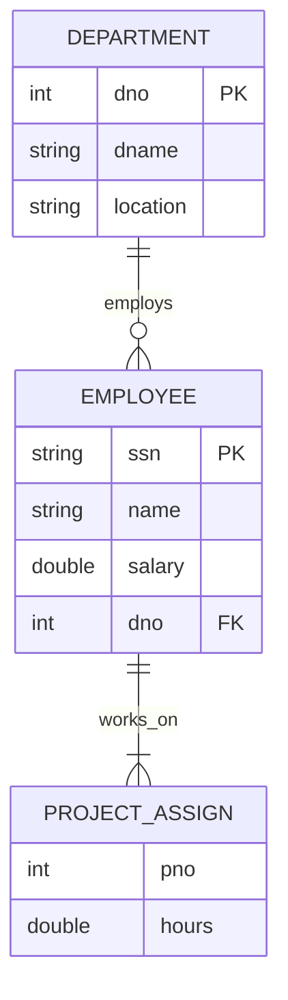
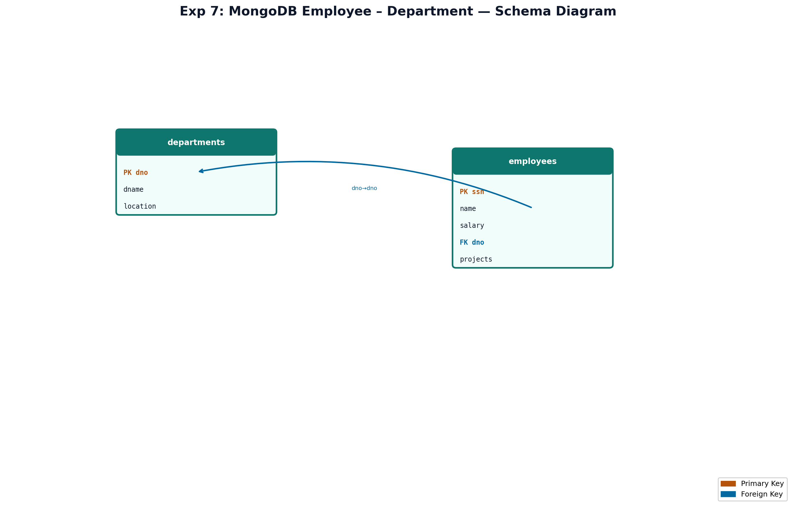

# EXPERIMENT NUMBER 7

## TITLE
MongoDB Employee and Department + Salary Increment Program


---


## AIM
To design Employee and Department collections in MongoDB, perform document-based queries, and implement a PL/SQL program that awards a 15% salary increment to all employees in a specified department.


---


## PROBLEM STATEMENT
An organization stores workforce data in MongoDB instead of a purely relational store. Each **Department** document contains department number, name, and location. Each **Employee** document contains SSN, name, salary, department reference, and optional project assignments. The system must support listing employees by department name and by project number, and must execute a server-side PL/SQL batch update to increase salaries for a given department.


---


## OBJECTIVES
1. Create and populate MongoDB collections with embedded and referenced data.
2. Execute `find()`, projection, and filtering on nested fields.
3. Write PL/SQL with `UPDATE`, `SQL%ROWCOUNT`, and user feedback messages.


---


## THEORY

### DBMS Concepts Involved
MongoDB is a **document-oriented NoSQL** database. Data is stored as BSON documents inside **collections** (analogous to tables). Unlike rigid relational schemas, documents in the same collection may vary slightly, though lab designs use a consistent structure.

### Entities
| Entity | Storage | Key Fields |
|--------|---------|------------|
| Department | `departments` collection | `dno`, `dname`, `location` |
| Employee | `employees` collection | `ssn`, `name`, `salary`, `dno`, `projects[]` |

### Relationships
- **Employee → Department**: Reference by `dno` (logical foreign key).
- **Employee → Project**: Array of sub-documents `{ pno, hours }` (embedded M:N).

### MongoDB Concepts Used
- `insertOne` / `insertMany` for data loading
- `find` with query filters and projections
- Dot notation for array fields: `projects.pno`

### PL/SQL Concepts Used
- Anonymous PL/SQL block
- `UPDATE` with `WHERE` on department number
- `SQL%ROWCOUNT` to count affected rows
- `DBMS_OUTPUT.PUT_LINE` for messages


---


## ENTITY IDENTIFICATION
| Entity Name | Attributes | Primary Key |
|-------------|------------|-------------|
| Department | dno, dname, location | dno |
| Employee | ssn, name, salary, dno, projects | ssn |


---


## CONSTRAINTS
1. **Domain**: `salary > 0`; `dno` is positive integer.
2. **Entity Integrity**: `ssn` and `dno` must be unique within their collections.
3. **Referential Integrity (Logical)**: Every `employees.dno` must exist in `departments`.
4. **Participation**: Each employee belongs to exactly one department.
5. **Cardinality**: Department 1:N Employee.


---


## ER DIAGRAM


### ER Diagram (Figure)


*Figure: Entity–Relationship diagram (Chen notation). PK = Primary Key, FK = Foreign Key.*
*Figure: Entity–Relationship diagram (Chen notation). PK = Primary Key, FK = Foreign Key.*
### Mermaid


### ASCII
```text
  +-------------+ 1     N +------------------+
  | DEPARTMENT  |-------->|    EMPLOYEE      |
  | dno (PK)    |         | ssn (PK)         |
  | dname       |         | name, salary     |
  +-------------+         | dno (FK)         |
                          | projects[]       |
                          +------------------+
```


---


## SCHEMA DIAGRAM


### Schema Diagram (Figure)


*Figure: Relational schema with referential links. Orange = PK, Blue = FK.*
*Figure: Relational schema with referential links. Orange = PK, Blue = FK.*
```text
departments( dno PK, dname, location )
employees( ssn PK, name, salary, dno FK, projects[{ pno, hours }] )
```


---


## RELATIONAL MODEL (Oracle mirror for PL/SQL)
```text
DEPARTMENT(DNo, DName, Location)
EMPLOYEE(SSN, Name, Salary, DNo)  -- DNo REFERENCES DEPARTMENT(DNo)
```


---


## SQL IMPLEMENTATION (Oracle tables for PL/SQL)

### CREATE TABLE Statements
```sql
DROP TABLE EMPLOYEE CASCADE CONSTRAINTS;
DROP TABLE DEPARTMENT CASCADE CONSTRAINTS;

CREATE TABLE DEPARTMENT (
    DNo   NUMBER(2) PRIMARY KEY,
    DName VARCHAR2(50) NOT NULL UNIQUE,
    Location VARCHAR2(50) NOT NULL
);

CREATE TABLE EMPLOYEE (
    SSN    CHAR(9) PRIMARY KEY,
    Name   VARCHAR2(50) NOT NULL,
    Salary NUMBER(10,2) CHECK (Salary > 0),
    DNo    NUMBER(2) NOT NULL REFERENCES DEPARTMENT(DNo)
);
```

### INSERT STATEMENTS (10+ records)
```sql
INSERT INTO DEPARTMENT VALUES (1, 'Research', 'Bangalore');
INSERT INTO DEPARTMENT VALUES (2, 'Administration', 'Chennai');
INSERT INTO DEPARTMENT VALUES (3, 'Development', 'Pune');

INSERT INTO EMPLOYEE VALUES ('101', 'Alice Johnson', 80000, 1);
INSERT INTO EMPLOYEE VALUES ('102', 'Bob Smith', 75000, 1);
INSERT INTO EMPLOYEE VALUES ('103', 'Charlie Brown', 60000, 1);
INSERT INTO EMPLOYEE VALUES ('201', 'Diana Prince', 95000, 2);
INSERT INTO EMPLOYEE VALUES ('202', 'Evan Wright', 55000, 2);
INSERT INTO EMPLOYEE VALUES ('301', 'Fiona Gallagher', 110000, 3);
INSERT INTO EMPLOYEE VALUES ('302', 'George Miller', 90000, 3);
INSERT INTO EMPLOYEE VALUES ('303', 'Hannah Abbott', 85000, 3);
INSERT INTO EMPLOYEE VALUES ('304', 'Ian Malcolm', 45000, 3);
INSERT INTO EMPLOYEE VALUES ('305', 'Julia Roberts', 98000, 3);
COMMIT;
```

### DISPLAY TABLE CONTENTS
```sql
SELECT * FROM DEPARTMENT;
SELECT * FROM EMPLOYEE;
```


---


# MONGODB IMPLEMENTATION

## Collection Design
```javascript
// Database: company_db
// Collection: departments
{ "dno": 1, "dname": "Research", "location": "Bangalore" }

// Collection: employees
{
  "ssn": "101",
  "name": "Alice Johnson",
  "salary": 80000,
  "dno": 1,
  "projects": [ { "pno": 12, "hours": 20 } ]
}
```

## Sample Documents – insertMany()
```javascript
use company_db;

db.departments.insertMany([
  { dno: 1, dname: "Research", location: "Bangalore" },
  { dno: 2, dname: "Administration", location: "Chennai" },
  { dno: 3, dname: "Development", location: "Pune" }
]);

db.employees.insertMany([
  { ssn: "101", name: "Alice Johnson", salary: 80000, dno: 1, projects: [{ pno: 12, hours: 20 }] },
  { ssn: "102", name: "Bob Smith", salary: 75000, dno: 1, projects: [{ pno: 12, hours: 40 }] },
  { ssn: "103", name: "Charlie Brown", salary: 60000, dno: 1, projects: [{ pno: 12, hours: 35 }] },
  { ssn: "201", name: "Diana Prince", salary: 95000, dno: 2, projects: [{ pno: 13, hours: 10 }] },
  { ssn: "202", name: "Evan Wright", salary: 55000, dno: 2, projects: [{ pno: 13, hours: 40 }] },
  { ssn: "301", name: "Fiona Gallagher", salary: 110000, dno: 3, projects: [{ pno: 10, hours: 15 }, { pno: 11, hours: 20 }] },
  { ssn: "302", name: "George Miller", salary: 90000, dno: 3, projects: [{ pno: 10, hours: 30 }] },
  { ssn: "303", name: "Hannah Abbott", salary: 85000, dno: 3, projects: [{ pno: 11, hours: 25 }] },
  { ssn: "304", name: "Ian Malcolm", salary: 45000, dno: 3, projects: [{ pno: 14, hours: 45 }] },
  { ssn: "305", name: "Julia Roberts", salary: 98000, dno: 3, projects: [{ pno: 10, hours: 10 }] }
]);
```

## Query 1 – List employees of Department named 'Development'
### Requirement
List all employees belonging to the department whose name is **Development**.

### MongoDB Query
```javascript
var dept = db.departments.findOne({ dname: "Development" });
db.employees.find(
  { dno: dept.dno },
  { _id: 0, ssn: 1, name: 1, salary: 1, dno: 1 }
);
```

### Alternative (aggregation)
```javascript
db.employees.aggregate([
  { $lookup: { from: "departments", localField: "dno", foreignField: "dno", as: "dept" } },
  { $match: { "dept.dname": "Development" } },
  { $project: { _id: 0, ssn: 1, name: 1, salary: 1, dname: { $arrayElemAt: ["$dept.dname", 0] } } }
]);
```

### Expected Output
| ssn | name | salary | dno |
|-----|------|--------|-----|
| 301 | Fiona Gallagher | 110000 | 3 |
| 302 | George Miller | 90000 | 3 |
| 303 | Hannah Abbott | 85000 | 3 |
| 304 | Ian Malcolm | 45000 | 3 |
| 305 | Julia Roberts | 98000 | 3 |

## Query 2 – Employees on Project Number 10
### Requirement
Display names of employees working on project number **10**.

### MongoDB Query
```javascript
db.employees.find(
  { "projects.pno": 10 },
  { _id: 0, name: 1, ssn: 1, projects: 1 }
);
```

### Expected Output
| name | ssn | projects |
|------|-----|----------|
| Fiona Gallagher | 301 | [{pno:10,hours:15},{pno:11,hours:20}] |
| George Miller | 302 | [{pno:10,hours:30}] |
| Julia Roberts | 305 | [{pno:10,hours:10}] |


---


# PL/SQL IMPLEMENTATION

## Complete Program – 15% Pay Increase for Department #3
```sql
SET SERVEROUTPUT ON;

DECLARE
    v_dept_no NUMBER := 3;          -- Department number (Development)
    v_rows    NUMBER;
BEGIN
    UPDATE EMPLOYEE
    SET Salary = Salary * 1.15
    WHERE DNo = v_dept_no;

    v_rows := SQL%ROWCOUNT;

    DBMS_OUTPUT.PUT_LINE('Pay increase of 15% applied to department ' || v_dept_no);
    DBMS_OUTPUT.PUT_LINE('Number of employees updated: ' || v_rows);

    COMMIT;
EXCEPTION
    WHEN OTHERS THEN
        ROLLBACK;
        DBMS_OUTPUT.PUT_LINE('Error: ' || SQLERRM);
END;
/
```

## Line-by-Line Explanation
| Line | Explanation |
|------|-------------|
| `SET SERVEROUTPUT ON` | Enables message display in SQL Developer |
| `v_dept_no := 3` | Target department for increment |
| `UPDATE ... Salary * 1.15` | Applies 15% increase |
| `SQL%ROWCOUNT` | Returns number of rows updated |
| `COMMIT` | Makes changes permanent |
| `EXCEPTION` block | Rolls back on failure |

## Sample Output
```text
Pay increase of 15% applied to department 3
Number of employees updated: 5
```


---


# MONGODB OUTPUT
```text
> db.employees.find({ "projects.pno": 10 }, { name: 1, _id: 0 })
{ "name": "Fiona Gallagher" }
{ "name": "George Miller" }
{ "name": "Julia Roberts" }
```


---


# OUTPUT SECTION (Oracle SQL Developer style)
```text
SQL> SELECT * FROM EMPLOYEE WHERE DNo = 3;

SSN  NAME              SALARY    DNO
---  ----------------  --------  ---
301  Fiona Gallagher   126500.00  3
302  George Miller     103500.00  3
...
5 rows selected.
```


---


# STEP-BY-STEP EXECUTION
1. Open **MongoDB Compass** or `mongosh` and run `use company_db`.
2. Create `departments` and `employees` collections using `insertMany`.
3. Execute Query 1 and Query 2; verify document counts.
4. Open **Oracle SQL Developer**; run DDL and DML for `DEPARTMENT` and `EMPLOYEE`.
5. Enable `DBMS_OUTPUT`; execute the PL/SQL block for department 3.
6. Run `SELECT * FROM EMPLOYEE WHERE DNo = 3` to verify increased salaries.


---


# VIVA QUESTIONS
1. What is BSON?
2. Difference between SQL and NoSQL databases?
3. What is a collection in MongoDB?
4. What does `insertMany` do?
5. How do you query nested array fields?
6. What is `$lookup` in aggregation?
7. What is `SQL%ROWCOUNT`?
8. Why use PL/SQL instead of a single SQL UPDATE?
9. What is the purpose of `COMMIT`?
10. What is document embedding vs referencing?
11. What is `findOne`?
12. What is projection in MongoDB?
13. What is an anonymous PL/SQL block?
14. How is referential integrity enforced in MongoDB?
15. What is `DBMS_OUTPUT`?


---


# VIVA ANSWERS
1. **BSON** is Binary JSON, MongoDB's internal storage format extending JSON with additional data types.
2. **SQL** uses fixed schemas and tables; **NoSQL** (MongoDB) uses flexible document schemas and horizontal scaling.
3. A **collection** is a grouping of MongoDB documents, similar to a table.
4. **`insertMany`** inserts multiple documents in one operation.
5. Use **dot notation** e.g. `"projects.pno": 10` to match array elements.
6. **`$lookup`** performs a left outer join between collections in an aggregation pipeline.
7. **`SQL%ROWCOUNT`** holds the number of rows affected by the last SQL statement.
8. PL/SQL allows **conditional logic**, error handling, and formatted messages in one block.
9. **`COMMIT`** permanently saves transaction changes.
10. **Embedding** stores related data inside a document; **referencing** stores foreign keys (`dno`) separately.
11. **`findOne`** returns the first matching document or null.
12. **Projection** selects which fields to return: `{ name: 1, _id: 0 }`.
13. An **anonymous block** is PL/SQL code executed once without creating a stored procedure.
14. MongoDB does not enforce FKs by default; applications or schema validation enforce it.
15. **`DBMS_OUTPUT`** is an Oracle package for printing messages from PL/SQL.


---


# FREQUENTLY ASKED LAB EXAM QUESTIONS
1. Write MongoDB query to find employees with salary > 80000.
2. Write PL/SQL to decrease salary by 10% for department 1.
3. How to delete all employees in a department in MongoDB?
4. Write aggregation to count employees per department.
5. What is the difference between `updateOne` and `updateMany`?
6. How to create an index on `employees.dno`?
7. Write SQL join equivalent of `$lookup`.
8. Explain transaction in Oracle PL/SQL.
9. List advantages of MongoDB for unstructured data.
10. Write `find()` with sort and limit.


---


# RESULT
The Employee and Department data was successfully stored in MongoDB and queried by department name and project number. The PL/SQL salary increment program executed correctly and updated five employees in department 3, with the row count displayed through `DBMS_OUTPUT`.
