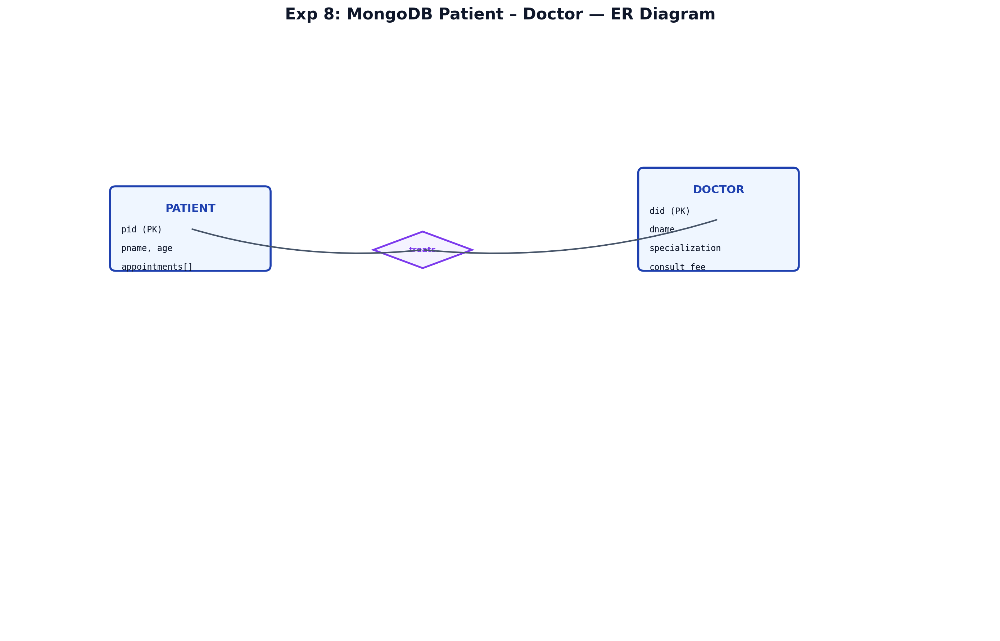
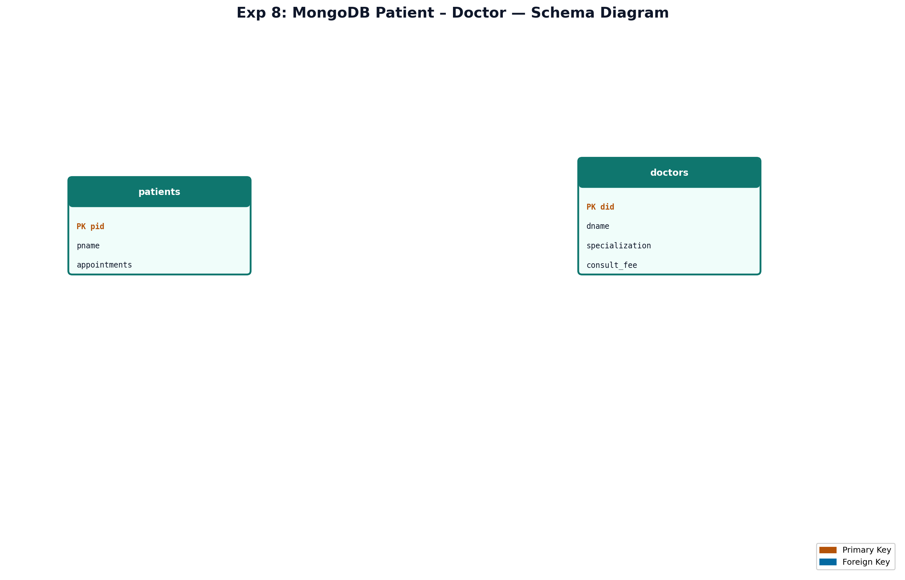

# EXPERIMENT NUMBER 8

## TITLE
MongoDB Patient and Doctor + Consultation Fee Update Program


---


## AIM
To model Patient and Doctor data in MongoDB, execute appointment-based queries, and implement a PL/SQL program that increases consultation fees by 20% for doctors in a given specialization.


---


## PROBLEM STATEMENT
A hospital stores **patients** and **doctors** as MongoDB documents. Appointments link patients to doctors with date and time. The system must list patients treated by a named doctor and patients with appointments on a given date. A PL/SQL program must update consultation fees for all doctors in a specified specialization.


---


## OBJECTIVES
1. Design MongoDB collections with appointment sub-documents or references.
2. Perform filtering on doctor names and appointment dates.
3. Implement PL/SQL bulk update with row count feedback.


---


## THEORY
### DBMS Concepts
- **Entities**: Patient (PID, PName, Age, Gender), Doctor (DID, DName, Specialization, ConsultFee).
- **Relationship**: Appointment (M:N between Patient and Doctor) with Date and Time attributes.
- **MongoDB**: Store appointments as array inside patient document OR separate `appointments` collection.
- **PL/SQL**: `UPDATE` with `WHERE Specialization = ...` and `SQL%ROWCOUNT`.


---


## ENTITY IDENTIFICATION
| Entity | Attributes | Primary Key |
|--------|------------|-------------|
| Patient | pid, pname, age, gender, appointments[] | pid |
| Doctor | did, dname, specialization, consult_fee | did |


---


## CONSTRAINTS
1. Domain: Age > 0; Gender IN ('M','F'); ConsultFee > 0.
2. Entity Integrity: pid, did unique.
3. Referential: appointment.did exists in doctors.
4. Participation: Partial – not all patients need appointments.
5. Cardinality: M:N Patient–Doctor via Appointment.


---


## ER DIAGRAM (Mermaid)


### ER Diagram (Figure)


*Figure: Entity–Relationship diagram (Chen notation). PK = Primary Key, FK = Foreign Key.*
*Figure: Entity–Relationship diagram (Chen notation). PK = Primary Key, FK = Foreign Key.*
```mermaid
erDiagram
    PATIENT { string pid PK; string pname; int age; char gender }
    DOCTOR { string did PK; string dname; string specialization; double consult_fee }
    APPOINTMENT { date app_date; string app_time; string did FK; string pid FK }
    PATIENT ||--o{ APPOINTMENT : schedules
    DOCTOR ||--o{ APPOINTMENT : conducts
```


---


## SCHEMA DIAGRAM


### Schema Diagram (Figure)


*Figure: Relational schema with referential links. Orange = PK, Blue = FK.*
*Figure: Relational schema with referential links. Orange = PK, Blue = FK.*


---


## MONGODB IMPLEMENTATION

### insertMany – doctors
```javascript
use hospital_db;
db.doctors.insertMany([
  { did: "D101", dname: "Dr. Smith", specialization: "Cardiology", consult_fee: 1500 },
  { did: "D102", dname: "Dr. Strange", specialization: "Neurology", consult_fee: 2000 },
  { did: "D103", dname: "Dr. House", specialization: "Internal Medicine", consult_fee: 1200 },
  { did: "D104", dname: "Dr. Grey", specialization: "Cardiology", consult_fee: 1800 },
  { did: "D105", dname: "Dr. Banner", specialization: "Neurology", consult_fee: 1600 }
]);
```

### insertMany – patients
```javascript
db.patients.insertMany([
  { pid: "P001", pname: "John Doe", age: 45, gender: "M",
    appointments: [
      { did: "D101", dname: "Dr. Smith", app_date: ISODate("2026-06-01"), app_time: "10:00" },
      { did: "D102", dname: "Dr. Strange", app_date: ISODate("2026-06-05"), app_time: "11:30" }
    ]},
  { pid: "P002", pname: "Mary Jane", age: 32, gender: "F",
    appointments: [{ did: "D103", dname: "Dr. House", app_date: ISODate("2026-06-01"), app_time: "09:00" }]},
  { pid: "P003", pname: "Robert Downey", age: 50, gender: "M",
    appointments: [{ did: "D104", dname: "Dr. Grey", app_date: ISODate("2026-06-10"), app_time: "14:00" }]},
  { pid: "P004", pname: "Scarlett Johansson", age: 28, gender: "F", appointments: [] },
  { pid: "P005", pname: "Chris Evans", age: 38, gender: "M",
    appointments: [{ did: "D101", dname: "Dr. Smith", app_date: ISODate("2026-06-01"), app_time: "15:00" }]}
]);
```

### Query i – Patients treated by Dr. Smith
```javascript
db.patients.find(
  { "appointments.dname": "Dr. Smith" },
  { _id: 0, pid: 1, pname: 1, age: 1, gender: 1 }
);
```

### Query ii – Patients with appointment on 2026-06-01
```javascript
db.patients.find(
  { "appointments.app_date": ISODate("2026-06-01") },
  { _id: 0, pname: 1, appointments: 1 }
);
```


---


## SQL IMPLEMENTATION (Oracle for PL/SQL)
```sql
DROP TABLE APPOINTMENT CASCADE CONSTRAINTS;
DROP TABLE PATIENT CASCADE CONSTRAINTS;
DROP TABLE DOCTOR CASCADE CONSTRAINTS;

CREATE TABLE DOCTOR (
    DID VARCHAR2(10) PRIMARY KEY,
    DName VARCHAR2(50) NOT NULL,
    Specialization VARCHAR2(50) NOT NULL,
    ConsultFee NUMBER(8,2) CHECK (ConsultFee > 0)
);

CREATE TABLE PATIENT (
    PID VARCHAR2(10) PRIMARY KEY,
    PName VARCHAR2(50) NOT NULL,
    Age NUMBER(3) CHECK (Age > 0),
    Gender CHAR(1) CHECK (Gender IN ('M','F'))
);

CREATE TABLE APPOINTMENT (
    PID VARCHAR2(10) REFERENCES PATIENT(PID) ON DELETE CASCADE,
    DID VARCHAR2(10) REFERENCES DOCTOR(DID) ON DELETE CASCADE,
    AppDate DATE NOT NULL,
    AppTime VARCHAR2(10),
    PRIMARY KEY (PID, DID, AppDate)
);

INSERT INTO DOCTOR VALUES ('D101','Dr. Smith','Cardiology',1500);
INSERT INTO DOCTOR VALUES ('D102','Dr. Strange','Neurology',2000);
INSERT INTO DOCTOR VALUES ('D103','Dr. House','Internal Medicine',1200);
INSERT INTO DOCTOR VALUES ('D104','Dr. Grey','Cardiology',1800);
INSERT INTO DOCTOR VALUES ('D105','Dr. Banner','Neurology',1600);
-- ... additional inserts for patients and appointments
COMMIT;
```


---


## PL/SQL – 20% Fee Increase for Cardiology
```sql
SET SERVEROUTPUT ON;
DECLARE
    v_spec VARCHAR2(50) := 'Cardiology';
    v_count NUMBER;
BEGIN
    UPDATE DOCTOR
    SET ConsultFee = ConsultFee * 1.20
    WHERE Specialization = v_spec;

    v_count := SQL%ROWCOUNT;
    DBMS_OUTPUT.PUT_LINE('Specialization: ' || v_spec);
    DBMS_OUTPUT.PUT_LINE('Doctors updated: ' || v_count);
    COMMIT;
END;
/
```

### Sample Output
```text
Specialization: Cardiology
Doctors updated: 2
```


---


## MONGODB OUTPUT
```text
{ "pname": "John Doe", "pid": "P001", ... }
{ "pname": "Chris Evans", "pid": "P005", ... }
```


---


## STEP-BY-STEP EXECUTION
1. Create `hospital_db` and insert doctor/patient documents.
2. Run find queries for Dr. Smith and date 2026-06-01.
3. Create Oracle tables; insert matching relational data.
4. Execute PL/SQL fee update; verify with `SELECT * FROM DOCTOR WHERE Specialization='Cardiology'`.


---


## VIVA QUESTIONS
1. How is ISODate used in MongoDB?
2. What is partial participation?
3. Explain M:N mapping in documents.
4. What is SQL%ROWCOUNT?
5. Difference between embedded appointments vs separate collection?
6. How to index appointment dates?
7. What is COMMIT?
8. Write MongoDB updateOne example.
9. What is specialization as domain constraint?
10. How does ON DELETE CASCADE work?
11. What is find() cursor?
12. What is PL/SQL block structure?
13. How to format dates in Oracle?
14. What is aggregation $unwind?
15. Why hospital data may use MongoDB?


---


## VIVA ANSWERS
1. **ISODate** stores UTC dates for reliable date comparisons in queries.
2. **Partial participation**: some patients have zero appointments (optional relationship).
3. **M:N in documents**: duplicate doctor info in patient appointment array or use junction collection.
4. **SQL%ROWCOUNT** returns rows affected by last SQL statement.
5. **Embedded** = faster reads; **separate collection** = normalized, easier updates.
6. `db.patients.createIndex({ "appointments.app_date": 1 })`
7. **COMMIT** saves changes permanently.
8. `db.doctors.updateOne({ did: "D101" }, { $set: { consult_fee: 1600 } })`
9. **Specialization** restricts valid doctor categories (domain/business rule).
10. **ON DELETE CASCADE** removes child rows when parent is deleted.
11. **find()** returns a cursor iterable in mongosh.
12. **DECLARE-BEGIN-EXCEPTION-END** structure.
13. `TO_DATE('2026-06-01','YYYY-MM-DD')` in Oracle.
14. **$unwind** deconstructs array fields into separate documents per element.
15. Flexible schema for varying patient records and nested appointments.


---


## LAB EXAM QUESTIONS
1. List all neurologists in MongoDB.
2. PL/SQL to add flat 500 to all consultation fees.
3. Find patients older than 40 with appointments.
4. Delete appointments on a specific date.
5. Count appointments per doctor using aggregation.
6. Oracle query: patients who consulted Dr. House.
7. Create unique index on pid.
8. updateMany to set gender default.
9. Explain referential integrity in Oracle vs MongoDB.
10. Write exception handler for zero rows updated.


---


## RESULT
Patient and Doctor collections were created in MongoDB and queried successfully. The PL/SQL program increased consultation fees by 20% for Cardiology doctors and reported that 2 doctors were updated.
