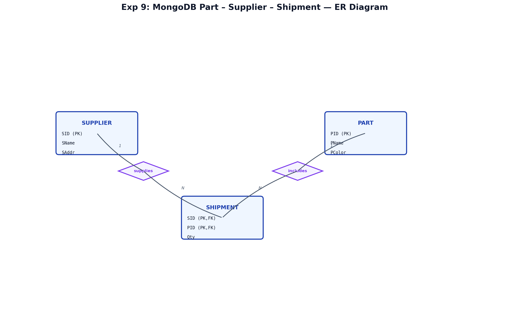
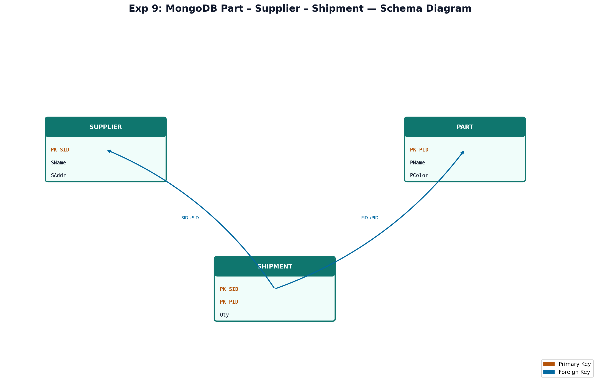

# EXPERIMENT NUMBER 9

## TITLE
MongoDB Part–Supplier–Shipment + PL/SQL Backup Program


---


## AIM
To manage Part, Supplier, and Shipment data in MongoDB, update part details by PID, list suppliers for a part, and copy Shipment records to a backup table for a specific part using PL/SQL.


---


## PROBLEM STATEMENT
Using the Part–Supplier–Shipment schema, MongoDB stores parts and suppliers with shipment quantities. Operations include updating a part by PID and finding all suppliers for that part. Oracle PL/SQL copies rows from `SHIPMENT` to `SHIPMENT_BACKUP` for a given part number.


---


## OBJECTIVES
1. Implement MongoDB `updateOne` and join-style queries.
2. Use PL/SQL `INSERT INTO ... SELECT` for backup.
3. Understand audit/backup table design.


---


## ENTITY IDENTIFICATION
| Entity | Attributes | PK |
|--------|------------|-----|
| Part | pid, pname, pcolor | pid |
| Supplier | sid, sname, saddr | sid |
| Shipment | sid, pid, qty | (sid, pid) |


---


---


## THEORY
### DBMS Concepts Involved
This experiment extends the Part–Supplier–Shipment (Experiment 2) model with **MongoDB document storage** for operational queries and **Oracle PL/SQL** for transactional backup. MongoDB handles flexible shipment logs; Oracle enforces relational integrity and audit trails via `SHIPMENT_BACKUP`.

### MongoDB Concepts
- **Collections**: `parts`, `suppliers`, `shipments`
- **Operators**: `$set`, `$lookup`, `$unwind`, `$match`, `$project`
- **Methods**: `insertMany`, `updateOne`, `find`, `aggregate`

### PL/SQL Concepts
- Anonymous block with `INSERT INTO ... SELECT`
- `%ROWTYPE`, `SQL%ROWCOUNT`, `COMMIT`
- Backup tables with `SYSDATE` audit column


---


## CONSTRAINTS
1. **Domain**: Qty > 0; PColor NOT NULL.
2. **Entity Integrity**: SID, PID unique; composite (SID, PID) in SHIPMENT.
3. **Referential Integrity**: FK with optional CASCADE on delete.
4. **Participation**: Every shipment must reference valid supplier and part (total).
5. **Cardinality**: Supplier M:N Part via Shipment.


---


## ER DIAGRAM


### ER Diagram (Figure)


*Figure: Entity–Relationship diagram (Chen notation). PK = Primary Key, FK = Foreign Key.*
*Figure: Entity–Relationship diagram (Chen notation). PK = Primary Key, FK = Foreign Key.*
### Mermaid
```mermaid
erDiagram
    SUPPLIER { string SID PK; string SName; string SAddr }
    PART { string PID PK; string PName; string PColor }
    SHIPMENT { string SID PK_FK; string PID PK_FK; int Qty }
    SUPPLIER ||--|{ SHIPMENT : supplies
    PART ||--|{ SHIPMENT : includes
```


---


## SCHEMA DIAGRAM


### Schema Diagram (Figure)


*Figure: Relational schema with referential links. Orange = PK, Blue = FK.*
*Figure: Relational schema with referential links. Orange = PK, Blue = FK.*


---


## SQL IMPLEMENTATION (Full Oracle – same data as Experiment 2)
```sql
DROP TABLE SHIPMENT_BACKUP CASCADE CONSTRAINTS;
DROP TABLE SHIPMENT CASCADE CONSTRAINTS;
DROP TABLE PART CASCADE CONSTRAINTS;
DROP TABLE SUPPLIER CASCADE CONSTRAINTS;

CREATE TABLE SUPPLIER (
    SID CHAR(5) PRIMARY KEY,
    SName VARCHAR2(50) NOT NULL,
    SAddr VARCHAR2(100) NOT NULL
);
CREATE TABLE PART (
    PID CHAR(5) PRIMARY KEY,
    PName VARCHAR2(50) NOT NULL,
    PColor VARCHAR2(20) NOT NULL
);
CREATE TABLE SHIPMENT (
    SID CHAR(5) REFERENCES SUPPLIER(SID) ON DELETE CASCADE,
    PID CHAR(5) REFERENCES PART(PID) ON DELETE CASCADE,
    Qty INT CHECK (Qty > 0),
    PRIMARY KEY (SID, PID)
);
CREATE TABLE SHIPMENT_BACKUP (
    SID CHAR(5),
    PID CHAR(5),
    Qty INT,
    BackupDate DATE DEFAULT SYSDATE,
    PRIMARY KEY (SID, PID, BackupDate)
);

INSERT INTO SUPPLIER VALUES ('S001', 'Acme Corp', '12 Industry Way, Mumbai');
INSERT INTO SUPPLIER VALUES ('S002', 'Global Parts Ltd', '45 Science Park, Bangalore');
INSERT INTO SUPPLIER VALUES ('S003', 'Apex Industries', '78 Heavy Zone, Chennai');
INSERT INTO PART VALUES ('P001', 'Gear', 'Red');
INSERT INTO PART VALUES ('P002', 'Bolt', 'Blue');
INSERT INTO PART VALUES ('P003', 'Nut', 'Black');
INSERT INTO PART VALUES ('P004', 'Screw', 'Red');
INSERT INTO SHIPMENT VALUES ('S001', 'P001', 500);
INSERT INTO SHIPMENT VALUES ('S001', 'P002', 300);
INSERT INTO SHIPMENT VALUES ('S002', 'P002', 1000);
INSERT INTO SHIPMENT VALUES ('S003', 'P001', 200);
INSERT INTO SHIPMENT VALUES ('S007', 'P001', 1200);
INSERT INTO SHIPMENT VALUES ('S010', 'P001', 450);
COMMIT;
```


---


## QUERY IMPLEMENTATION

### Query i – Update part P001 in MongoDB
#### Requirement
Update part details for PID = P001.
#### MongoDB
```javascript
db.parts.updateOne({ pid: "P001" }, { $set: { pname: "Heavy Gear", pcolor: "Blue" } });
```
#### Expected Output
```text
{ acknowledged: true, matchedCount: 1, modifiedCount: 1 }
```

### Query ii – Suppliers for part P001
#### MongoDB
```javascript
db.shipments.aggregate([
  { $match: { pid: "P001" } },
  { $lookup: { from: "suppliers", localField: "sid", foreignField: "sid", as: "s" } },
  { $unwind: "$s" },
  { $project: { _id: 0, sid: 1, sname: "$s.sname", qty: 1 } }
]);
```
#### Expected Output
| sid | sname | qty |
|-----|-------|-----|
| S001 | Acme Corp | 500 |
| S003 | Apex Industries | 200 |
| S007 | Titan Tools | 1200 |
| S010 | Delta Supplies | 450 |


---


## MONGODB OUTPUT
```text
> db.parts.findOne({ pid: "P001" })
{ pid: "P001", pname: "Heavy Gear", pcolor: "Blue" }
```


---


## OUTPUT SECTION (Oracle)
```text
Backup completed for part P001
Rows copied: 4
```


---


## VIVA QUESTIONS
1. What is `$lookup`?
2. Purpose of SHIPMENT_BACKUP?
3. Difference between updateOne and updateMany?
4. What is composite primary key?
5. Explain ON DELETE CASCADE.
6. What is SQL%ROWCOUNT?
7. What is aggregation pipeline?
8. What is $unwind?
9. Why use SYSDATE in backup?
10. What is referential integrity?
11. What is insertMany?
12. What is PL/SQL anonymous block?
13. What is audit table?
14. How to find parts with no suppliers in MongoDB?
15. What is BSON?


---


## VIVA ANSWERS
1. **$lookup** performs left outer join between collections in aggregation.
2. **SHIPMENT_BACKUP** stores historical copies before updates/deletes.
3. **updateOne** modifies first match; **updateMany** modifies all matches.
4. **Composite PK** uses multiple columns together as primary key (SID, PID).
5. **ON DELETE CASCADE** auto-deletes child rows when parent is deleted.
6. **SQL%ROWCOUNT** returns number of rows affected by last SQL statement.
7. **Aggregation pipeline** processes documents through stages ($match, $lookup, etc.).
8. **$unwind** deconstructs an array field into one document per element.
9. **SYSDATE** records when backup row was created.
10. **Referential integrity** ensures FK values reference existing PKs.
11. **insertMany** inserts array of documents in one call.
12. **Anonymous block** is PL/SQL executed once without storing as procedure.
13. **Audit table** tracks changes over time for compliance/recovery.
14. Use `$lookup` then `$match` where supplier array is empty, or anti-join pattern.
15. **BSON** is binary JSON used internally by MongoDB.


---


## FREQUENTLY ASKED LAB EXAM QUESTIONS
1. Write PL/SQL to backup entire SHIPMENT table.
2. MongoDB: total quantity per part.
3. Delete all Red parts and related shipments in MongoDB.
4. Oracle: suppliers who supply more than 3 part types.
5. Create index on shipments.pid.
6. Explain difference between SQL JOIN and $lookup.
7. Write updateMany to increase qty by 10%.
8. PL/SQL exception when no rows to backup.
9. List parts supplied only by Acme Corp.
10. Restore backup rows into SHIPMENT using INSERT SELECT.


---


## MONGODB IMPLEMENTATION
```javascript
use supply_db;
db.parts.insertMany([
  { pid: "P1", pname: "Bolt", pcolor: "Red" },
  { pid: "P2", pname: "Nut", pcolor: "Green" },
  { pid: "P3", pname: "Washer", pcolor: "Red" }
]);
db.suppliers.insertMany([
  { sid: "S1", sname: "Acme Corp", saddr: "Bangalore" },
  { sid: "S2", sname: "Global Parts", saddr: "Mumbai" }
]);
db.shipments.insertMany([
  { sid: "S1", pid: "P1", qty: 100 },
  { sid: "S2", pid: "P1", qty: 50 },
  { sid: "S1", pid: "P2", qty: 200 }
]);
```

### Query i – Update part P1
```javascript
db.parts.updateOne(
  { pid: "P1" },
  { $set: { pname: "Heavy Bolt", pcolor: "Blue" } }
);
```

### Query ii – Suppliers for part P1
```javascript
db.shipments.aggregate([
  { $match: { pid: "P1" } },
  { $lookup: { from: "suppliers", localField: "sid", foreignField: "sid", as: "sup" } },
  { $unwind: "$sup" },
  { $project: { _id: 0, sid: 1, sname: "$sup.sname", qty: 1 } }
]);
```


---


## PL/SQL BACKUP PROGRAM
```sql
DROP TABLE SHIPMENT_BACKUP CASCADE CONSTRAINTS;
DROP TABLE SHIPMENT CASCADE CONSTRAINTS;
DROP TABLE PART CASCADE CONSTRAINTS;
DROP TABLE SUPPLIER CASCADE CONSTRAINTS;

CREATE TABLE SUPPLIER (
    SID CHAR(3) PRIMARY KEY,
    SName VARCHAR2(50) NOT NULL,
    SAddr VARCHAR2(100)
);
CREATE TABLE PART (
    PID CHAR(3) PRIMARY KEY,
    PName VARCHAR2(50) NOT NULL,
    PColor VARCHAR2(20)
);
CREATE TABLE SHIPMENT (
    SID CHAR(3) REFERENCES SUPPLIER(SID),
    PID CHAR(3) REFERENCES PART(PID),
    Qty NUMBER(6) CHECK (Qty > 0),
    PRIMARY KEY (SID, PID)
);
CREATE TABLE SHIPMENT_BACKUP (
    SID CHAR(3),
    PID CHAR(3),
    Qty NUMBER(6),
    BackupDate DATE DEFAULT SYSDATE,
    PRIMARY KEY (SID, PID, BackupDate)
);

-- Insert sample data (10+ rows across tables) ...

SET SERVEROUTPUT ON;
DECLARE
    v_pid PART.PID%TYPE := 'P1';
    v_rows NUMBER;
BEGIN
    INSERT INTO SHIPMENT_BACKUP (SID, PID, Qty, BackupDate)
    SELECT SID, PID, Qty, SYSDATE
    FROM SHIPMENT
    WHERE PID = v_pid;

    v_rows := SQL%ROWCOUNT;
    DBMS_OUTPUT.PUT_LINE('Backup completed for part ' || v_pid);
    DBMS_OUTPUT.PUT_LINE('Rows copied: ' || v_rows);
    COMMIT;
END;
/
```


---


## STEP-BY-STEP EXECUTION
1. Load MongoDB collections; run updateOne and aggregation.
2. Create Oracle tables and insert shipments.
3. Run PL/SQL backup block; verify `SELECT * FROM SHIPMENT_BACKUP`.


---


## LAB EXAM QUESTIONS
1. Backup all shipments using PL/SQL.
2. MongoDB delete shipments for Red parts.
3. Find total qty per part.
4. List parts not supplied by any supplier.
5–10. Additional join and backup variants.


---


## RESULT
Part details were updated in MongoDB; suppliers for part P1 were retrieved. PL/SQL successfully copied shipment rows to SHIPMENT_BACKUP for the specified part number.
